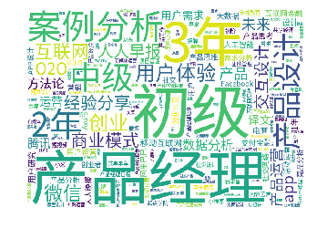

# 以人人都是产品经理网站3.6万篇文章为例阐述整个数据ETL和分析的过程

## 1 数据获取

主要利用python中的requests，BeautifulSoup库从人人都是产品经理网站爬取36000篇文章并存入MongoDB数据库。整个爬虫用到的库还有json——用于解析从网页获取的json格式字串，re——借助re库实现正则表达式功能，对于爬取的字串进行预处理，pymongo——与数据库建立连接，把爬取的数据存入MongoDB数据库，numpy、urllib和multiprocessing。  
整个爬虫用到的是函数式变成的思想，主体部分定义了若干爬取函数，主要有：  
1. 获取初始页HTML和解析初始页的函数，用于获取详情的url列表
2. 获取详情页HTML和解析详情页的函数，用于获取文章的信息，并返回一个文章信息的字典
3. main函数，首先，调用获取详情的URL列表的函数，取得详情页url后，然后，利用for循环对每个详情页url调用获取文章信息的函数，取得文章内容，最后把文章内容存入MongoDB数据库
4. 开启多线程，提高爬虫效率，整个爬虫总共获取了36000条记录，耗时2小时30分钟，如果没有开启多线程，估计要爬一天

整个爬虫应用的库和定义的函数详情如下表所示：  

|主要用到的Python库或爬虫定义的函数|作用或实现的功能|
|:---:|:---:|
|requests|模拟网页发出get请求取得页面HTML|
|numpy|从请求头中随机获取一个头部信息|
|urllib|解析字符串，构造请求头部信息|
|BeautifulSoup|解析网页HTML代码，获取需要的信息，如URL、文章信息|
|json|解析json格式的页面，当获取到的页面代码是json字串时，就需要用json库对其反序列化|
|re|进行字符串的操作，对一些爬取下来的信息进行预处理|
|pymongo|与MongoDB数据库建立连接，把请求下来的信息存入数据库|
|multiprocessing|开启多线程，提高爬虫效率|
|函数：get_index_page()|获取初始页HTML|
|函数：parse_index_page()|解析初始页HTML，取得详情页URL|
|函数：get_detail_page()|获取详情页HTML|
|函数：parse_detail_page()|解析详情页HTML，获得文章内容，返回文章字典|
|函数：main()|调用get_index_page()和parse_index_page()取得详情页URL列表，遍历URL列表调用get_detail_page()和parse_detail_page()取得文章内容字典，最后存入MongoDB数据库|

爬虫的源代码在product.py文件中

## 2 数据清洗、转换

### 2.1 从MongoDB数据库中获取数据，并转换成DataFrame格式，整个清洗过程主要用到pandas库


```python
# 引入pymongo和pandas
from pymongo import MongoClient
import pandas as pd
```

与MongoDB建立连接，取得数据并转化成DataFrame格式


```python
client = MongoClient()
db = client.product
cursor = db.everyone_product_more.find()

df = pd.DataFrame(list(cursor))
```


```python
df
```


<div>
<style>
    .dataframe thead tr:only-child th {
        text-align: right;
    }

    .dataframe thead th {
        text-align: left;
    }

    .dataframe tbody tr th {
        vertical-align: top;
    }
</style>
<table border="1" class="dataframe">
  <thead>
    <tr style="text-align: right;">
      <th></th>
      <th>_id</th>
      <th>article</th>
      <th>author</th>
      <th>comment</th>
      <th>good</th>
      <th>star</th>
      <th>tag</th>
      <th>time</th>
      <th>title</th>
      <th>total_article</th>
      <th>total_watch</th>
      <th>watch</th>
    </tr>
  </thead>
  <tbody>
    <tr>
      <th>0</th>
      <td>5ad8a175bb7e360c709ff511</td>
      <td>如果说运营是辆急速飞驰的跑车，那么数据就是驱动它前行的齿轮。随着互联网人口红利逐步消失，砸钱...</td>
      <td>[]</td>
      <td>11</td>
      <td>[]</td>
      <td>[]</td>
      <td>[]</td>
      <td>2017-08-20 14:00-17:00</td>
      <td>[]</td>
      <td>None</td>
      <td>None</td>
      <td>[]</td>
    </tr>
    <tr>
      <th>1</th>
      <td>5ad8a175bb7e36203c5d5775</td>
      <td>\n双11真的是一年之中最便宜的吗？\n双11又要到了，无数人开始在购物车里屯货，大晚上抱着...</td>
      <td>周得狗</td>
      <td>12</td>
      <td>30</td>
      <td>74</td>
      <td>[双十一, 案例分析, 用户心理]</td>
      <td>2017-10-24</td>
      <td>为什么“双11”的产品会让你感觉很便宜？</td>
      <td>6篇</td>
      <td>4.5万</td>
      <td>1.1万</td>
    </tr>
    <tr>
      <th>2</th>
      <td>5ad8a175bb7e3628ec305e9b</td>
      <td>人人都是产品经理的网站里有大量的面经，说的都很好。在这个躁动的月份，我也想分享一些关于产品经...</td>
      <td>辰哥不瞎说</td>
      <td>1</td>
      <td>8</td>
      <td>6</td>
      <td>[2年, 产品工作, 产品求职, 初级]</td>
      <td>2018-04-19</td>
      <td>产品经理面试中的“潜规则”</td>
      <td>2篇</td>
      <td>1.1万</td>
      <td>739</td>
    </tr>
    <tr>
      <th>3</th>
      <td>5ad8a175bb7e36223812a826</td>
      <td>AR或许成为IP转化的新动力，各大IP都会有AR虚拟形象的需求。近两年，短视频十分火热。短视...</td>
      <td>雷锋网\n</td>
      <td>[]</td>
      <td>2</td>
      <td>24</td>
      <td>[3年, AR, 中级, 短视频应用]</td>
      <td>2018-01-18</td>
      <td>AR是短视频的下一个风口吗？我们体验了数十个AR短视频应用</td>
      <td>94篇</td>
      <td>66.4万</td>
      <td>3374</td>
    </tr>
    <tr>
      <th>4</th>
      <td>5ad8a175bb7e3628ec305e9c</td>
      <td>在玩抖音的时候，有没有辛苦拍出来的视频却不受欢迎？那一起来学学这七种方法~最近朋友圈常见到这...</td>
      <td>纸盒小卡车\n</td>
      <td>[]</td>
      <td>0</td>
      <td>0</td>
      <td>[3年, 中级, 抖音, 营销]</td>
      <td>2018-04-19</td>
      <td>七种“写作手法”教你称霸抖音营销</td>
      <td>185篇</td>
      <td>2.3m</td>
      <td>317</td>
    </tr>
    <tr>
      <th>5</th>
      <td>5ad8a175bb7e360c709ff512</td>
      <td>哈喽，你我相约七点半，你来了么^_^产品经理日报继续为您带来今日最新的资讯：腾讯发布一个AI...</td>
      <td>产品周报\n</td>
      <td>[]</td>
      <td>1</td>
      <td>0</td>
      <td>[Facebook, 共享单车, 腾讯觅影, 高德地图]</td>
      <td>2017-08-03</td>
      <td>产品经理日报第1022期｜AI医学影像产品——腾讯觅影，有望攻克食管癌早筛难题</td>
      <td>234篇</td>
      <td>1.7m</td>
      <td>4108</td>
    </tr>
    <tr>
      <th>6</th>
      <td>5ad8a175bb7e36223812a827</td>
      <td>市场的规模仍在逐渐壮大，在线教育终究还是长线竞争，且未来会更有看头。在线教育市场从不缺少标杆...</td>
      <td>Alter\n</td>
      <td>[]</td>
      <td>5</td>
      <td>33</td>
      <td>[2年, 初级, 在线教育]</td>
      <td>2018-01-18</td>
      <td>在线教育的快与慢，精品内容的进与退</td>
      <td>56篇</td>
      <td>36.1万</td>
      <td>3563</td>
    </tr>
    <tr>
      <th>7</th>
      <td>5ad8a175bb7e3628ec305e9d</td>
      <td>本文作者将从三个维度来粗略对比一下瑞幸和星巴克的差异，enjoy~不知大家有没有注意到，近来...</td>
      <td>Fancy</td>
      <td>1</td>
      <td>5</td>
      <td>2</td>
      <td>[3年, luckin coffee, 中级, 品牌运营, 星巴克]</td>
      <td>2018-04-19</td>
      <td>成立不到半年就敢 PK 星巴克？luckin coffee是什么来路？</td>
      <td>5篇</td>
      <td>2.1万</td>
      <td>434</td>
    </tr>
    <tr>
      <th>8</th>
      <td>5ad8a175bb7e36203c5d5776</td>
      <td>万字长文，作者试图理清共享单车市场。最近一个月以来，共享单车行业热点不断，从“打脸者”朱啸虎...</td>
      <td>柳胖胖\n</td>
      <td>4</td>
      <td>20</td>
      <td>54</td>
      <td>[ofo, 共享单车, 合并, 摩拜]</td>
      <td>2017-10-24</td>
      <td>我对共享单车的6点看法：两强PK进入生死时速，但合并还远未到时候</td>
      <td>66篇</td>
      <td>57.7万</td>
      <td>4202</td>
    </tr>
    <tr>
      <th>9</th>
      <td>5ad8a175bb7e360c709ff513</td>
      <td>创业公司必须不断成长才能蓬勃发展，仅仅生存下来是不够的。从 Y Combinator 的保罗...</td>
      <td>米可\n</td>
      <td>1</td>
      <td>5</td>
      <td>20</td>
      <td>[创业公司, 创业经验]</td>
      <td>2017-08-03</td>
      <td>要么成长，要么死亡！创业公司如何突破增长停滞的困境？</td>
      <td>821篇</td>
      <td>7m</td>
      <td>5575</td>
    </tr>
    <tr>
      <th>10</th>
      <td>5ad8a175bb7e36223812a828</td>
      <td>本文作者所在的公司有意投身于体育o2o相关的业务，作为本职其实是一名UI设计师这此次做的竞品...</td>
      <td>chyoseolxx</td>
      <td>2</td>
      <td>16</td>
      <td>63</td>
      <td>[1年, O2O, 体育类产品, 初级, 竞品分析]</td>
      <td>2018-01-18</td>
      <td>体育类O2O移动端竞品分析</td>
      <td>1篇</td>
      <td>9821</td>
      <td>9906</td>
    </tr>
    <tr>
      <th>11</th>
      <td>5ad8a176bb7e3628ec305e9e</td>
      <td>数据异常分析，是数据分析工作中最常见且重要的分析主题，本文总结了数据分析的一般过程和方法，希...</td>
      <td>时之沙</td>
      <td>[]</td>
      <td>4</td>
      <td>3</td>
      <td>[2年, 初级, 数据异常分析]</td>
      <td>2018-04-19</td>
      <td>当我们在做数据异常分析时，我们在分析什么</td>
      <td>1篇</td>
      <td>442</td>
      <td>442</td>
    </tr>
    <tr>
      <th>12</th>
      <td>5ad8a176bb7e36203c5d5777</td>
      <td>抄袭，其实是一种借鉴。在这过程中，我们需要用不同的角度看世界，直到发现最合适的参考物。今天一...</td>
      <td>康熙师爷\n</td>
      <td>2</td>
      <td>13</td>
      <td>50</td>
      <td>[思维方式, 运营视角]</td>
      <td>2017-10-24</td>
      <td>除了苹果、江小白、杜蕾斯，我们还能抄点啥？</td>
      <td>14篇</td>
      <td>11.1万</td>
      <td>6741</td>
    </tr>
    <tr>
      <th>13</th>
      <td>5ad8a176bb7e36223812a829</td>
      <td>设计在生活中是如何体现的？设计怎么出现在生活中？如何影响着我们？我理解的人机交互是一个 “物...</td>
      <td>Ella\n</td>
      <td>[]</td>
      <td>2</td>
      <td>11</td>
      <td>[2年, 初级, 视觉信息]</td>
      <td>2018-01-18</td>
      <td>设计的表达：视觉信息的表现</td>
      <td>517篇</td>
      <td>5.3m</td>
      <td>3133</td>
    </tr>
    <tr>
      <th>14</th>
      <td>5ad8a176bb7e36203c5d5778</td>
      <td>文章从四个方面切入，对图表设计做了相关总结，希望能够给你带来启发。用户在使用产品过程中，会接...</td>
      <td>王M争\n</td>
      <td>4</td>
      <td>13</td>
      <td>62</td>
      <td>[图表设计, 案例分析]</td>
      <td>2017-10-24</td>
      <td>设计总结：图表设计二三事</td>
      <td>38篇</td>
      <td>29.4万</td>
      <td>6112</td>
    </tr>
    <tr>
      <th>15</th>
      <td>5ad8a176bb7e3628ec305e9f</td>
      <td>得到，是一款聚集国内头部精品资源的知识服务App，这里有一份关于它的产品的详细分析报告，一起...</td>
      <td>逍影歌</td>
      <td>1</td>
      <td>6</td>
      <td>18</td>
      <td>[3年, 中级, 产品分析, 得到]</td>
      <td>2018-04-19</td>
      <td>“得到”产品分析报告</td>
      <td>2篇</td>
      <td>1万</td>
      <td>1302</td>
    </tr>
    <tr>
      <th>16</th>
      <td>5ad8a176bb7e36223812a82a</td>
      <td>不是所有人都适合创业，想创业并能一路坚持的人员必然是少数。对很多人来说，创业只是好奇和时尚，...</td>
      <td>郭乐彬</td>
      <td>2</td>
      <td>33</td>
      <td>76</td>
      <td>[3年, 中级, 互联网创业, 创业经验]</td>
      <td>2018-01-18</td>
      <td>起码得先活下来！互联网创业少走弯路的3个忠告</td>
      <td>1篇</td>
      <td>5926</td>
      <td>5926</td>
    </tr>
    <tr>
      <th>17</th>
      <td>5ad8a176bb7e36203c5d5779</td>
      <td>报名方式：在人人都是产品经理微信公众号（ID：woshipm）后台回复“起点学院”2017....</td>
      <td>[]</td>
      <td>13</td>
      <td>[]</td>
      <td>[]</td>
      <td>[]</td>
      <td>2017-10-26 20:30-21:30</td>
      <td>[]</td>
      <td>None</td>
      <td>None</td>
      <td>[]</td>
    </tr>
    <tr>
      <th>18</th>
      <td>5ad8a176bb7e3628ec305ea0</td>
      <td>“用研”，就是“研究用户”，通过问卷、访谈等途径了解用户的行为、需求和态度，如果你的社群运营...</td>
      <td>長小鹿</td>
      <td>[]</td>
      <td>1</td>
      <td>1</td>
      <td>[3年, 中级, 用研, 社群运营]</td>
      <td>2018-04-19</td>
      <td>如何从“研究用户”出发，思考社群的目标和维护？</td>
      <td>6篇</td>
      <td>3.3万</td>
      <td>504</td>
    </tr>
    <tr>
      <th>19</th>
      <td>5ad8a176bb7e36223812a82b</td>
      <td>在这个消费者主导的时代，强大的企业既要处理好用户与创作者的关系，又要形成具有特色的产品供应链...</td>
      <td>刘旷\n</td>
      <td>[]</td>
      <td>1</td>
      <td>4</td>
      <td>[2年, 二次元经济, 初级]</td>
      <td>2018-01-18</td>
      <td>二次元经济前景大好，A站为何难以为继？</td>
      <td>365篇</td>
      <td>2.5m</td>
      <td>1350</td>
    </tr>
    <tr>
      <th>20</th>
      <td>5ad8a176bb7e36223812a82c</td>
      <td>文章为作者经过5年多的不断迭代，形成的一套交互设计知识体系，希望对你来说，有所收获。又是近一...</td>
      <td>青溪Joanna\n</td>
      <td>4</td>
      <td>31</td>
      <td>192</td>
      <td>[4年, 交互设计, 高级]</td>
      <td>2018-01-18</td>
      <td>5年迭代，我总结了一套全面的交互设计知识体系</td>
      <td>19篇</td>
      <td>22.9万</td>
      <td>1.9万</td>
    </tr>
    <tr>
      <th>21</th>
      <td>5ad8a176bb7e3628ec305ea1</td>
      <td>运营公众号通常会进行数据分析，但把后台的数据复制粘贴，把那些人人看得到的数据写出来，这样也没...</td>
      <td>七月\n</td>
      <td>1</td>
      <td>6</td>
      <td>4</td>
      <td>[1年, 公众号, 初级, 数据分析]</td>
      <td>2018-04-19</td>
      <td>微信公众号，主要分析哪些方面的数据？</td>
      <td>536篇</td>
      <td>4.3m</td>
      <td>709</td>
    </tr>
    <tr>
      <th>22</th>
      <td>5ad8a176bb7e36203c5d577a</td>
      <td>本文作者将用axure8.0模拟做一个老虎机积分抽奖的原型。enjoy~积分抽奖是现如今很多...</td>
      <td>玲子\n</td>
      <td>13</td>
      <td>13</td>
      <td>68</td>
      <td>[原型实例, 积分抽奖]</td>
      <td>2017-10-24</td>
      <td>Axure 8.0 原型实例（附rp文件）：老虎机积分抽奖</td>
      <td>31篇</td>
      <td>48.9万</td>
      <td>7797</td>
    </tr>
    <tr>
      <th>23</th>
      <td>5ad8a176bb7e36223812a82d</td>
      <td>本文分享了9个方法，帮你搭建更加高效的视觉层次。enjoy~视觉层次是塑造优秀数字产品的基础...</td>
      <td>米可\n</td>
      <td>1</td>
      <td>9</td>
      <td>40</td>
      <td>[2年, 初级, 视觉设计, 设计技巧]</td>
      <td>2018-01-18</td>
      <td>视觉层次构建的9个技巧</td>
      <td>821篇</td>
      <td>7m</td>
      <td>4575</td>
    </tr>
    <tr>
      <th>24</th>
      <td>5ad8a176bb7e3628ec305ea2</td>
      <td>什么是新零售，其实99%的从业者都不太明白，只是趋势来了，只能稀里糊涂的跟着走。如果你还不懂...</td>
      <td>亿欧网\n</td>
      <td>[]</td>
      <td>0</td>
      <td>0</td>
      <td>[2年, 初级, 新零售]</td>
      <td>2018-04-19</td>
      <td>关于新零售，99%的从业者还是糊涂的</td>
      <td>252篇</td>
      <td>2.2m</td>
      <td>555</td>
    </tr>
    <tr>
      <th>25</th>
      <td>5ad8a176bb7e36203c5d577b</td>
      <td>在讨论的过程中，做好主导者的角色。在推进的过程中，做好保障者的角色。在跟进的过程中，做好ti...</td>
      <td>花生酱先生\n</td>
      <td>1</td>
      <td>15</td>
      <td>95</td>
      <td>[产品经理, 产品经验, 项目管理]</td>
      <td>2017-10-24</td>
      <td>产品之术：项目到底怎么跟？</td>
      <td>40篇</td>
      <td>46.5万</td>
      <td>8779</td>
    </tr>
    <tr>
      <th>26</th>
      <td>5ad8a176bb7e36223812a82e</td>
      <td>本文讨论的是如何利用客服系统中的权限设计来帮助客服团队进行科学管理。enjoy~SaaS产品...</td>
      <td>智八哥</td>
      <td>[]</td>
      <td>8</td>
      <td>33</td>
      <td>[2年, 初级, 客服系统, 权限设计]</td>
      <td>2018-01-18</td>
      <td>深度使用客服系统6个月后，我的一点总结（二）</td>
      <td>2篇</td>
      <td>9315</td>
      <td>3126</td>
    </tr>
    <tr>
      <th>27</th>
      <td>5ad8a176bb7e3628ec305ea3</td>
      <td>快手、火山小视频安卓版本的下架整改，内涵段子的停运，四款新闻资讯APP的下架处理，平台思维下...</td>
      <td>曾响铃\n</td>
      <td>[]</td>
      <td>0</td>
      <td>0</td>
      <td>[3年, AI传媒, 中级, 短视频]</td>
      <td>2018-04-19</td>
      <td>用短视频赋能，AI传媒也有“趣缘社群”坎</td>
      <td>109篇</td>
      <td>64.9万</td>
      <td>377</td>
    </tr>
    <tr>
      <th>28</th>
      <td>5ad8a176bb7e36223812a82f</td>
      <td>本文作者以Airbnb为例，简单地讲一下自己数据分析的经验。enjoy~以下是Airbnb结...</td>
      <td>小和</td>
      <td>1</td>
      <td>4</td>
      <td>42</td>
      <td>[3年, 产品设计, 初级, 移动产品]</td>
      <td>2018-01-18</td>
      <td>如何通过数据分析指导移动产品设计？</td>
      <td>1篇</td>
      <td>3908</td>
      <td>3898</td>
    </tr>
    <tr>
      <th>29</th>
      <td>5ad8a177bb7e36223812a830</td>
      <td>王思聪们的撒币大战，将走向何处？一起来看看本文作者说说~王小丫一定没想到，十年前她玩剩下的答...</td>
      <td>吴怼怼\n</td>
      <td>3</td>
      <td>7</td>
      <td>17</td>
      <td>[3年, 初级, 撒币大战, 直播答题]</td>
      <td>2018-01-18</td>
      <td>7天撒币1亿，直播答题的终局在哪？</td>
      <td>77篇</td>
      <td>31.7万</td>
      <td>4274</td>
    </tr>
    <tr>
      <th>...</th>
      <td>...</td>
      <td>...</td>
      <td>...</td>
      <td>...</td>
      <td>...</td>
      <td>...</td>
      <td>...</td>
      <td>...</td>
      <td>...</td>
      <td>...</td>
      <td>...</td>
      <td>...</td>
    </tr>
    <tr>
      <th>35970</th>
      <td>5ad8bcb1bb7e36223812cae8</td>
      <td>中国互联网，不管是BAT，还是TABLE，品牌资产管理做到极致的，唯有腾讯。腾讯自诞生开始，...</td>
      <td>漓江\n</td>
      <td>[]</td>
      <td>0</td>
      <td>5</td>
      <td>[QQ 品牌]</td>
      <td>2013-06-03</td>
      <td>干货分享：看QQ会员如何实现品牌资产增值</td>
      <td>579篇</td>
      <td>5.3m</td>
      <td>6267</td>
    </tr>
    <tr>
      <th>35971</th>
      <td>5ad8bcb2bb7e36223812cae9</td>
      <td>几乎每个淘宝运营一提到数据营销，基本上都能说上来这些软件：量子恒道、淘宝指数、数据魔方。但是...</td>
      <td>漓江\n</td>
      <td>[]</td>
      <td>2</td>
      <td>6</td>
      <td>[淘宝 数据分析]</td>
      <td>2013-06-03</td>
      <td>淘宝卖家数据分析指南</td>
      <td>579篇</td>
      <td>5.3m</td>
      <td>3594</td>
    </tr>
    <tr>
      <th>35972</th>
      <td>5ad8bcb2bb7e36223812caea</td>
      <td>新浪(纳斯达克交易代码：SINA)近日发布了2013年第一季度财报，净亏损1320万美元。尽...</td>
      <td>大城小蛙\n</td>
      <td>[]</td>
      <td>0</td>
      <td>1</td>
      <td>[新浪微博]</td>
      <td>2013-06-03</td>
      <td>新浪微博page未来如何商业化？</td>
      <td>472篇</td>
      <td>4.9m</td>
      <td>3789</td>
    </tr>
    <tr>
      <th>35973</th>
      <td>5ad8bcb6bb7e36223812caeb</td>
      <td>概念、模式、理论很重要，但在最具实干精神的互联网领域，行动才是最好的答案。国内互联网三巨头B...</td>
      <td>大城小蛙\n</td>
      <td>[]</td>
      <td>1</td>
      <td>3</td>
      <td>[数据挖掘, 百度, 腾讯, 阿里巴巴]</td>
      <td>2013-06-03</td>
      <td>BAT百度腾讯阿里三巨头开挖大数据</td>
      <td>472篇</td>
      <td>4.9m</td>
      <td>6500</td>
    </tr>
    <tr>
      <th>35974</th>
      <td>5ad8bcb7bb7e36223812caec</td>
      <td>2012年6月1日，距今整整一年前。张小龙在腾讯微博上发表了他的第5187条微博，也是他在腾...</td>
      <td>包子\n</td>
      <td>[]</td>
      <td>0</td>
      <td>0</td>
      <td>[腾讯微博，社交，媒体]</td>
      <td>2013-06-03</td>
      <td>腾讯微博，再见！</td>
      <td>381篇</td>
      <td>3.7m</td>
      <td>1291</td>
    </tr>
    <tr>
      <th>35975</th>
      <td>5ad8bcb7bb7e36223812caed</td>
      <td>也许，大多数人想去的是东京、纽约这样的大地方，但实际上那些真正符合你兴趣和爱好的旅行才是真正...</td>
      <td>艾米\n</td>
      <td>[]</td>
      <td>0</td>
      <td>3</td>
      <td>[旅行社交 O2O]</td>
      <td>2013-06-03</td>
      <td>旅行，其实可以更加个性化</td>
      <td>320篇</td>
      <td>2.6m</td>
      <td>8862</td>
    </tr>
    <tr>
      <th>35976</th>
      <td>5ad8bcb8bb7e36223812caee</td>
      <td>第一眼看到微购，我的想法是：这不是框计算的电商版本吗?框计算似乎是一件很遥远的事。最早在20...</td>
      <td>漓江\n</td>
      <td>1</td>
      <td>1</td>
      <td>0</td>
      <td>[百度微购 框计算]</td>
      <td>2013-06-03</td>
      <td>关于百度微购的七点推断</td>
      <td>579篇</td>
      <td>5.3m</td>
      <td>1.1万</td>
    </tr>
    <tr>
      <th>35977</th>
      <td>5ad8bcb8bb7e36223812caef</td>
      <td>最近一直在思考产品规划和产品设计研发的事情，原来谈的比较多的都是关于咨询和实施方面的内容，而...</td>
      <td>艾米\n</td>
      <td>2</td>
      <td>6</td>
      <td>2</td>
      <td>[产品经理 产品研发]</td>
      <td>2013-06-03</td>
      <td>产品经理必读，产品的核心思想</td>
      <td>320篇</td>
      <td>2.6m</td>
      <td>7739</td>
    </tr>
    <tr>
      <th>35978</th>
      <td>5ad8bcb9bb7e36223812caf0</td>
      <td>移动端的到来，使音乐变得唾手可得，在积累了过亿用户之后，行业也陷入了激烈竞争。现在，每家都在...</td>
      <td>漓江\n</td>
      <td>[]</td>
      <td>0</td>
      <td>1</td>
      <td>[数字音乐]</td>
      <td>2013-06-03</td>
      <td>数字音乐：盈利模式的个性化探索</td>
      <td>579篇</td>
      <td>5.3m</td>
      <td>4074</td>
    </tr>
    <tr>
      <th>35979</th>
      <td>5ad8bcb9bb7e36223812caf1</td>
      <td>问题并非出在工具上，而是过去这种纸质考试形式上。今天，出自 Y Combinator 孵化器...</td>
      <td>艾米\n</td>
      <td>[]</td>
      <td>0</td>
      <td>1</td>
      <td>[Terascore 在线教育]</td>
      <td>2013-06-03</td>
      <td>Terascore正式上线，在线教育的在线考试</td>
      <td>320篇</td>
      <td>2.6m</td>
      <td>6445</td>
    </tr>
    <tr>
      <th>35980</th>
      <td>5ad8bcb9bb7e36223812caf2</td>
      <td>笔者上月（2013年4月）有机会去了一次旧金山，印象最深的就是Uber。早在一年以前就知道U...</td>
      <td>艾米\n</td>
      <td>[]</td>
      <td>0</td>
      <td>0</td>
      <td>[打车应用 Uber]</td>
      <td>2013-06-03</td>
      <td>在旧金山用Uber打车</td>
      <td>320篇</td>
      <td>2.6m</td>
      <td>1608</td>
    </tr>
    <tr>
      <th>35981</th>
      <td>5ad8bcbabb7e36223812caf3</td>
      <td>自PPS嫁给百度爱奇艺，傍上百度这个大款之后，人们对视频领域的焦点就都放在了搜狐视频和PPT...</td>
      <td>艾米\n</td>
      <td>[]</td>
      <td>0</td>
      <td>0</td>
      <td>[PPTV 视频 PPS 爱奇艺]</td>
      <td>2013-06-03</td>
      <td>PPTV告诉我们，钱太多也不总是好事儿</td>
      <td>320篇</td>
      <td>2.6m</td>
      <td>8499</td>
    </tr>
    <tr>
      <th>35982</th>
      <td>5ad8bcbabb7e36223812caf4</td>
      <td>扁平化的UI设计风格正在逐渐流行起来，Thinglist、 Currency、Letterp...</td>
      <td>DT\n</td>
      <td>2</td>
      <td>0</td>
      <td>1</td>
      <td>[Flat UI，扁平化设计]</td>
      <td>2013-06-03</td>
      <td>层级明确、元素简单、颜色丰富、精简文字–Flat UI的设计原则</td>
      <td>319篇</td>
      <td>4.3m</td>
      <td>8569</td>
    </tr>
    <tr>
      <th>35983</th>
      <td>5ad8bcbcbb7e36223812caf5</td>
      <td>上周，中国移动悄然推出了一款名为Jego的应用，似乎大有一举吞掉海外市场的野心。不过，笔者发...</td>
      <td>老曹\n</td>
      <td>[]</td>
      <td>0</td>
      <td>0</td>
      <td>[中国移动, 微信, 语音]</td>
      <td>2013-06-03</td>
      <td>中移动Jego试用:一盘小众鸡肋的菜</td>
      <td>4907篇</td>
      <td>23.5m</td>
      <td>1490</td>
    </tr>
    <tr>
      <th>35984</th>
      <td>5ad8bcbcbb7e36223812caf6</td>
      <td>手机QQ看似纠正了一个“错误”，可这种纠正也许是它正在犯下的更大错误。\xa05月8日，腾讯...</td>
      <td>DT\n</td>
      <td>[]</td>
      <td>1</td>
      <td>0</td>
      <td>[手机QQ，产品运营]</td>
      <td>2013-06-02</td>
      <td>手机QQ错在哪儿了？</td>
      <td>319篇</td>
      <td>4.3m</td>
      <td>7346</td>
    </tr>
    <tr>
      <th>35985</th>
      <td>5ad8bcbcbb7e36223812caf7</td>
      <td>\xa0\n\xa0图：咕咚网高级产品经理 王磊\xa0 \xa0 \xa0 王磊（@lei...</td>
      <td>朱帝\n</td>
      <td>[]</td>
      <td>1</td>
      <td>1</td>
      <td>[移动互联网]</td>
      <td>2013-06-02</td>
      <td>iOS vs. Android，应用设计该如何对症下药？</td>
      <td>556篇</td>
      <td>6.5m</td>
      <td>4151</td>
    </tr>
    <tr>
      <th>35986</th>
      <td>5ad8bcc0bb7e36223812caf8</td>
      <td>【导读】“每一个巨大的商业奇迹背后，都有无数个Mentor（注：导师）参与其中。”日前，黑马...</td>
      <td>达令</td>
      <td>[]</td>
      <td>0</td>
      <td>0</td>
      <td>[85后, 周鸿祎, 对话]</td>
      <td>2013-06-02</td>
      <td>周鸿祎对话85后：这个世界没有奇迹！</td>
      <td>277篇</td>
      <td>1.8m</td>
      <td>1184</td>
    </tr>
    <tr>
      <th>35987</th>
      <td>5ad8bcc0bb7e36223812caf9</td>
      <td>在今年的 I/O 大会上，两位设计师讲述了 Android 设计原则的心理学因素。Co.De...</td>
      <td>朱帝\n</td>
      <td>1</td>
      <td>0</td>
      <td>0</td>
      <td>[Android]</td>
      <td>2013-06-02</td>
      <td>Android 团队如何进行情感设计</td>
      <td>556篇</td>
      <td>6.5m</td>
      <td>1577</td>
    </tr>
    <tr>
      <th>35988</th>
      <td>5ad8bcc1bb7e36223812cafa</td>
      <td>[导读]快递员能够提取80%的快递服务费用和100%的小费，快递公司抽成20%。\xa0Po...</td>
      <td>达令</td>
      <td>[]</td>
      <td>0</td>
      <td>0</td>
      <td>[Postmates, 增值, 快递]</td>
      <td>2013-06-02</td>
      <td>纽约快递公司Postmates：一小时内送达任何东西</td>
      <td>277篇</td>
      <td>1.8m</td>
      <td>3091</td>
    </tr>
    <tr>
      <th>35989</th>
      <td>5ad8bcc5bb7e36223812cafb</td>
      <td>【导读】云知声近期的频频亮相令其颇受关注。3月27日，在“锤子ROM”发布会上，云知声与老牌...</td>
      <td>达令</td>
      <td>[]</td>
      <td>0</td>
      <td>1</td>
      <td>[云服务, 云知声, 云计算]</td>
      <td>2013-06-02</td>
      <td>云知声：创立一年的公司如何挑战科大讯飞</td>
      <td>277篇</td>
      <td>1.8m</td>
      <td>4916</td>
    </tr>
    <tr>
      <th>35990</th>
      <td>5ad8bcc5bb7e36223812cafc</td>
      <td>【导读】通常对于企业的估值有现金流折现法、乘数法、残值法等，作者是通过乘数法来进行对搜狗进行...</td>
      <td>达令</td>
      <td>[]</td>
      <td>0</td>
      <td>0</td>
      <td>[估价, 搜狗, 搜索]</td>
      <td>2013-06-02</td>
      <td>【技术贴】用估值模型计算，搜狗到底值多少钱？</td>
      <td>277篇</td>
      <td>1.8m</td>
      <td>3362</td>
    </tr>
    <tr>
      <th>35991</th>
      <td>5ad8bccabb7e36223812cafd</td>
      <td>今天韩都衣舍创始人赵迎光今天发布了一条微博：@韩都衣舍赵迎光：对于新创立的网络品牌说几句话(...</td>
      <td>达令</td>
      <td>[]</td>
      <td>0</td>
      <td>0</td>
      <td>[孵化器, 淘宝, 韩都衣舍]</td>
      <td>2013-06-02</td>
      <td>韩都衣舍赵迎光：淘宝是目前中国最好的孵化器</td>
      <td>277篇</td>
      <td>1.8m</td>
      <td>916</td>
    </tr>
    <tr>
      <th>35992</th>
      <td>5ad8bccabb7e36223812cafe</td>
      <td>赚钱的核心包含：立项、开发、发行我觉得手游市场赚钱的核心，主要包含三个方面：第一个是立项，立...</td>
      <td>达令</td>
      <td>[]</td>
      <td>3</td>
      <td>0</td>
      <td>[app, 手游, 运营]</td>
      <td>2013-06-02</td>
      <td>掌趣张沛：手游如何做才能赚大钱</td>
      <td>277篇</td>
      <td>1.8m</td>
      <td>6790</td>
    </tr>
    <tr>
      <th>35993</th>
      <td>5ad8bccabb7e36223812caff</td>
      <td>最近很多朋友来打听果壳智能手表的事情，这里一并答复。近日，苹果、Google、三星等巨头也只...</td>
      <td>达令</td>
      <td>[]</td>
      <td>0</td>
      <td>1</td>
      <td>[业界动态, 智能手表, 果壳网]</td>
      <td>2013-06-02</td>
      <td>果壳CEO顾晓斌：我眼中的智能手表</td>
      <td>277篇</td>
      <td>1.8m</td>
      <td>3566</td>
    </tr>
    <tr>
      <th>35994</th>
      <td>5ad8bccbbb7e36223812cb00</td>
      <td>\xa0Twitter最近一段时间的大动作都指向同一个目标：赚取更多广告收入。无论是即将推出...</td>
      <td>包子\n</td>
      <td>[]</td>
      <td>0</td>
      <td>0</td>
      <td>[Twitter 广告 数据]</td>
      <td>2013-06-02</td>
      <td>Twitter如何让社交广告成为一桩大生意？</td>
      <td>381篇</td>
      <td>3.7m</td>
      <td>3092</td>
    </tr>
    <tr>
      <th>35995</th>
      <td>5ad8bccbbb7e36223812cb01</td>
      <td>你愿意为自己的小 Baby 的健康成长付出多少努力？看看有多少年轻妈妈过五关斩六将，闯到香港...</td>
      <td>少爷熙</td>
      <td>[]</td>
      <td>1</td>
      <td>2</td>
      <td>[婴儿产品]</td>
      <td>2013-06-01</td>
      <td>宝贝计划——来源于父母的新市场</td>
      <td>67篇</td>
      <td>30.2万</td>
      <td>2531</td>
    </tr>
    <tr>
      <th>35996</th>
      <td>5ad8bccbbb7e36223812cb02</td>
      <td>音乐一直以来都是互联网最大的应用之一，仅次于游戏。全球市场看，有超过500家主流数字音乐服务...</td>
      <td>漓江\n</td>
      <td>[]</td>
      <td>0</td>
      <td>1</td>
      <td>[音乐服务]</td>
      <td>2013-06-01</td>
      <td>国际数字音乐服务的创新模式</td>
      <td>579篇</td>
      <td>5.3m</td>
      <td>1355</td>
    </tr>
    <tr>
      <th>35997</th>
      <td>5ad8bcccbb7e36223812cb03</td>
      <td>可穿戴式设备群雄乱斗，其中也不乏阵亡者。作为市场先锋之一的 Zeo，从去年年底起悄悄地退出了...</td>
      <td>漓江\n</td>
      <td>[]</td>
      <td>0</td>
      <td>0</td>
      <td>[可穿戴式设备]</td>
      <td>2013-06-01</td>
      <td>对一个失败案例的讨论：从Zeo到Zero——睡眠管理设备创业公司Zeo“进入深度睡眠”</td>
      <td>579篇</td>
      <td>5.3m</td>
      <td>9692</td>
    </tr>
    <tr>
      <th>35998</th>
      <td>5ad8bcccbb7e36223812cb04</td>
      <td>\n扁平化设计在当下的用户界面设计界是很有争议的，微软的 Metro 风最早将其介绍给大众，...</td>
      <td>达令</td>
      <td>[]</td>
      <td>1</td>
      <td>0</td>
      <td>[产品设计, 扁平化设计, 用户体验]</td>
      <td>2013-06-01</td>
      <td>准“扁平化设计”</td>
      <td>277篇</td>
      <td>1.8m</td>
      <td>1910</td>
    </tr>
    <tr>
      <th>35999</th>
      <td>5ad8bccdbb7e36223812cb05</td>
      <td>本文译自Speckyboy Design Magazine，译者@C7210\xa0。在传统...</td>
      <td>达令</td>
      <td>[]</td>
      <td>2</td>
      <td>4</td>
      <td>[产品经理 UI 产品设计 用户体验, 扁平化设计]</td>
      <td>2013-06-01</td>
      <td>用扁平化的界面设计吸引用户</td>
      <td>277篇</td>
      <td>1.8m</td>
      <td>6200</td>
    </tr>
  </tbody>
</table>
<p>36000 rows × 12 columns</p>
</div>


大致看下数据的情况,总共有12个指标：'_id', 'article', 'author', 'comment', 'good', 'star', 'tag', 'time','title', 'total_article', 'total_watch', 'watch'，其中第一列_id是MongoDB生产的每条记录的唯一标识，可以删除，其余的分别是：文章内容，文章作者，文章评论量，文章点赞量，文章收藏量，文章标签，文章发表时间，文章的标题，文章作者总共发表的文章数量，文章作者所有文章的浏览量，文章的浏览量，共11个关于文章信息的指标。目前，所有指标的数据类型均为object，后续需要转换。


```python
# 查看数据信息
df.info()
```

    <class 'pandas.core.frame.DataFrame'>
    RangeIndex: 36000 entries, 0 to 35999
    Data columns (total 12 columns):
    _id              36000 non-null object
    article          36000 non-null object
    author           36000 non-null object
    comment          36000 non-null object
    good             36000 non-null object
    star             36000 non-null object
    tag              36000 non-null object
    time             36000 non-null object
    title            36000 non-null object
    total_article    35600 non-null object
    total_watch      35600 non-null object
    watch            36000 non-null object
    dtypes: object(12)
    memory usage: 3.3+ MB
    


```python
# 删除_id
df = df.drop('_id', axis=1)
```

### 2.2 查看数据的缺失情况


```python
df.isnull().sum()
```


    article            0
    author             0
    comment            0
    good               0
    star               0
    tag                0
    time               0
    title              0
    total_article    400
    total_watch      400
    watch              0
    dtype: int64


文章作者总共发表的文章数量和文章作者所有文章的浏览量分别有400条记录缺失，再查看一下缺失行的详细信息，缺失都比较严重，因此考虑把缺失行全部删除，而相对36000条数据量，删除400条缺失信息是可以接受的


```python
df.loc[df['total_article'].isnull(),['title', 'author', 'total_article', 'total_watch']]
```


<div>
<style>
    .dataframe thead tr:only-child th {
        text-align: right;
    }

    .dataframe thead th {
        text-align: left;
    }

    .dataframe tbody tr th {
        vertical-align: top;
    }
</style>
<table border="1" class="dataframe">
  <thead>
    <tr style="text-align: right;">
      <th></th>
      <th>title</th>
      <th>author</th>
      <th>total_article</th>
      <th>total_watch</th>
    </tr>
  </thead>
  <tbody>
    <tr>
      <th>0</th>
      <td>[]</td>
      <td>[]</td>
      <td>None</td>
      <td>None</td>
    </tr>
    <tr>
      <th>17</th>
      <td>[]</td>
      <td>[]</td>
      <td>None</td>
      <td>None</td>
    </tr>
    <tr>
      <th>40</th>
      <td>[]</td>
      <td>[]</td>
      <td>None</td>
      <td>None</td>
    </tr>
    <tr>
      <th>94</th>
      <td>[]</td>
      <td>[]</td>
      <td>None</td>
      <td>None</td>
    </tr>
    <tr>
      <th>109</th>
      <td>[]</td>
      <td>[]</td>
      <td>None</td>
      <td>None</td>
    </tr>
    <tr>
      <th>119</th>
      <td>[]</td>
      <td>[]</td>
      <td>None</td>
      <td>None</td>
    </tr>
    <tr>
      <th>138</th>
      <td>[]</td>
      <td>[]</td>
      <td>None</td>
      <td>None</td>
    </tr>
    <tr>
      <th>187</th>
      <td>[]</td>
      <td>[]</td>
      <td>None</td>
      <td>None</td>
    </tr>
    <tr>
      <th>352</th>
      <td>[]</td>
      <td>[]</td>
      <td>None</td>
      <td>None</td>
    </tr>
    <tr>
      <th>365</th>
      <td>[]</td>
      <td>[]</td>
      <td>None</td>
      <td>None</td>
    </tr>
    <tr>
      <th>433</th>
      <td>[]</td>
      <td>[]</td>
      <td>None</td>
      <td>None</td>
    </tr>
    <tr>
      <th>482</th>
      <td>[]</td>
      <td>[]</td>
      <td>None</td>
      <td>None</td>
    </tr>
    <tr>
      <th>511</th>
      <td>[]</td>
      <td>[]</td>
      <td>None</td>
      <td>None</td>
    </tr>
    <tr>
      <th>529</th>
      <td>[]</td>
      <td>[]</td>
      <td>None</td>
      <td>None</td>
    </tr>
    <tr>
      <th>551</th>
      <td>[]</td>
      <td>[]</td>
      <td>None</td>
      <td>None</td>
    </tr>
    <tr>
      <th>592</th>
      <td>[]</td>
      <td>[]</td>
      <td>None</td>
      <td>None</td>
    </tr>
    <tr>
      <th>758</th>
      <td>[]</td>
      <td>[]</td>
      <td>None</td>
      <td>None</td>
    </tr>
    <tr>
      <th>770</th>
      <td>[]</td>
      <td>[]</td>
      <td>None</td>
      <td>None</td>
    </tr>
    <tr>
      <th>943</th>
      <td>[]</td>
      <td>[]</td>
      <td>None</td>
      <td>None</td>
    </tr>
    <tr>
      <th>1021</th>
      <td>[]</td>
      <td>[]</td>
      <td>None</td>
      <td>None</td>
    </tr>
    <tr>
      <th>1042</th>
      <td>[]</td>
      <td>[]</td>
      <td>None</td>
      <td>None</td>
    </tr>
    <tr>
      <th>1123</th>
      <td>[]</td>
      <td>[]</td>
      <td>None</td>
      <td>None</td>
    </tr>
    <tr>
      <th>1241</th>
      <td>[]</td>
      <td>[]</td>
      <td>None</td>
      <td>None</td>
    </tr>
    <tr>
      <th>1314</th>
      <td>[]</td>
      <td>[]</td>
      <td>None</td>
      <td>None</td>
    </tr>
    <tr>
      <th>1387</th>
      <td>[]</td>
      <td>[]</td>
      <td>None</td>
      <td>None</td>
    </tr>
    <tr>
      <th>1438</th>
      <td>[]</td>
      <td>[]</td>
      <td>None</td>
      <td>None</td>
    </tr>
    <tr>
      <th>1655</th>
      <td>[]</td>
      <td>[]</td>
      <td>None</td>
      <td>None</td>
    </tr>
    <tr>
      <th>1756</th>
      <td>[]</td>
      <td>[]</td>
      <td>None</td>
      <td>None</td>
    </tr>
    <tr>
      <th>1758</th>
      <td>[]</td>
      <td>[]</td>
      <td>None</td>
      <td>None</td>
    </tr>
    <tr>
      <th>1822</th>
      <td>[]</td>
      <td>[]</td>
      <td>None</td>
      <td>None</td>
    </tr>
    <tr>
      <th>...</th>
      <td>...</td>
      <td>...</td>
      <td>...</td>
      <td>...</td>
    </tr>
    <tr>
      <th>27422</th>
      <td>[]</td>
      <td>[]</td>
      <td>None</td>
      <td>None</td>
    </tr>
    <tr>
      <th>27586</th>
      <td>[]</td>
      <td>[]</td>
      <td>None</td>
      <td>None</td>
    </tr>
    <tr>
      <th>27599</th>
      <td>[]</td>
      <td>[]</td>
      <td>None</td>
      <td>None</td>
    </tr>
    <tr>
      <th>27666</th>
      <td>[]</td>
      <td>[]</td>
      <td>None</td>
      <td>None</td>
    </tr>
    <tr>
      <th>27735</th>
      <td>[]</td>
      <td>[]</td>
      <td>None</td>
      <td>None</td>
    </tr>
    <tr>
      <th>27869</th>
      <td>[]</td>
      <td>[]</td>
      <td>None</td>
      <td>None</td>
    </tr>
    <tr>
      <th>27916</th>
      <td>[]</td>
      <td>[]</td>
      <td>None</td>
      <td>None</td>
    </tr>
    <tr>
      <th>27983</th>
      <td>[]</td>
      <td>[]</td>
      <td>None</td>
      <td>None</td>
    </tr>
    <tr>
      <th>28025</th>
      <td>[]</td>
      <td>[]</td>
      <td>None</td>
      <td>None</td>
    </tr>
    <tr>
      <th>28066</th>
      <td>[]</td>
      <td></td>
      <td>None</td>
      <td>None</td>
    </tr>
    <tr>
      <th>28149</th>
      <td>[]</td>
      <td>[]</td>
      <td>None</td>
      <td>None</td>
    </tr>
    <tr>
      <th>28276</th>
      <td>[]</td>
      <td>[]</td>
      <td>None</td>
      <td>None</td>
    </tr>
    <tr>
      <th>28363</th>
      <td>[]</td>
      <td>[]</td>
      <td>None</td>
      <td>None</td>
    </tr>
    <tr>
      <th>28833</th>
      <td>[]</td>
      <td>[]</td>
      <td>None</td>
      <td>None</td>
    </tr>
    <tr>
      <th>29032</th>
      <td>[]</td>
      <td>[]</td>
      <td>None</td>
      <td>None</td>
    </tr>
    <tr>
      <th>29456</th>
      <td>[]</td>
      <td>[]</td>
      <td>None</td>
      <td>None</td>
    </tr>
    <tr>
      <th>29550</th>
      <td>[]</td>
      <td>[]</td>
      <td>None</td>
      <td>None</td>
    </tr>
    <tr>
      <th>29773</th>
      <td>[]</td>
      <td>[]</td>
      <td>None</td>
      <td>None</td>
    </tr>
    <tr>
      <th>29990</th>
      <td>[]</td>
      <td>[]</td>
      <td>None</td>
      <td>None</td>
    </tr>
    <tr>
      <th>30441</th>
      <td>[]</td>
      <td>[]</td>
      <td>None</td>
      <td>None</td>
    </tr>
    <tr>
      <th>31036</th>
      <td>[]</td>
      <td>[]</td>
      <td>None</td>
      <td>None</td>
    </tr>
    <tr>
      <th>31839</th>
      <td>[]</td>
      <td>[]</td>
      <td>None</td>
      <td>None</td>
    </tr>
    <tr>
      <th>32301</th>
      <td>[]</td>
      <td>[]</td>
      <td>None</td>
      <td>None</td>
    </tr>
    <tr>
      <th>33021</th>
      <td>[]</td>
      <td></td>
      <td>None</td>
      <td>None</td>
    </tr>
    <tr>
      <th>33066</th>
      <td>[]</td>
      <td></td>
      <td>None</td>
      <td>None</td>
    </tr>
    <tr>
      <th>33971</th>
      <td>[]</td>
      <td></td>
      <td>None</td>
      <td>None</td>
    </tr>
    <tr>
      <th>34197</th>
      <td>[]</td>
      <td>[]</td>
      <td>None</td>
      <td>None</td>
    </tr>
    <tr>
      <th>34410</th>
      <td>[]</td>
      <td>[]</td>
      <td>None</td>
      <td>None</td>
    </tr>
    <tr>
      <th>34722</th>
      <td>[]</td>
      <td></td>
      <td>None</td>
      <td>None</td>
    </tr>
    <tr>
      <th>35768</th>
      <td>[]</td>
      <td></td>
      <td>None</td>
      <td>None</td>
    </tr>
  </tbody>
</table>
<p>400 rows × 4 columns</p>
</div>


删除缺失值。再查看下数据信息，总共还有35600条记录。


```python
df = df.dropna()
```


```python
df.info()
```

    <class 'pandas.core.frame.DataFrame'>
    Int64Index: 35600 entries, 1 to 35999
    Data columns (total 11 columns):
    article          35600 non-null object
    author           35600 non-null object
    comment          35600 non-null object
    good             35600 non-null object
    star             35600 non-null object
    tag              35600 non-null object
    time             35600 non-null object
    title            35600 non-null object
    total_article    35600 non-null object
    total_watch      35600 non-null object
    watch            35600 non-null object
    dtypes: object(11)
    memory usage: 3.3+ MB
    


```python
df
```


<div>
<style>
    .dataframe thead tr:only-child th {
        text-align: right;
    }

    .dataframe thead th {
        text-align: left;
    }

    .dataframe tbody tr th {
        vertical-align: top;
    }
</style>
<table border="1" class="dataframe">
  <thead>
    <tr style="text-align: right;">
      <th></th>
      <th>article</th>
      <th>author</th>
      <th>comment</th>
      <th>good</th>
      <th>star</th>
      <th>tag</th>
      <th>time</th>
      <th>title</th>
      <th>total_article</th>
      <th>total_watch</th>
      <th>watch</th>
    </tr>
  </thead>
  <tbody>
    <tr>
      <th>1</th>
      <td>\n双11真的是一年之中最便宜的吗？\n双11又要到了，无数人开始在购物车里屯货，大晚上抱着...</td>
      <td>周得狗</td>
      <td>12</td>
      <td>30</td>
      <td>74</td>
      <td>[双十一, 案例分析, 用户心理]</td>
      <td>2017-10-24</td>
      <td>为什么“双11”的产品会让你感觉很便宜？</td>
      <td>6篇</td>
      <td>4.5万</td>
      <td>1.1万</td>
    </tr>
    <tr>
      <th>2</th>
      <td>人人都是产品经理的网站里有大量的面经，说的都很好。在这个躁动的月份，我也想分享一些关于产品经...</td>
      <td>辰哥不瞎说</td>
      <td>1</td>
      <td>8</td>
      <td>6</td>
      <td>[2年, 产品工作, 产品求职, 初级]</td>
      <td>2018-04-19</td>
      <td>产品经理面试中的“潜规则”</td>
      <td>2篇</td>
      <td>1.1万</td>
      <td>739</td>
    </tr>
    <tr>
      <th>3</th>
      <td>AR或许成为IP转化的新动力，各大IP都会有AR虚拟形象的需求。近两年，短视频十分火热。短视...</td>
      <td>雷锋网\n</td>
      <td>[]</td>
      <td>2</td>
      <td>24</td>
      <td>[3年, AR, 中级, 短视频应用]</td>
      <td>2018-01-18</td>
      <td>AR是短视频的下一个风口吗？我们体验了数十个AR短视频应用</td>
      <td>94篇</td>
      <td>66.4万</td>
      <td>3374</td>
    </tr>
    <tr>
      <th>4</th>
      <td>在玩抖音的时候，有没有辛苦拍出来的视频却不受欢迎？那一起来学学这七种方法~最近朋友圈常见到这...</td>
      <td>纸盒小卡车\n</td>
      <td>[]</td>
      <td>0</td>
      <td>0</td>
      <td>[3年, 中级, 抖音, 营销]</td>
      <td>2018-04-19</td>
      <td>七种“写作手法”教你称霸抖音营销</td>
      <td>185篇</td>
      <td>2.3m</td>
      <td>317</td>
    </tr>
    <tr>
      <th>5</th>
      <td>哈喽，你我相约七点半，你来了么^_^产品经理日报继续为您带来今日最新的资讯：腾讯发布一个AI...</td>
      <td>产品周报\n</td>
      <td>[]</td>
      <td>1</td>
      <td>0</td>
      <td>[Facebook, 共享单车, 腾讯觅影, 高德地图]</td>
      <td>2017-08-03</td>
      <td>产品经理日报第1022期｜AI医学影像产品——腾讯觅影，有望攻克食管癌早筛难题</td>
      <td>234篇</td>
      <td>1.7m</td>
      <td>4108</td>
    </tr>
    <tr>
      <th>6</th>
      <td>市场的规模仍在逐渐壮大，在线教育终究还是长线竞争，且未来会更有看头。在线教育市场从不缺少标杆...</td>
      <td>Alter\n</td>
      <td>[]</td>
      <td>5</td>
      <td>33</td>
      <td>[2年, 初级, 在线教育]</td>
      <td>2018-01-18</td>
      <td>在线教育的快与慢，精品内容的进与退</td>
      <td>56篇</td>
      <td>36.1万</td>
      <td>3563</td>
    </tr>
    <tr>
      <th>7</th>
      <td>本文作者将从三个维度来粗略对比一下瑞幸和星巴克的差异，enjoy~不知大家有没有注意到，近来...</td>
      <td>Fancy</td>
      <td>1</td>
      <td>5</td>
      <td>2</td>
      <td>[3年, luckin coffee, 中级, 品牌运营, 星巴克]</td>
      <td>2018-04-19</td>
      <td>成立不到半年就敢 PK 星巴克？luckin coffee是什么来路？</td>
      <td>5篇</td>
      <td>2.1万</td>
      <td>434</td>
    </tr>
    <tr>
      <th>8</th>
      <td>万字长文，作者试图理清共享单车市场。最近一个月以来，共享单车行业热点不断，从“打脸者”朱啸虎...</td>
      <td>柳胖胖\n</td>
      <td>4</td>
      <td>20</td>
      <td>54</td>
      <td>[ofo, 共享单车, 合并, 摩拜]</td>
      <td>2017-10-24</td>
      <td>我对共享单车的6点看法：两强PK进入生死时速，但合并还远未到时候</td>
      <td>66篇</td>
      <td>57.7万</td>
      <td>4202</td>
    </tr>
    <tr>
      <th>9</th>
      <td>创业公司必须不断成长才能蓬勃发展，仅仅生存下来是不够的。从 Y Combinator 的保罗...</td>
      <td>米可\n</td>
      <td>1</td>
      <td>5</td>
      <td>20</td>
      <td>[创业公司, 创业经验]</td>
      <td>2017-08-03</td>
      <td>要么成长，要么死亡！创业公司如何突破增长停滞的困境？</td>
      <td>821篇</td>
      <td>7m</td>
      <td>5575</td>
    </tr>
    <tr>
      <th>10</th>
      <td>本文作者所在的公司有意投身于体育o2o相关的业务，作为本职其实是一名UI设计师这此次做的竞品...</td>
      <td>chyoseolxx</td>
      <td>2</td>
      <td>16</td>
      <td>63</td>
      <td>[1年, O2O, 体育类产品, 初级, 竞品分析]</td>
      <td>2018-01-18</td>
      <td>体育类O2O移动端竞品分析</td>
      <td>1篇</td>
      <td>9821</td>
      <td>9906</td>
    </tr>
    <tr>
      <th>11</th>
      <td>数据异常分析，是数据分析工作中最常见且重要的分析主题，本文总结了数据分析的一般过程和方法，希...</td>
      <td>时之沙</td>
      <td>[]</td>
      <td>4</td>
      <td>3</td>
      <td>[2年, 初级, 数据异常分析]</td>
      <td>2018-04-19</td>
      <td>当我们在做数据异常分析时，我们在分析什么</td>
      <td>1篇</td>
      <td>442</td>
      <td>442</td>
    </tr>
    <tr>
      <th>12</th>
      <td>抄袭，其实是一种借鉴。在这过程中，我们需要用不同的角度看世界，直到发现最合适的参考物。今天一...</td>
      <td>康熙师爷\n</td>
      <td>2</td>
      <td>13</td>
      <td>50</td>
      <td>[思维方式, 运营视角]</td>
      <td>2017-10-24</td>
      <td>除了苹果、江小白、杜蕾斯，我们还能抄点啥？</td>
      <td>14篇</td>
      <td>11.1万</td>
      <td>6741</td>
    </tr>
    <tr>
      <th>13</th>
      <td>设计在生活中是如何体现的？设计怎么出现在生活中？如何影响着我们？我理解的人机交互是一个 “物...</td>
      <td>Ella\n</td>
      <td>[]</td>
      <td>2</td>
      <td>11</td>
      <td>[2年, 初级, 视觉信息]</td>
      <td>2018-01-18</td>
      <td>设计的表达：视觉信息的表现</td>
      <td>517篇</td>
      <td>5.3m</td>
      <td>3133</td>
    </tr>
    <tr>
      <th>14</th>
      <td>文章从四个方面切入，对图表设计做了相关总结，希望能够给你带来启发。用户在使用产品过程中，会接...</td>
      <td>王M争\n</td>
      <td>4</td>
      <td>13</td>
      <td>62</td>
      <td>[图表设计, 案例分析]</td>
      <td>2017-10-24</td>
      <td>设计总结：图表设计二三事</td>
      <td>38篇</td>
      <td>29.4万</td>
      <td>6112</td>
    </tr>
    <tr>
      <th>15</th>
      <td>得到，是一款聚集国内头部精品资源的知识服务App，这里有一份关于它的产品的详细分析报告，一起...</td>
      <td>逍影歌</td>
      <td>1</td>
      <td>6</td>
      <td>18</td>
      <td>[3年, 中级, 产品分析, 得到]</td>
      <td>2018-04-19</td>
      <td>“得到”产品分析报告</td>
      <td>2篇</td>
      <td>1万</td>
      <td>1302</td>
    </tr>
    <tr>
      <th>16</th>
      <td>不是所有人都适合创业，想创业并能一路坚持的人员必然是少数。对很多人来说，创业只是好奇和时尚，...</td>
      <td>郭乐彬</td>
      <td>2</td>
      <td>33</td>
      <td>76</td>
      <td>[3年, 中级, 互联网创业, 创业经验]</td>
      <td>2018-01-18</td>
      <td>起码得先活下来！互联网创业少走弯路的3个忠告</td>
      <td>1篇</td>
      <td>5926</td>
      <td>5926</td>
    </tr>
    <tr>
      <th>18</th>
      <td>“用研”，就是“研究用户”，通过问卷、访谈等途径了解用户的行为、需求和态度，如果你的社群运营...</td>
      <td>長小鹿</td>
      <td>[]</td>
      <td>1</td>
      <td>1</td>
      <td>[3年, 中级, 用研, 社群运营]</td>
      <td>2018-04-19</td>
      <td>如何从“研究用户”出发，思考社群的目标和维护？</td>
      <td>6篇</td>
      <td>3.3万</td>
      <td>504</td>
    </tr>
    <tr>
      <th>19</th>
      <td>在这个消费者主导的时代，强大的企业既要处理好用户与创作者的关系，又要形成具有特色的产品供应链...</td>
      <td>刘旷\n</td>
      <td>[]</td>
      <td>1</td>
      <td>4</td>
      <td>[2年, 二次元经济, 初级]</td>
      <td>2018-01-18</td>
      <td>二次元经济前景大好，A站为何难以为继？</td>
      <td>365篇</td>
      <td>2.5m</td>
      <td>1350</td>
    </tr>
    <tr>
      <th>20</th>
      <td>文章为作者经过5年多的不断迭代，形成的一套交互设计知识体系，希望对你来说，有所收获。又是近一...</td>
      <td>青溪Joanna\n</td>
      <td>4</td>
      <td>31</td>
      <td>192</td>
      <td>[4年, 交互设计, 高级]</td>
      <td>2018-01-18</td>
      <td>5年迭代，我总结了一套全面的交互设计知识体系</td>
      <td>19篇</td>
      <td>22.9万</td>
      <td>1.9万</td>
    </tr>
    <tr>
      <th>21</th>
      <td>运营公众号通常会进行数据分析，但把后台的数据复制粘贴，把那些人人看得到的数据写出来，这样也没...</td>
      <td>七月\n</td>
      <td>1</td>
      <td>6</td>
      <td>4</td>
      <td>[1年, 公众号, 初级, 数据分析]</td>
      <td>2018-04-19</td>
      <td>微信公众号，主要分析哪些方面的数据？</td>
      <td>536篇</td>
      <td>4.3m</td>
      <td>709</td>
    </tr>
    <tr>
      <th>22</th>
      <td>本文作者将用axure8.0模拟做一个老虎机积分抽奖的原型。enjoy~积分抽奖是现如今很多...</td>
      <td>玲子\n</td>
      <td>13</td>
      <td>13</td>
      <td>68</td>
      <td>[原型实例, 积分抽奖]</td>
      <td>2017-10-24</td>
      <td>Axure 8.0 原型实例（附rp文件）：老虎机积分抽奖</td>
      <td>31篇</td>
      <td>48.9万</td>
      <td>7797</td>
    </tr>
    <tr>
      <th>23</th>
      <td>本文分享了9个方法，帮你搭建更加高效的视觉层次。enjoy~视觉层次是塑造优秀数字产品的基础...</td>
      <td>米可\n</td>
      <td>1</td>
      <td>9</td>
      <td>40</td>
      <td>[2年, 初级, 视觉设计, 设计技巧]</td>
      <td>2018-01-18</td>
      <td>视觉层次构建的9个技巧</td>
      <td>821篇</td>
      <td>7m</td>
      <td>4575</td>
    </tr>
    <tr>
      <th>24</th>
      <td>什么是新零售，其实99%的从业者都不太明白，只是趋势来了，只能稀里糊涂的跟着走。如果你还不懂...</td>
      <td>亿欧网\n</td>
      <td>[]</td>
      <td>0</td>
      <td>0</td>
      <td>[2年, 初级, 新零售]</td>
      <td>2018-04-19</td>
      <td>关于新零售，99%的从业者还是糊涂的</td>
      <td>252篇</td>
      <td>2.2m</td>
      <td>555</td>
    </tr>
    <tr>
      <th>25</th>
      <td>在讨论的过程中，做好主导者的角色。在推进的过程中，做好保障者的角色。在跟进的过程中，做好ti...</td>
      <td>花生酱先生\n</td>
      <td>1</td>
      <td>15</td>
      <td>95</td>
      <td>[产品经理, 产品经验, 项目管理]</td>
      <td>2017-10-24</td>
      <td>产品之术：项目到底怎么跟？</td>
      <td>40篇</td>
      <td>46.5万</td>
      <td>8779</td>
    </tr>
    <tr>
      <th>26</th>
      <td>本文讨论的是如何利用客服系统中的权限设计来帮助客服团队进行科学管理。enjoy~SaaS产品...</td>
      <td>智八哥</td>
      <td>[]</td>
      <td>8</td>
      <td>33</td>
      <td>[2年, 初级, 客服系统, 权限设计]</td>
      <td>2018-01-18</td>
      <td>深度使用客服系统6个月后，我的一点总结（二）</td>
      <td>2篇</td>
      <td>9315</td>
      <td>3126</td>
    </tr>
    <tr>
      <th>27</th>
      <td>快手、火山小视频安卓版本的下架整改，内涵段子的停运，四款新闻资讯APP的下架处理，平台思维下...</td>
      <td>曾响铃\n</td>
      <td>[]</td>
      <td>0</td>
      <td>0</td>
      <td>[3年, AI传媒, 中级, 短视频]</td>
      <td>2018-04-19</td>
      <td>用短视频赋能，AI传媒也有“趣缘社群”坎</td>
      <td>109篇</td>
      <td>64.9万</td>
      <td>377</td>
    </tr>
    <tr>
      <th>28</th>
      <td>本文作者以Airbnb为例，简单地讲一下自己数据分析的经验。enjoy~以下是Airbnb结...</td>
      <td>小和</td>
      <td>1</td>
      <td>4</td>
      <td>42</td>
      <td>[3年, 产品设计, 初级, 移动产品]</td>
      <td>2018-01-18</td>
      <td>如何通过数据分析指导移动产品设计？</td>
      <td>1篇</td>
      <td>3908</td>
      <td>3898</td>
    </tr>
    <tr>
      <th>29</th>
      <td>王思聪们的撒币大战，将走向何处？一起来看看本文作者说说~王小丫一定没想到，十年前她玩剩下的答...</td>
      <td>吴怼怼\n</td>
      <td>3</td>
      <td>7</td>
      <td>17</td>
      <td>[3年, 初级, 撒币大战, 直播答题]</td>
      <td>2018-01-18</td>
      <td>7天撒币1亿，直播答题的终局在哪？</td>
      <td>77篇</td>
      <td>31.7万</td>
      <td>4274</td>
    </tr>
    <tr>
      <th>30</th>
      <td>对于电商领域，小程序意味着什么？在什么场景下适用于小程序？应该怎么去展开营销？本文作者将就此...</td>
      <td>Barry</td>
      <td>[]</td>
      <td>3</td>
      <td>36</td>
      <td>[3年, 初级, 小程序, 电商营销]</td>
      <td>2018-01-18</td>
      <td>对于电商领域，小程序意味着什么？</td>
      <td>3篇</td>
      <td>1.3万</td>
      <td>4151</td>
    </tr>
    <tr>
      <th>31</th>
      <td>\n上篇文章推送后得到了大家的鼓励和建议，我准备趁热打铁继续上周的话题：我的需求分析方法论第...</td>
      <td>刘祯</td>
      <td>8</td>
      <td>12</td>
      <td>107</td>
      <td>[产品方法论, 需求分析]</td>
      <td>2017-10-24</td>
      <td>我的产品方法论之需求分析（中）</td>
      <td>9篇</td>
      <td>10.2万</td>
      <td>1.1万</td>
    </tr>
    <tr>
      <th>...</th>
      <td>...</td>
      <td>...</td>
      <td>...</td>
      <td>...</td>
      <td>...</td>
      <td>...</td>
      <td>...</td>
      <td>...</td>
      <td>...</td>
      <td>...</td>
      <td>...</td>
    </tr>
    <tr>
      <th>35970</th>
      <td>中国互联网，不管是BAT，还是TABLE，品牌资产管理做到极致的，唯有腾讯。腾讯自诞生开始，...</td>
      <td>漓江\n</td>
      <td>[]</td>
      <td>0</td>
      <td>5</td>
      <td>[QQ 品牌]</td>
      <td>2013-06-03</td>
      <td>干货分享：看QQ会员如何实现品牌资产增值</td>
      <td>579篇</td>
      <td>5.3m</td>
      <td>6267</td>
    </tr>
    <tr>
      <th>35971</th>
      <td>几乎每个淘宝运营一提到数据营销，基本上都能说上来这些软件：量子恒道、淘宝指数、数据魔方。但是...</td>
      <td>漓江\n</td>
      <td>[]</td>
      <td>2</td>
      <td>6</td>
      <td>[淘宝 数据分析]</td>
      <td>2013-06-03</td>
      <td>淘宝卖家数据分析指南</td>
      <td>579篇</td>
      <td>5.3m</td>
      <td>3594</td>
    </tr>
    <tr>
      <th>35972</th>
      <td>新浪(纳斯达克交易代码：SINA)近日发布了2013年第一季度财报，净亏损1320万美元。尽...</td>
      <td>大城小蛙\n</td>
      <td>[]</td>
      <td>0</td>
      <td>1</td>
      <td>[新浪微博]</td>
      <td>2013-06-03</td>
      <td>新浪微博page未来如何商业化？</td>
      <td>472篇</td>
      <td>4.9m</td>
      <td>3789</td>
    </tr>
    <tr>
      <th>35973</th>
      <td>概念、模式、理论很重要，但在最具实干精神的互联网领域，行动才是最好的答案。国内互联网三巨头B...</td>
      <td>大城小蛙\n</td>
      <td>[]</td>
      <td>1</td>
      <td>3</td>
      <td>[数据挖掘, 百度, 腾讯, 阿里巴巴]</td>
      <td>2013-06-03</td>
      <td>BAT百度腾讯阿里三巨头开挖大数据</td>
      <td>472篇</td>
      <td>4.9m</td>
      <td>6500</td>
    </tr>
    <tr>
      <th>35974</th>
      <td>2012年6月1日，距今整整一年前。张小龙在腾讯微博上发表了他的第5187条微博，也是他在腾...</td>
      <td>包子\n</td>
      <td>[]</td>
      <td>0</td>
      <td>0</td>
      <td>[腾讯微博，社交，媒体]</td>
      <td>2013-06-03</td>
      <td>腾讯微博，再见！</td>
      <td>381篇</td>
      <td>3.7m</td>
      <td>1291</td>
    </tr>
    <tr>
      <th>35975</th>
      <td>也许，大多数人想去的是东京、纽约这样的大地方，但实际上那些真正符合你兴趣和爱好的旅行才是真正...</td>
      <td>艾米\n</td>
      <td>[]</td>
      <td>0</td>
      <td>3</td>
      <td>[旅行社交 O2O]</td>
      <td>2013-06-03</td>
      <td>旅行，其实可以更加个性化</td>
      <td>320篇</td>
      <td>2.6m</td>
      <td>8862</td>
    </tr>
    <tr>
      <th>35976</th>
      <td>第一眼看到微购，我的想法是：这不是框计算的电商版本吗?框计算似乎是一件很遥远的事。最早在20...</td>
      <td>漓江\n</td>
      <td>1</td>
      <td>1</td>
      <td>0</td>
      <td>[百度微购 框计算]</td>
      <td>2013-06-03</td>
      <td>关于百度微购的七点推断</td>
      <td>579篇</td>
      <td>5.3m</td>
      <td>1.1万</td>
    </tr>
    <tr>
      <th>35977</th>
      <td>最近一直在思考产品规划和产品设计研发的事情，原来谈的比较多的都是关于咨询和实施方面的内容，而...</td>
      <td>艾米\n</td>
      <td>2</td>
      <td>6</td>
      <td>2</td>
      <td>[产品经理 产品研发]</td>
      <td>2013-06-03</td>
      <td>产品经理必读，产品的核心思想</td>
      <td>320篇</td>
      <td>2.6m</td>
      <td>7739</td>
    </tr>
    <tr>
      <th>35978</th>
      <td>移动端的到来，使音乐变得唾手可得，在积累了过亿用户之后，行业也陷入了激烈竞争。现在，每家都在...</td>
      <td>漓江\n</td>
      <td>[]</td>
      <td>0</td>
      <td>1</td>
      <td>[数字音乐]</td>
      <td>2013-06-03</td>
      <td>数字音乐：盈利模式的个性化探索</td>
      <td>579篇</td>
      <td>5.3m</td>
      <td>4074</td>
    </tr>
    <tr>
      <th>35979</th>
      <td>问题并非出在工具上，而是过去这种纸质考试形式上。今天，出自 Y Combinator 孵化器...</td>
      <td>艾米\n</td>
      <td>[]</td>
      <td>0</td>
      <td>1</td>
      <td>[Terascore 在线教育]</td>
      <td>2013-06-03</td>
      <td>Terascore正式上线，在线教育的在线考试</td>
      <td>320篇</td>
      <td>2.6m</td>
      <td>6445</td>
    </tr>
    <tr>
      <th>35980</th>
      <td>笔者上月（2013年4月）有机会去了一次旧金山，印象最深的就是Uber。早在一年以前就知道U...</td>
      <td>艾米\n</td>
      <td>[]</td>
      <td>0</td>
      <td>0</td>
      <td>[打车应用 Uber]</td>
      <td>2013-06-03</td>
      <td>在旧金山用Uber打车</td>
      <td>320篇</td>
      <td>2.6m</td>
      <td>1608</td>
    </tr>
    <tr>
      <th>35981</th>
      <td>自PPS嫁给百度爱奇艺，傍上百度这个大款之后，人们对视频领域的焦点就都放在了搜狐视频和PPT...</td>
      <td>艾米\n</td>
      <td>[]</td>
      <td>0</td>
      <td>0</td>
      <td>[PPTV 视频 PPS 爱奇艺]</td>
      <td>2013-06-03</td>
      <td>PPTV告诉我们，钱太多也不总是好事儿</td>
      <td>320篇</td>
      <td>2.6m</td>
      <td>8499</td>
    </tr>
    <tr>
      <th>35982</th>
      <td>扁平化的UI设计风格正在逐渐流行起来，Thinglist、 Currency、Letterp...</td>
      <td>DT\n</td>
      <td>2</td>
      <td>0</td>
      <td>1</td>
      <td>[Flat UI，扁平化设计]</td>
      <td>2013-06-03</td>
      <td>层级明确、元素简单、颜色丰富、精简文字–Flat UI的设计原则</td>
      <td>319篇</td>
      <td>4.3m</td>
      <td>8569</td>
    </tr>
    <tr>
      <th>35983</th>
      <td>上周，中国移动悄然推出了一款名为Jego的应用，似乎大有一举吞掉海外市场的野心。不过，笔者发...</td>
      <td>老曹\n</td>
      <td>[]</td>
      <td>0</td>
      <td>0</td>
      <td>[中国移动, 微信, 语音]</td>
      <td>2013-06-03</td>
      <td>中移动Jego试用:一盘小众鸡肋的菜</td>
      <td>4907篇</td>
      <td>23.5m</td>
      <td>1490</td>
    </tr>
    <tr>
      <th>35984</th>
      <td>手机QQ看似纠正了一个“错误”，可这种纠正也许是它正在犯下的更大错误。\xa05月8日，腾讯...</td>
      <td>DT\n</td>
      <td>[]</td>
      <td>1</td>
      <td>0</td>
      <td>[手机QQ，产品运营]</td>
      <td>2013-06-02</td>
      <td>手机QQ错在哪儿了？</td>
      <td>319篇</td>
      <td>4.3m</td>
      <td>7346</td>
    </tr>
    <tr>
      <th>35985</th>
      <td>\xa0\n\xa0图：咕咚网高级产品经理 王磊\xa0 \xa0 \xa0 王磊（@lei...</td>
      <td>朱帝\n</td>
      <td>[]</td>
      <td>1</td>
      <td>1</td>
      <td>[移动互联网]</td>
      <td>2013-06-02</td>
      <td>iOS vs. Android，应用设计该如何对症下药？</td>
      <td>556篇</td>
      <td>6.5m</td>
      <td>4151</td>
    </tr>
    <tr>
      <th>35986</th>
      <td>【导读】“每一个巨大的商业奇迹背后，都有无数个Mentor（注：导师）参与其中。”日前，黑马...</td>
      <td>达令</td>
      <td>[]</td>
      <td>0</td>
      <td>0</td>
      <td>[85后, 周鸿祎, 对话]</td>
      <td>2013-06-02</td>
      <td>周鸿祎对话85后：这个世界没有奇迹！</td>
      <td>277篇</td>
      <td>1.8m</td>
      <td>1184</td>
    </tr>
    <tr>
      <th>35987</th>
      <td>在今年的 I/O 大会上，两位设计师讲述了 Android 设计原则的心理学因素。Co.De...</td>
      <td>朱帝\n</td>
      <td>1</td>
      <td>0</td>
      <td>0</td>
      <td>[Android]</td>
      <td>2013-06-02</td>
      <td>Android 团队如何进行情感设计</td>
      <td>556篇</td>
      <td>6.5m</td>
      <td>1577</td>
    </tr>
    <tr>
      <th>35988</th>
      <td>[导读]快递员能够提取80%的快递服务费用和100%的小费，快递公司抽成20%。\xa0Po...</td>
      <td>达令</td>
      <td>[]</td>
      <td>0</td>
      <td>0</td>
      <td>[Postmates, 增值, 快递]</td>
      <td>2013-06-02</td>
      <td>纽约快递公司Postmates：一小时内送达任何东西</td>
      <td>277篇</td>
      <td>1.8m</td>
      <td>3091</td>
    </tr>
    <tr>
      <th>35989</th>
      <td>【导读】云知声近期的频频亮相令其颇受关注。3月27日，在“锤子ROM”发布会上，云知声与老牌...</td>
      <td>达令</td>
      <td>[]</td>
      <td>0</td>
      <td>1</td>
      <td>[云服务, 云知声, 云计算]</td>
      <td>2013-06-02</td>
      <td>云知声：创立一年的公司如何挑战科大讯飞</td>
      <td>277篇</td>
      <td>1.8m</td>
      <td>4916</td>
    </tr>
    <tr>
      <th>35990</th>
      <td>【导读】通常对于企业的估值有现金流折现法、乘数法、残值法等，作者是通过乘数法来进行对搜狗进行...</td>
      <td>达令</td>
      <td>[]</td>
      <td>0</td>
      <td>0</td>
      <td>[估价, 搜狗, 搜索]</td>
      <td>2013-06-02</td>
      <td>【技术贴】用估值模型计算，搜狗到底值多少钱？</td>
      <td>277篇</td>
      <td>1.8m</td>
      <td>3362</td>
    </tr>
    <tr>
      <th>35991</th>
      <td>今天韩都衣舍创始人赵迎光今天发布了一条微博：@韩都衣舍赵迎光：对于新创立的网络品牌说几句话(...</td>
      <td>达令</td>
      <td>[]</td>
      <td>0</td>
      <td>0</td>
      <td>[孵化器, 淘宝, 韩都衣舍]</td>
      <td>2013-06-02</td>
      <td>韩都衣舍赵迎光：淘宝是目前中国最好的孵化器</td>
      <td>277篇</td>
      <td>1.8m</td>
      <td>916</td>
    </tr>
    <tr>
      <th>35992</th>
      <td>赚钱的核心包含：立项、开发、发行我觉得手游市场赚钱的核心，主要包含三个方面：第一个是立项，立...</td>
      <td>达令</td>
      <td>[]</td>
      <td>3</td>
      <td>0</td>
      <td>[app, 手游, 运营]</td>
      <td>2013-06-02</td>
      <td>掌趣张沛：手游如何做才能赚大钱</td>
      <td>277篇</td>
      <td>1.8m</td>
      <td>6790</td>
    </tr>
    <tr>
      <th>35993</th>
      <td>最近很多朋友来打听果壳智能手表的事情，这里一并答复。近日，苹果、Google、三星等巨头也只...</td>
      <td>达令</td>
      <td>[]</td>
      <td>0</td>
      <td>1</td>
      <td>[业界动态, 智能手表, 果壳网]</td>
      <td>2013-06-02</td>
      <td>果壳CEO顾晓斌：我眼中的智能手表</td>
      <td>277篇</td>
      <td>1.8m</td>
      <td>3566</td>
    </tr>
    <tr>
      <th>35994</th>
      <td>\xa0Twitter最近一段时间的大动作都指向同一个目标：赚取更多广告收入。无论是即将推出...</td>
      <td>包子\n</td>
      <td>[]</td>
      <td>0</td>
      <td>0</td>
      <td>[Twitter 广告 数据]</td>
      <td>2013-06-02</td>
      <td>Twitter如何让社交广告成为一桩大生意？</td>
      <td>381篇</td>
      <td>3.7m</td>
      <td>3092</td>
    </tr>
    <tr>
      <th>35995</th>
      <td>你愿意为自己的小 Baby 的健康成长付出多少努力？看看有多少年轻妈妈过五关斩六将，闯到香港...</td>
      <td>少爷熙</td>
      <td>[]</td>
      <td>1</td>
      <td>2</td>
      <td>[婴儿产品]</td>
      <td>2013-06-01</td>
      <td>宝贝计划——来源于父母的新市场</td>
      <td>67篇</td>
      <td>30.2万</td>
      <td>2531</td>
    </tr>
    <tr>
      <th>35996</th>
      <td>音乐一直以来都是互联网最大的应用之一，仅次于游戏。全球市场看，有超过500家主流数字音乐服务...</td>
      <td>漓江\n</td>
      <td>[]</td>
      <td>0</td>
      <td>1</td>
      <td>[音乐服务]</td>
      <td>2013-06-01</td>
      <td>国际数字音乐服务的创新模式</td>
      <td>579篇</td>
      <td>5.3m</td>
      <td>1355</td>
    </tr>
    <tr>
      <th>35997</th>
      <td>可穿戴式设备群雄乱斗，其中也不乏阵亡者。作为市场先锋之一的 Zeo，从去年年底起悄悄地退出了...</td>
      <td>漓江\n</td>
      <td>[]</td>
      <td>0</td>
      <td>0</td>
      <td>[可穿戴式设备]</td>
      <td>2013-06-01</td>
      <td>对一个失败案例的讨论：从Zeo到Zero——睡眠管理设备创业公司Zeo“进入深度睡眠”</td>
      <td>579篇</td>
      <td>5.3m</td>
      <td>9692</td>
    </tr>
    <tr>
      <th>35998</th>
      <td>\n扁平化设计在当下的用户界面设计界是很有争议的，微软的 Metro 风最早将其介绍给大众，...</td>
      <td>达令</td>
      <td>[]</td>
      <td>1</td>
      <td>0</td>
      <td>[产品设计, 扁平化设计, 用户体验]</td>
      <td>2013-06-01</td>
      <td>准“扁平化设计”</td>
      <td>277篇</td>
      <td>1.8m</td>
      <td>1910</td>
    </tr>
    <tr>
      <th>35999</th>
      <td>本文译自Speckyboy Design Magazine，译者@C7210\xa0。在传统...</td>
      <td>达令</td>
      <td>[]</td>
      <td>2</td>
      <td>4</td>
      <td>[产品经理 UI 产品设计 用户体验, 扁平化设计]</td>
      <td>2013-06-01</td>
      <td>用扁平化的界面设计吸引用户</td>
      <td>277篇</td>
      <td>1.8m</td>
      <td>6200</td>
    </tr>
  </tbody>
</table>
<p>35600 rows × 11 columns</p>
</div>


### 2.3 依次清理各个字段

- 文章作者字段在结尾处存在换行符，清理掉


```python
df['author'] = df['author'].str.strip()
```

- 评论量字段存在[],表示列表的字符，应该是评论量为0，并且这个字段需要转化成数字类型。


```python
df['comment'].values
```


    array([12, 1, list([]), ..., list([]), list([]), list([])], dtype=object)


利用map结合匿名函数清理comment字段


```python
df['comment'] = df['comment'].map(lambda e: 0 if type(e)==list else int(e))
```

- good和star字段转化成数字类型即可


```python
df[['good', 'star']] = df[['good', 'star']].astype('int')
```

用DataFrame的describe先看下三个数字型字段的统计描述，发现收藏量star的值有存在小于0的情况，不合理。


```python
df.describe()
```


<div>
<style>
    .dataframe thead tr:only-child th {
        text-align: right;
    }

    .dataframe thead th {
        text-align: left;
    }

    .dataframe tbody tr th {
        vertical-align: top;
    }
</style>
<table border="1" class="dataframe">
  <thead>
    <tr style="text-align: right;">
      <th></th>
      <th>comment</th>
      <th>good</th>
      <th>star</th>
    </tr>
  </thead>
  <tbody>
    <tr>
      <th>count</th>
      <td>35600.000000</td>
      <td>35600.000000</td>
      <td>35600.000000</td>
    </tr>
    <tr>
      <th>mean</th>
      <td>3.092809</td>
      <td>15.604803</td>
      <td>61.381067</td>
    </tr>
    <tr>
      <th>std</th>
      <td>5.793591</td>
      <td>37.438179</td>
      <td>124.130612</td>
    </tr>
    <tr>
      <th>min</th>
      <td>0.000000</td>
      <td>0.000000</td>
      <td>-2.000000</td>
    </tr>
    <tr>
      <th>25%</th>
      <td>0.000000</td>
      <td>3.000000</td>
      <td>2.000000</td>
    </tr>
    <tr>
      <th>50%</th>
      <td>1.000000</td>
      <td>7.000000</td>
      <td>20.000000</td>
    </tr>
    <tr>
      <th>75%</th>
      <td>4.000000</td>
      <td>16.000000</td>
      <td>66.000000</td>
    </tr>
    <tr>
      <th>max</th>
      <td>99.000000</td>
      <td>2160.000000</td>
      <td>4213.000000</td>
    </tr>
  </tbody>
</table>
</div>


- 定位到star小于0的值，并改成0


```python
df.loc[df['star'] < 0, 'star'] = 0
```

- time字段是时间格式，将其转换成datetime格式


```python
df['time'] = pd.to_datetime(df['time'], format = '%Y-%m-%d')
```


```python
df.info()
```

    <class 'pandas.core.frame.DataFrame'>
    Int64Index: 35600 entries, 1 to 35999
    Data columns (total 11 columns):
    article          35600 non-null object
    author           35600 non-null object
    comment          35600 non-null int64
    good             35600 non-null int32
    star             35600 non-null int32
    tag              35600 non-null object
    time             35600 non-null datetime64[ns]
    title            35600 non-null object
    total_article    35600 non-null object
    total_watch      35600 non-null object
    watch            35600 non-null object
    dtypes: datetime64[ns](1), int32(2), int64(1), object(7)
    memory usage: 3.0+ MB
    

用正则表达式查看total_article字段带有字符串‘篇’的条数，发现每条记录都含有‘篇’字，需要去掉并转化成数字类型。


```python
df['total_article'].str.contains('篇').sum()
```


    35600


- 利用map结合匿名函数去除total_article字段中‘篇’并转化成数字类型


```python
df['total_article'] = df['total_article'].map(lambda e: int(e.strip('篇')))
```

对于total_watch的处理就麻烦些，因为它带有中文单位‘万’和m(百万），因此我们需要去除‘万’并乘以10000，去除m并乘以1000000

带'万'字符和'm'字符的记录数分别有16516和17887条，总共34403条


```python
df['total_watch'].str.contains('万').sum()
```


    16516


```python
df['total_watch'].str.contains('m').sum()
```


    17887


```python
df['total_watch'].str.contains('[万m]').sum()
```


    34403


- 当然，清理这个字段的方法不止一种，我觉得最简单的一种是定义一个清理函数，然后结合map方法进行清理，如下：  
但是这个方法有个问题，可能会超出notebook默认的数据处理能力，而无法进行，解决办法是需要到notebook配置文件重新设置这个值。


```python
def clean_total_watch(e):
    if '万' in e:
        e = float(e.strip('万'))*10000
    elif 'm' in e:
        e = float(e.strip('m'))*1000000
    else:
        e = float(e)
    return e

df['total_watch'] = df['total_watch'].map(clean_total_watch)
```


```python
df
```


<div>
<style>
    .dataframe thead tr:only-child th {
        text-align: right;
    }

    .dataframe thead th {
        text-align: left;
    }

    .dataframe tbody tr th {
        vertical-align: top;
    }
</style>
<table border="1" class="dataframe">
  <thead>
    <tr style="text-align: right;">
      <th></th>
      <th>article</th>
      <th>author</th>
      <th>comment</th>
      <th>good</th>
      <th>star</th>
      <th>tag</th>
      <th>time</th>
      <th>title</th>
      <th>total_article</th>
      <th>total_watch</th>
      <th>watch</th>
    </tr>
  </thead>
  <tbody>
    <tr>
      <th>1</th>
      <td>\n双11真的是一年之中最便宜的吗？\n双11又要到了，无数人开始在购物车里屯货，大晚上抱着...</td>
      <td>周得狗</td>
      <td>12</td>
      <td>30</td>
      <td>74</td>
      <td>[双十一, 案例分析, 用户心理]</td>
      <td>2017-10-24</td>
      <td>为什么“双11”的产品会让你感觉很便宜？</td>
      <td>6</td>
      <td>45000.0</td>
      <td>1.1万</td>
    </tr>
    <tr>
      <th>2</th>
      <td>人人都是产品经理的网站里有大量的面经，说的都很好。在这个躁动的月份，我也想分享一些关于产品经...</td>
      <td>辰哥不瞎说</td>
      <td>1</td>
      <td>8</td>
      <td>6</td>
      <td>[2年, 产品工作, 产品求职, 初级]</td>
      <td>2018-04-19</td>
      <td>产品经理面试中的“潜规则”</td>
      <td>2</td>
      <td>11000.0</td>
      <td>739</td>
    </tr>
    <tr>
      <th>3</th>
      <td>AR或许成为IP转化的新动力，各大IP都会有AR虚拟形象的需求。近两年，短视频十分火热。短视...</td>
      <td>雷锋网</td>
      <td>0</td>
      <td>2</td>
      <td>24</td>
      <td>[3年, AR, 中级, 短视频应用]</td>
      <td>2018-01-18</td>
      <td>AR是短视频的下一个风口吗？我们体验了数十个AR短视频应用</td>
      <td>94</td>
      <td>664000.0</td>
      <td>3374</td>
    </tr>
    <tr>
      <th>4</th>
      <td>在玩抖音的时候，有没有辛苦拍出来的视频却不受欢迎？那一起来学学这七种方法~最近朋友圈常见到这...</td>
      <td>纸盒小卡车</td>
      <td>0</td>
      <td>0</td>
      <td>0</td>
      <td>[3年, 中级, 抖音, 营销]</td>
      <td>2018-04-19</td>
      <td>七种“写作手法”教你称霸抖音营销</td>
      <td>185</td>
      <td>2300000.0</td>
      <td>317</td>
    </tr>
    <tr>
      <th>5</th>
      <td>哈喽，你我相约七点半，你来了么^_^产品经理日报继续为您带来今日最新的资讯：腾讯发布一个AI...</td>
      <td>产品周报</td>
      <td>0</td>
      <td>1</td>
      <td>0</td>
      <td>[Facebook, 共享单车, 腾讯觅影, 高德地图]</td>
      <td>2017-08-03</td>
      <td>产品经理日报第1022期｜AI医学影像产品——腾讯觅影，有望攻克食管癌早筛难题</td>
      <td>234</td>
      <td>1700000.0</td>
      <td>4108</td>
    </tr>
    <tr>
      <th>6</th>
      <td>市场的规模仍在逐渐壮大，在线教育终究还是长线竞争，且未来会更有看头。在线教育市场从不缺少标杆...</td>
      <td>Alter</td>
      <td>0</td>
      <td>5</td>
      <td>33</td>
      <td>[2年, 初级, 在线教育]</td>
      <td>2018-01-18</td>
      <td>在线教育的快与慢，精品内容的进与退</td>
      <td>56</td>
      <td>361000.0</td>
      <td>3563</td>
    </tr>
    <tr>
      <th>7</th>
      <td>本文作者将从三个维度来粗略对比一下瑞幸和星巴克的差异，enjoy~不知大家有没有注意到，近来...</td>
      <td>Fancy</td>
      <td>1</td>
      <td>5</td>
      <td>2</td>
      <td>[3年, luckin coffee, 中级, 品牌运营, 星巴克]</td>
      <td>2018-04-19</td>
      <td>成立不到半年就敢 PK 星巴克？luckin coffee是什么来路？</td>
      <td>5</td>
      <td>21000.0</td>
      <td>434</td>
    </tr>
    <tr>
      <th>8</th>
      <td>万字长文，作者试图理清共享单车市场。最近一个月以来，共享单车行业热点不断，从“打脸者”朱啸虎...</td>
      <td>柳胖胖</td>
      <td>4</td>
      <td>20</td>
      <td>54</td>
      <td>[ofo, 共享单车, 合并, 摩拜]</td>
      <td>2017-10-24</td>
      <td>我对共享单车的6点看法：两强PK进入生死时速，但合并还远未到时候</td>
      <td>66</td>
      <td>577000.0</td>
      <td>4202</td>
    </tr>
    <tr>
      <th>9</th>
      <td>创业公司必须不断成长才能蓬勃发展，仅仅生存下来是不够的。从 Y Combinator 的保罗...</td>
      <td>米可</td>
      <td>1</td>
      <td>5</td>
      <td>20</td>
      <td>[创业公司, 创业经验]</td>
      <td>2017-08-03</td>
      <td>要么成长，要么死亡！创业公司如何突破增长停滞的困境？</td>
      <td>821</td>
      <td>7000000.0</td>
      <td>5575</td>
    </tr>
    <tr>
      <th>10</th>
      <td>本文作者所在的公司有意投身于体育o2o相关的业务，作为本职其实是一名UI设计师这此次做的竞品...</td>
      <td>chyoseolxx</td>
      <td>2</td>
      <td>16</td>
      <td>63</td>
      <td>[1年, O2O, 体育类产品, 初级, 竞品分析]</td>
      <td>2018-01-18</td>
      <td>体育类O2O移动端竞品分析</td>
      <td>1</td>
      <td>9821.0</td>
      <td>9906</td>
    </tr>
    <tr>
      <th>11</th>
      <td>数据异常分析，是数据分析工作中最常见且重要的分析主题，本文总结了数据分析的一般过程和方法，希...</td>
      <td>时之沙</td>
      <td>0</td>
      <td>4</td>
      <td>3</td>
      <td>[2年, 初级, 数据异常分析]</td>
      <td>2018-04-19</td>
      <td>当我们在做数据异常分析时，我们在分析什么</td>
      <td>1</td>
      <td>442.0</td>
      <td>442</td>
    </tr>
    <tr>
      <th>12</th>
      <td>抄袭，其实是一种借鉴。在这过程中，我们需要用不同的角度看世界，直到发现最合适的参考物。今天一...</td>
      <td>康熙师爷</td>
      <td>2</td>
      <td>13</td>
      <td>50</td>
      <td>[思维方式, 运营视角]</td>
      <td>2017-10-24</td>
      <td>除了苹果、江小白、杜蕾斯，我们还能抄点啥？</td>
      <td>14</td>
      <td>111000.0</td>
      <td>6741</td>
    </tr>
    <tr>
      <th>13</th>
      <td>设计在生活中是如何体现的？设计怎么出现在生活中？如何影响着我们？我理解的人机交互是一个 “物...</td>
      <td>Ella</td>
      <td>0</td>
      <td>2</td>
      <td>11</td>
      <td>[2年, 初级, 视觉信息]</td>
      <td>2018-01-18</td>
      <td>设计的表达：视觉信息的表现</td>
      <td>517</td>
      <td>5300000.0</td>
      <td>3133</td>
    </tr>
    <tr>
      <th>14</th>
      <td>文章从四个方面切入，对图表设计做了相关总结，希望能够给你带来启发。用户在使用产品过程中，会接...</td>
      <td>王M争</td>
      <td>4</td>
      <td>13</td>
      <td>62</td>
      <td>[图表设计, 案例分析]</td>
      <td>2017-10-24</td>
      <td>设计总结：图表设计二三事</td>
      <td>38</td>
      <td>294000.0</td>
      <td>6112</td>
    </tr>
    <tr>
      <th>15</th>
      <td>得到，是一款聚集国内头部精品资源的知识服务App，这里有一份关于它的产品的详细分析报告，一起...</td>
      <td>逍影歌</td>
      <td>1</td>
      <td>6</td>
      <td>18</td>
      <td>[3年, 中级, 产品分析, 得到]</td>
      <td>2018-04-19</td>
      <td>“得到”产品分析报告</td>
      <td>2</td>
      <td>10000.0</td>
      <td>1302</td>
    </tr>
    <tr>
      <th>16</th>
      <td>不是所有人都适合创业，想创业并能一路坚持的人员必然是少数。对很多人来说，创业只是好奇和时尚，...</td>
      <td>郭乐彬</td>
      <td>2</td>
      <td>33</td>
      <td>76</td>
      <td>[3年, 中级, 互联网创业, 创业经验]</td>
      <td>2018-01-18</td>
      <td>起码得先活下来！互联网创业少走弯路的3个忠告</td>
      <td>1</td>
      <td>5926.0</td>
      <td>5926</td>
    </tr>
    <tr>
      <th>18</th>
      <td>“用研”，就是“研究用户”，通过问卷、访谈等途径了解用户的行为、需求和态度，如果你的社群运营...</td>
      <td>長小鹿</td>
      <td>0</td>
      <td>1</td>
      <td>1</td>
      <td>[3年, 中级, 用研, 社群运营]</td>
      <td>2018-04-19</td>
      <td>如何从“研究用户”出发，思考社群的目标和维护？</td>
      <td>6</td>
      <td>33000.0</td>
      <td>504</td>
    </tr>
    <tr>
      <th>19</th>
      <td>在这个消费者主导的时代，强大的企业既要处理好用户与创作者的关系，又要形成具有特色的产品供应链...</td>
      <td>刘旷</td>
      <td>0</td>
      <td>1</td>
      <td>4</td>
      <td>[2年, 二次元经济, 初级]</td>
      <td>2018-01-18</td>
      <td>二次元经济前景大好，A站为何难以为继？</td>
      <td>365</td>
      <td>2500000.0</td>
      <td>1350</td>
    </tr>
    <tr>
      <th>20</th>
      <td>文章为作者经过5年多的不断迭代，形成的一套交互设计知识体系，希望对你来说，有所收获。又是近一...</td>
      <td>青溪Joanna</td>
      <td>4</td>
      <td>31</td>
      <td>192</td>
      <td>[4年, 交互设计, 高级]</td>
      <td>2018-01-18</td>
      <td>5年迭代，我总结了一套全面的交互设计知识体系</td>
      <td>19</td>
      <td>229000.0</td>
      <td>1.9万</td>
    </tr>
    <tr>
      <th>21</th>
      <td>运营公众号通常会进行数据分析，但把后台的数据复制粘贴，把那些人人看得到的数据写出来，这样也没...</td>
      <td>七月</td>
      <td>1</td>
      <td>6</td>
      <td>4</td>
      <td>[1年, 公众号, 初级, 数据分析]</td>
      <td>2018-04-19</td>
      <td>微信公众号，主要分析哪些方面的数据？</td>
      <td>536</td>
      <td>4300000.0</td>
      <td>709</td>
    </tr>
    <tr>
      <th>22</th>
      <td>本文作者将用axure8.0模拟做一个老虎机积分抽奖的原型。enjoy~积分抽奖是现如今很多...</td>
      <td>玲子</td>
      <td>13</td>
      <td>13</td>
      <td>68</td>
      <td>[原型实例, 积分抽奖]</td>
      <td>2017-10-24</td>
      <td>Axure 8.0 原型实例（附rp文件）：老虎机积分抽奖</td>
      <td>31</td>
      <td>489000.0</td>
      <td>7797</td>
    </tr>
    <tr>
      <th>23</th>
      <td>本文分享了9个方法，帮你搭建更加高效的视觉层次。enjoy~视觉层次是塑造优秀数字产品的基础...</td>
      <td>米可</td>
      <td>1</td>
      <td>9</td>
      <td>40</td>
      <td>[2年, 初级, 视觉设计, 设计技巧]</td>
      <td>2018-01-18</td>
      <td>视觉层次构建的9个技巧</td>
      <td>821</td>
      <td>7000000.0</td>
      <td>4575</td>
    </tr>
    <tr>
      <th>24</th>
      <td>什么是新零售，其实99%的从业者都不太明白，只是趋势来了，只能稀里糊涂的跟着走。如果你还不懂...</td>
      <td>亿欧网</td>
      <td>0</td>
      <td>0</td>
      <td>0</td>
      <td>[2年, 初级, 新零售]</td>
      <td>2018-04-19</td>
      <td>关于新零售，99%的从业者还是糊涂的</td>
      <td>252</td>
      <td>2200000.0</td>
      <td>555</td>
    </tr>
    <tr>
      <th>25</th>
      <td>在讨论的过程中，做好主导者的角色。在推进的过程中，做好保障者的角色。在跟进的过程中，做好ti...</td>
      <td>花生酱先生</td>
      <td>1</td>
      <td>15</td>
      <td>95</td>
      <td>[产品经理, 产品经验, 项目管理]</td>
      <td>2017-10-24</td>
      <td>产品之术：项目到底怎么跟？</td>
      <td>40</td>
      <td>465000.0</td>
      <td>8779</td>
    </tr>
    <tr>
      <th>26</th>
      <td>本文讨论的是如何利用客服系统中的权限设计来帮助客服团队进行科学管理。enjoy~SaaS产品...</td>
      <td>智八哥</td>
      <td>0</td>
      <td>8</td>
      <td>33</td>
      <td>[2年, 初级, 客服系统, 权限设计]</td>
      <td>2018-01-18</td>
      <td>深度使用客服系统6个月后，我的一点总结（二）</td>
      <td>2</td>
      <td>9315.0</td>
      <td>3126</td>
    </tr>
    <tr>
      <th>27</th>
      <td>快手、火山小视频安卓版本的下架整改，内涵段子的停运，四款新闻资讯APP的下架处理，平台思维下...</td>
      <td>曾响铃</td>
      <td>0</td>
      <td>0</td>
      <td>0</td>
      <td>[3年, AI传媒, 中级, 短视频]</td>
      <td>2018-04-19</td>
      <td>用短视频赋能，AI传媒也有“趣缘社群”坎</td>
      <td>109</td>
      <td>649000.0</td>
      <td>377</td>
    </tr>
    <tr>
      <th>28</th>
      <td>本文作者以Airbnb为例，简单地讲一下自己数据分析的经验。enjoy~以下是Airbnb结...</td>
      <td>小和</td>
      <td>1</td>
      <td>4</td>
      <td>42</td>
      <td>[3年, 产品设计, 初级, 移动产品]</td>
      <td>2018-01-18</td>
      <td>如何通过数据分析指导移动产品设计？</td>
      <td>1</td>
      <td>3908.0</td>
      <td>3898</td>
    </tr>
    <tr>
      <th>29</th>
      <td>王思聪们的撒币大战，将走向何处？一起来看看本文作者说说~王小丫一定没想到，十年前她玩剩下的答...</td>
      <td>吴怼怼</td>
      <td>3</td>
      <td>7</td>
      <td>17</td>
      <td>[3年, 初级, 撒币大战, 直播答题]</td>
      <td>2018-01-18</td>
      <td>7天撒币1亿，直播答题的终局在哪？</td>
      <td>77</td>
      <td>317000.0</td>
      <td>4274</td>
    </tr>
    <tr>
      <th>30</th>
      <td>对于电商领域，小程序意味着什么？在什么场景下适用于小程序？应该怎么去展开营销？本文作者将就此...</td>
      <td>Barry</td>
      <td>0</td>
      <td>3</td>
      <td>36</td>
      <td>[3年, 初级, 小程序, 电商营销]</td>
      <td>2018-01-18</td>
      <td>对于电商领域，小程序意味着什么？</td>
      <td>3</td>
      <td>13000.0</td>
      <td>4151</td>
    </tr>
    <tr>
      <th>31</th>
      <td>\n上篇文章推送后得到了大家的鼓励和建议，我准备趁热打铁继续上周的话题：我的需求分析方法论第...</td>
      <td>刘祯</td>
      <td>8</td>
      <td>12</td>
      <td>107</td>
      <td>[产品方法论, 需求分析]</td>
      <td>2017-10-24</td>
      <td>我的产品方法论之需求分析（中）</td>
      <td>9</td>
      <td>102000.0</td>
      <td>1.1万</td>
    </tr>
    <tr>
      <th>...</th>
      <td>...</td>
      <td>...</td>
      <td>...</td>
      <td>...</td>
      <td>...</td>
      <td>...</td>
      <td>...</td>
      <td>...</td>
      <td>...</td>
      <td>...</td>
      <td>...</td>
    </tr>
    <tr>
      <th>35970</th>
      <td>中国互联网，不管是BAT，还是TABLE，品牌资产管理做到极致的，唯有腾讯。腾讯自诞生开始，...</td>
      <td>漓江</td>
      <td>0</td>
      <td>0</td>
      <td>5</td>
      <td>[QQ 品牌]</td>
      <td>2013-06-03</td>
      <td>干货分享：看QQ会员如何实现品牌资产增值</td>
      <td>579</td>
      <td>5300000.0</td>
      <td>6267</td>
    </tr>
    <tr>
      <th>35971</th>
      <td>几乎每个淘宝运营一提到数据营销，基本上都能说上来这些软件：量子恒道、淘宝指数、数据魔方。但是...</td>
      <td>漓江</td>
      <td>0</td>
      <td>2</td>
      <td>6</td>
      <td>[淘宝 数据分析]</td>
      <td>2013-06-03</td>
      <td>淘宝卖家数据分析指南</td>
      <td>579</td>
      <td>5300000.0</td>
      <td>3594</td>
    </tr>
    <tr>
      <th>35972</th>
      <td>新浪(纳斯达克交易代码：SINA)近日发布了2013年第一季度财报，净亏损1320万美元。尽...</td>
      <td>大城小蛙</td>
      <td>0</td>
      <td>0</td>
      <td>1</td>
      <td>[新浪微博]</td>
      <td>2013-06-03</td>
      <td>新浪微博page未来如何商业化？</td>
      <td>472</td>
      <td>4900000.0</td>
      <td>3789</td>
    </tr>
    <tr>
      <th>35973</th>
      <td>概念、模式、理论很重要，但在最具实干精神的互联网领域，行动才是最好的答案。国内互联网三巨头B...</td>
      <td>大城小蛙</td>
      <td>0</td>
      <td>1</td>
      <td>3</td>
      <td>[数据挖掘, 百度, 腾讯, 阿里巴巴]</td>
      <td>2013-06-03</td>
      <td>BAT百度腾讯阿里三巨头开挖大数据</td>
      <td>472</td>
      <td>4900000.0</td>
      <td>6500</td>
    </tr>
    <tr>
      <th>35974</th>
      <td>2012年6月1日，距今整整一年前。张小龙在腾讯微博上发表了他的第5187条微博，也是他在腾...</td>
      <td>包子</td>
      <td>0</td>
      <td>0</td>
      <td>0</td>
      <td>[腾讯微博，社交，媒体]</td>
      <td>2013-06-03</td>
      <td>腾讯微博，再见！</td>
      <td>381</td>
      <td>3700000.0</td>
      <td>1291</td>
    </tr>
    <tr>
      <th>35975</th>
      <td>也许，大多数人想去的是东京、纽约这样的大地方，但实际上那些真正符合你兴趣和爱好的旅行才是真正...</td>
      <td>艾米</td>
      <td>0</td>
      <td>0</td>
      <td>3</td>
      <td>[旅行社交 O2O]</td>
      <td>2013-06-03</td>
      <td>旅行，其实可以更加个性化</td>
      <td>320</td>
      <td>2600000.0</td>
      <td>8862</td>
    </tr>
    <tr>
      <th>35976</th>
      <td>第一眼看到微购，我的想法是：这不是框计算的电商版本吗?框计算似乎是一件很遥远的事。最早在20...</td>
      <td>漓江</td>
      <td>1</td>
      <td>1</td>
      <td>0</td>
      <td>[百度微购 框计算]</td>
      <td>2013-06-03</td>
      <td>关于百度微购的七点推断</td>
      <td>579</td>
      <td>5300000.0</td>
      <td>1.1万</td>
    </tr>
    <tr>
      <th>35977</th>
      <td>最近一直在思考产品规划和产品设计研发的事情，原来谈的比较多的都是关于咨询和实施方面的内容，而...</td>
      <td>艾米</td>
      <td>2</td>
      <td>6</td>
      <td>2</td>
      <td>[产品经理 产品研发]</td>
      <td>2013-06-03</td>
      <td>产品经理必读，产品的核心思想</td>
      <td>320</td>
      <td>2600000.0</td>
      <td>7739</td>
    </tr>
    <tr>
      <th>35978</th>
      <td>移动端的到来，使音乐变得唾手可得，在积累了过亿用户之后，行业也陷入了激烈竞争。现在，每家都在...</td>
      <td>漓江</td>
      <td>0</td>
      <td>0</td>
      <td>1</td>
      <td>[数字音乐]</td>
      <td>2013-06-03</td>
      <td>数字音乐：盈利模式的个性化探索</td>
      <td>579</td>
      <td>5300000.0</td>
      <td>4074</td>
    </tr>
    <tr>
      <th>35979</th>
      <td>问题并非出在工具上，而是过去这种纸质考试形式上。今天，出自 Y Combinator 孵化器...</td>
      <td>艾米</td>
      <td>0</td>
      <td>0</td>
      <td>1</td>
      <td>[Terascore 在线教育]</td>
      <td>2013-06-03</td>
      <td>Terascore正式上线，在线教育的在线考试</td>
      <td>320</td>
      <td>2600000.0</td>
      <td>6445</td>
    </tr>
    <tr>
      <th>35980</th>
      <td>笔者上月（2013年4月）有机会去了一次旧金山，印象最深的就是Uber。早在一年以前就知道U...</td>
      <td>艾米</td>
      <td>0</td>
      <td>0</td>
      <td>0</td>
      <td>[打车应用 Uber]</td>
      <td>2013-06-03</td>
      <td>在旧金山用Uber打车</td>
      <td>320</td>
      <td>2600000.0</td>
      <td>1608</td>
    </tr>
    <tr>
      <th>35981</th>
      <td>自PPS嫁给百度爱奇艺，傍上百度这个大款之后，人们对视频领域的焦点就都放在了搜狐视频和PPT...</td>
      <td>艾米</td>
      <td>0</td>
      <td>0</td>
      <td>0</td>
      <td>[PPTV 视频 PPS 爱奇艺]</td>
      <td>2013-06-03</td>
      <td>PPTV告诉我们，钱太多也不总是好事儿</td>
      <td>320</td>
      <td>2600000.0</td>
      <td>8499</td>
    </tr>
    <tr>
      <th>35982</th>
      <td>扁平化的UI设计风格正在逐渐流行起来，Thinglist、 Currency、Letterp...</td>
      <td>DT</td>
      <td>2</td>
      <td>0</td>
      <td>1</td>
      <td>[Flat UI，扁平化设计]</td>
      <td>2013-06-03</td>
      <td>层级明确、元素简单、颜色丰富、精简文字–Flat UI的设计原则</td>
      <td>319</td>
      <td>4300000.0</td>
      <td>8569</td>
    </tr>
    <tr>
      <th>35983</th>
      <td>上周，中国移动悄然推出了一款名为Jego的应用，似乎大有一举吞掉海外市场的野心。不过，笔者发...</td>
      <td>老曹</td>
      <td>0</td>
      <td>0</td>
      <td>0</td>
      <td>[中国移动, 微信, 语音]</td>
      <td>2013-06-03</td>
      <td>中移动Jego试用:一盘小众鸡肋的菜</td>
      <td>4907</td>
      <td>23500000.0</td>
      <td>1490</td>
    </tr>
    <tr>
      <th>35984</th>
      <td>手机QQ看似纠正了一个“错误”，可这种纠正也许是它正在犯下的更大错误。\xa05月8日，腾讯...</td>
      <td>DT</td>
      <td>0</td>
      <td>1</td>
      <td>0</td>
      <td>[手机QQ，产品运营]</td>
      <td>2013-06-02</td>
      <td>手机QQ错在哪儿了？</td>
      <td>319</td>
      <td>4300000.0</td>
      <td>7346</td>
    </tr>
    <tr>
      <th>35985</th>
      <td>\xa0\n\xa0图：咕咚网高级产品经理 王磊\xa0 \xa0 \xa0 王磊（@lei...</td>
      <td>朱帝</td>
      <td>0</td>
      <td>1</td>
      <td>1</td>
      <td>[移动互联网]</td>
      <td>2013-06-02</td>
      <td>iOS vs. Android，应用设计该如何对症下药？</td>
      <td>556</td>
      <td>6500000.0</td>
      <td>4151</td>
    </tr>
    <tr>
      <th>35986</th>
      <td>【导读】“每一个巨大的商业奇迹背后，都有无数个Mentor（注：导师）参与其中。”日前，黑马...</td>
      <td>达令</td>
      <td>0</td>
      <td>0</td>
      <td>0</td>
      <td>[85后, 周鸿祎, 对话]</td>
      <td>2013-06-02</td>
      <td>周鸿祎对话85后：这个世界没有奇迹！</td>
      <td>277</td>
      <td>1800000.0</td>
      <td>1184</td>
    </tr>
    <tr>
      <th>35987</th>
      <td>在今年的 I/O 大会上，两位设计师讲述了 Android 设计原则的心理学因素。Co.De...</td>
      <td>朱帝</td>
      <td>1</td>
      <td>0</td>
      <td>0</td>
      <td>[Android]</td>
      <td>2013-06-02</td>
      <td>Android 团队如何进行情感设计</td>
      <td>556</td>
      <td>6500000.0</td>
      <td>1577</td>
    </tr>
    <tr>
      <th>35988</th>
      <td>[导读]快递员能够提取80%的快递服务费用和100%的小费，快递公司抽成20%。\xa0Po...</td>
      <td>达令</td>
      <td>0</td>
      <td>0</td>
      <td>0</td>
      <td>[Postmates, 增值, 快递]</td>
      <td>2013-06-02</td>
      <td>纽约快递公司Postmates：一小时内送达任何东西</td>
      <td>277</td>
      <td>1800000.0</td>
      <td>3091</td>
    </tr>
    <tr>
      <th>35989</th>
      <td>【导读】云知声近期的频频亮相令其颇受关注。3月27日，在“锤子ROM”发布会上，云知声与老牌...</td>
      <td>达令</td>
      <td>0</td>
      <td>0</td>
      <td>1</td>
      <td>[云服务, 云知声, 云计算]</td>
      <td>2013-06-02</td>
      <td>云知声：创立一年的公司如何挑战科大讯飞</td>
      <td>277</td>
      <td>1800000.0</td>
      <td>4916</td>
    </tr>
    <tr>
      <th>35990</th>
      <td>【导读】通常对于企业的估值有现金流折现法、乘数法、残值法等，作者是通过乘数法来进行对搜狗进行...</td>
      <td>达令</td>
      <td>0</td>
      <td>0</td>
      <td>0</td>
      <td>[估价, 搜狗, 搜索]</td>
      <td>2013-06-02</td>
      <td>【技术贴】用估值模型计算，搜狗到底值多少钱？</td>
      <td>277</td>
      <td>1800000.0</td>
      <td>3362</td>
    </tr>
    <tr>
      <th>35991</th>
      <td>今天韩都衣舍创始人赵迎光今天发布了一条微博：@韩都衣舍赵迎光：对于新创立的网络品牌说几句话(...</td>
      <td>达令</td>
      <td>0</td>
      <td>0</td>
      <td>0</td>
      <td>[孵化器, 淘宝, 韩都衣舍]</td>
      <td>2013-06-02</td>
      <td>韩都衣舍赵迎光：淘宝是目前中国最好的孵化器</td>
      <td>277</td>
      <td>1800000.0</td>
      <td>916</td>
    </tr>
    <tr>
      <th>35992</th>
      <td>赚钱的核心包含：立项、开发、发行我觉得手游市场赚钱的核心，主要包含三个方面：第一个是立项，立...</td>
      <td>达令</td>
      <td>0</td>
      <td>3</td>
      <td>0</td>
      <td>[app, 手游, 运营]</td>
      <td>2013-06-02</td>
      <td>掌趣张沛：手游如何做才能赚大钱</td>
      <td>277</td>
      <td>1800000.0</td>
      <td>6790</td>
    </tr>
    <tr>
      <th>35993</th>
      <td>最近很多朋友来打听果壳智能手表的事情，这里一并答复。近日，苹果、Google、三星等巨头也只...</td>
      <td>达令</td>
      <td>0</td>
      <td>0</td>
      <td>1</td>
      <td>[业界动态, 智能手表, 果壳网]</td>
      <td>2013-06-02</td>
      <td>果壳CEO顾晓斌：我眼中的智能手表</td>
      <td>277</td>
      <td>1800000.0</td>
      <td>3566</td>
    </tr>
    <tr>
      <th>35994</th>
      <td>\xa0Twitter最近一段时间的大动作都指向同一个目标：赚取更多广告收入。无论是即将推出...</td>
      <td>包子</td>
      <td>0</td>
      <td>0</td>
      <td>0</td>
      <td>[Twitter 广告 数据]</td>
      <td>2013-06-02</td>
      <td>Twitter如何让社交广告成为一桩大生意？</td>
      <td>381</td>
      <td>3700000.0</td>
      <td>3092</td>
    </tr>
    <tr>
      <th>35995</th>
      <td>你愿意为自己的小 Baby 的健康成长付出多少努力？看看有多少年轻妈妈过五关斩六将，闯到香港...</td>
      <td>少爷熙</td>
      <td>0</td>
      <td>1</td>
      <td>2</td>
      <td>[婴儿产品]</td>
      <td>2013-06-01</td>
      <td>宝贝计划——来源于父母的新市场</td>
      <td>67</td>
      <td>302000.0</td>
      <td>2531</td>
    </tr>
    <tr>
      <th>35996</th>
      <td>音乐一直以来都是互联网最大的应用之一，仅次于游戏。全球市场看，有超过500家主流数字音乐服务...</td>
      <td>漓江</td>
      <td>0</td>
      <td>0</td>
      <td>1</td>
      <td>[音乐服务]</td>
      <td>2013-06-01</td>
      <td>国际数字音乐服务的创新模式</td>
      <td>579</td>
      <td>5300000.0</td>
      <td>1355</td>
    </tr>
    <tr>
      <th>35997</th>
      <td>可穿戴式设备群雄乱斗，其中也不乏阵亡者。作为市场先锋之一的 Zeo，从去年年底起悄悄地退出了...</td>
      <td>漓江</td>
      <td>0</td>
      <td>0</td>
      <td>0</td>
      <td>[可穿戴式设备]</td>
      <td>2013-06-01</td>
      <td>对一个失败案例的讨论：从Zeo到Zero——睡眠管理设备创业公司Zeo“进入深度睡眠”</td>
      <td>579</td>
      <td>5300000.0</td>
      <td>9692</td>
    </tr>
    <tr>
      <th>35998</th>
      <td>\n扁平化设计在当下的用户界面设计界是很有争议的，微软的 Metro 风最早将其介绍给大众，...</td>
      <td>达令</td>
      <td>0</td>
      <td>1</td>
      <td>0</td>
      <td>[产品设计, 扁平化设计, 用户体验]</td>
      <td>2013-06-01</td>
      <td>准“扁平化设计”</td>
      <td>277</td>
      <td>1800000.0</td>
      <td>1910</td>
    </tr>
    <tr>
      <th>35999</th>
      <td>本文译自Speckyboy Design Magazine，译者@C7210\xa0。在传统...</td>
      <td>达令</td>
      <td>0</td>
      <td>2</td>
      <td>4</td>
      <td>[产品经理 UI 产品设计 用户体验, 扁平化设计]</td>
      <td>2013-06-01</td>
      <td>用扁平化的界面设计吸引用户</td>
      <td>277</td>
      <td>1800000.0</td>
      <td>6200</td>
    </tr>
  </tbody>
</table>
<p>35600 rows × 11 columns</p>
</div>


- 还有一种办法稍微复杂些，但是不会有数据处理能力的限制。利用正则表达式把数字和单位分开成两列，然后把数字和单位相乘。


```python
df[['author_watch', 'unit']] = df['total_watch'].str.extract('([\d.]+)(\D+)?', expand=False)

df['author_watch'] = df['author_watch'].astype('float')

df.loc[df['unit'] == '万', 'unit'] = 10000

df.loc[df['unit'] == 'm', 'unit'] = 1000000

df.loc[df['unit'].isnull(), 'unit'] = 1

df['unit'] = df['unit'].astype('int')

df['author_watch'] = df['author_watch'] * df['unit']
```

- 清理浏览量watch字段，刚刚定义的清理函数就能派上用途了，因为watch字段和total_watc字段情况一样，能够应用上这个函数。


```python
df['watch'] = df['watch'].map(clean_total_watch)
```

至此，整个数据的清理工作就基本完成了。再看看数据的基本情况，总共11个字段，其中6个是数字类型的数据，1个时间格式数据，还有4个字符串格式数据。


```python
df.info()
```

    <class 'pandas.core.frame.DataFrame'>
    Int64Index: 35600 entries, 1 to 35999
    Data columns (total 11 columns):
    article          35600 non-null object
    author           35600 non-null object
    comment          35600 non-null int64
    good             35600 non-null int32
    star             35600 non-null int32
    tag              35600 non-null object
    time             35600 non-null datetime64[ns]
    title            35600 non-null object
    total_article    35600 non-null int64
    total_watch      35600 non-null float64
    watch            35600 non-null float64
    dtypes: datetime64[ns](1), float64(2), int32(2), int64(2), object(4)
    memory usage: 3.0+ MB
    


```python
df.describe()
```


<div>
<style>
    .dataframe thead tr:only-child th {
        text-align: right;
    }

    .dataframe thead th {
        text-align: left;
    }

    .dataframe tbody tr th {
        vertical-align: top;
    }
</style>
<table border="1" class="dataframe">
  <thead>
    <tr style="text-align: right;">
      <th></th>
      <th>comment</th>
      <th>good</th>
      <th>star</th>
      <th>total_article</th>
      <th>total_watch</th>
      <th>watch</th>
    </tr>
  </thead>
  <tbody>
    <tr>
      <th>count</th>
      <td>35600.000000</td>
      <td>35600.000000</td>
      <td>35600.000000</td>
      <td>35600.000000</td>
      <td>3.560000e+04</td>
      <td>3.560000e+04</td>
    </tr>
    <tr>
      <th>mean</th>
      <td>3.092809</td>
      <td>15.604803</td>
      <td>61.381208</td>
      <td>319.420225</td>
      <td>3.631434e+06</td>
      <td>1.152331e+04</td>
    </tr>
    <tr>
      <th>std</th>
      <td>5.793591</td>
      <td>37.438179</td>
      <td>124.130542</td>
      <td>578.784405</td>
      <td>6.542330e+06</td>
      <td>2.395408e+04</td>
    </tr>
    <tr>
      <th>min</th>
      <td>0.000000</td>
      <td>0.000000</td>
      <td>0.000000</td>
      <td>1.000000</td>
      <td>3.410000e+02</td>
      <td>2.040000e+02</td>
    </tr>
    <tr>
      <th>25%</th>
      <td>0.000000</td>
      <td>3.000000</td>
      <td>2.000000</td>
      <td>14.000000</td>
      <td>1.620000e+05</td>
      <td>4.794000e+03</td>
    </tr>
    <tr>
      <th>50%</th>
      <td>1.000000</td>
      <td>7.000000</td>
      <td>20.000000</td>
      <td>114.000000</td>
      <td>1.000000e+06</td>
      <td>8.082000e+03</td>
    </tr>
    <tr>
      <th>75%</th>
      <td>4.000000</td>
      <td>16.000000</td>
      <td>66.000000</td>
      <td>375.000000</td>
      <td>3.900000e+06</td>
      <td>1.200000e+04</td>
    </tr>
    <tr>
      <th>max</th>
      <td>99.000000</td>
      <td>2160.000000</td>
      <td>4213.000000</td>
      <td>4907.000000</td>
      <td>2.950000e+07</td>
      <td>2.500000e+06</td>
    </tr>
  </tbody>
</table>
</div>


- 最后，为了便于识别，'total_article'和'total_watch'字段命名为'author_total_article'和'author_total_watch'，再排序字段，把清理后的干净数据导出到EXCEL和MongoDB数据库


```python
df[['author_total_article', 'author_total_watch']] = df[['total_article', 'total_watch']]
```


```python
df = df[['title', 'author', 'time', 'tag', 'watch', 'star', 'good', 'comment', 'author_total_article', 'author_total_watch', 'article']]
```


```python
df
```


<div>
<style>
    .dataframe thead tr:only-child th {
        text-align: right;
    }

    .dataframe thead th {
        text-align: left;
    }

    .dataframe tbody tr th {
        vertical-align: top;
    }
</style>
<table border="1" class="dataframe">
  <thead>
    <tr style="text-align: right;">
      <th></th>
      <th>title</th>
      <th>author</th>
      <th>time</th>
      <th>tag</th>
      <th>watch</th>
      <th>star</th>
      <th>good</th>
      <th>comment</th>
      <th>author_total_article</th>
      <th>author_total_watch</th>
      <th>article</th>
    </tr>
  </thead>
  <tbody>
    <tr>
      <th>1</th>
      <td>为什么“双11”的产品会让你感觉很便宜？</td>
      <td>周得狗</td>
      <td>2017-10-24</td>
      <td>[双十一, 案例分析, 用户心理]</td>
      <td>11000.0</td>
      <td>74</td>
      <td>30</td>
      <td>12</td>
      <td>6</td>
      <td>45000.0</td>
      <td>\n双11真的是一年之中最便宜的吗？\n双11又要到了，无数人开始在购物车里屯货，大晚上抱着...</td>
    </tr>
    <tr>
      <th>2</th>
      <td>产品经理面试中的“潜规则”</td>
      <td>辰哥不瞎说</td>
      <td>2018-04-19</td>
      <td>[2年, 产品工作, 产品求职, 初级]</td>
      <td>739.0</td>
      <td>6</td>
      <td>8</td>
      <td>1</td>
      <td>2</td>
      <td>11000.0</td>
      <td>人人都是产品经理的网站里有大量的面经，说的都很好。在这个躁动的月份，我也想分享一些关于产品经...</td>
    </tr>
    <tr>
      <th>3</th>
      <td>AR是短视频的下一个风口吗？我们体验了数十个AR短视频应用</td>
      <td>雷锋网</td>
      <td>2018-01-18</td>
      <td>[3年, AR, 中级, 短视频应用]</td>
      <td>3374.0</td>
      <td>24</td>
      <td>2</td>
      <td>0</td>
      <td>94</td>
      <td>664000.0</td>
      <td>AR或许成为IP转化的新动力，各大IP都会有AR虚拟形象的需求。近两年，短视频十分火热。短视...</td>
    </tr>
    <tr>
      <th>4</th>
      <td>七种“写作手法”教你称霸抖音营销</td>
      <td>纸盒小卡车</td>
      <td>2018-04-19</td>
      <td>[3年, 中级, 抖音, 营销]</td>
      <td>317.0</td>
      <td>0</td>
      <td>0</td>
      <td>0</td>
      <td>185</td>
      <td>2300000.0</td>
      <td>在玩抖音的时候，有没有辛苦拍出来的视频却不受欢迎？那一起来学学这七种方法~最近朋友圈常见到这...</td>
    </tr>
    <tr>
      <th>5</th>
      <td>产品经理日报第1022期｜AI医学影像产品——腾讯觅影，有望攻克食管癌早筛难题</td>
      <td>产品周报</td>
      <td>2017-08-03</td>
      <td>[Facebook, 共享单车, 腾讯觅影, 高德地图]</td>
      <td>4108.0</td>
      <td>0</td>
      <td>1</td>
      <td>0</td>
      <td>234</td>
      <td>1700000.0</td>
      <td>哈喽，你我相约七点半，你来了么^_^产品经理日报继续为您带来今日最新的资讯：腾讯发布一个AI...</td>
    </tr>
    <tr>
      <th>6</th>
      <td>在线教育的快与慢，精品内容的进与退</td>
      <td>Alter</td>
      <td>2018-01-18</td>
      <td>[2年, 初级, 在线教育]</td>
      <td>3563.0</td>
      <td>33</td>
      <td>5</td>
      <td>0</td>
      <td>56</td>
      <td>361000.0</td>
      <td>市场的规模仍在逐渐壮大，在线教育终究还是长线竞争，且未来会更有看头。在线教育市场从不缺少标杆...</td>
    </tr>
    <tr>
      <th>7</th>
      <td>成立不到半年就敢 PK 星巴克？luckin coffee是什么来路？</td>
      <td>Fancy</td>
      <td>2018-04-19</td>
      <td>[3年, luckin coffee, 中级, 品牌运营, 星巴克]</td>
      <td>434.0</td>
      <td>2</td>
      <td>5</td>
      <td>1</td>
      <td>5</td>
      <td>21000.0</td>
      <td>本文作者将从三个维度来粗略对比一下瑞幸和星巴克的差异，enjoy~不知大家有没有注意到，近来...</td>
    </tr>
    <tr>
      <th>8</th>
      <td>我对共享单车的6点看法：两强PK进入生死时速，但合并还远未到时候</td>
      <td>柳胖胖</td>
      <td>2017-10-24</td>
      <td>[ofo, 共享单车, 合并, 摩拜]</td>
      <td>4202.0</td>
      <td>54</td>
      <td>20</td>
      <td>4</td>
      <td>66</td>
      <td>577000.0</td>
      <td>万字长文，作者试图理清共享单车市场。最近一个月以来，共享单车行业热点不断，从“打脸者”朱啸虎...</td>
    </tr>
    <tr>
      <th>9</th>
      <td>要么成长，要么死亡！创业公司如何突破增长停滞的困境？</td>
      <td>米可</td>
      <td>2017-08-03</td>
      <td>[创业公司, 创业经验]</td>
      <td>5575.0</td>
      <td>20</td>
      <td>5</td>
      <td>1</td>
      <td>821</td>
      <td>7000000.0</td>
      <td>创业公司必须不断成长才能蓬勃发展，仅仅生存下来是不够的。从 Y Combinator 的保罗...</td>
    </tr>
    <tr>
      <th>10</th>
      <td>体育类O2O移动端竞品分析</td>
      <td>chyoseolxx</td>
      <td>2018-01-18</td>
      <td>[1年, O2O, 体育类产品, 初级, 竞品分析]</td>
      <td>9906.0</td>
      <td>63</td>
      <td>16</td>
      <td>2</td>
      <td>1</td>
      <td>9821.0</td>
      <td>本文作者所在的公司有意投身于体育o2o相关的业务，作为本职其实是一名UI设计师这此次做的竞品...</td>
    </tr>
    <tr>
      <th>11</th>
      <td>当我们在做数据异常分析时，我们在分析什么</td>
      <td>时之沙</td>
      <td>2018-04-19</td>
      <td>[2年, 初级, 数据异常分析]</td>
      <td>442.0</td>
      <td>3</td>
      <td>4</td>
      <td>0</td>
      <td>1</td>
      <td>442.0</td>
      <td>数据异常分析，是数据分析工作中最常见且重要的分析主题，本文总结了数据分析的一般过程和方法，希...</td>
    </tr>
    <tr>
      <th>12</th>
      <td>除了苹果、江小白、杜蕾斯，我们还能抄点啥？</td>
      <td>康熙师爷</td>
      <td>2017-10-24</td>
      <td>[思维方式, 运营视角]</td>
      <td>6741.0</td>
      <td>50</td>
      <td>13</td>
      <td>2</td>
      <td>14</td>
      <td>111000.0</td>
      <td>抄袭，其实是一种借鉴。在这过程中，我们需要用不同的角度看世界，直到发现最合适的参考物。今天一...</td>
    </tr>
    <tr>
      <th>13</th>
      <td>设计的表达：视觉信息的表现</td>
      <td>Ella</td>
      <td>2018-01-18</td>
      <td>[2年, 初级, 视觉信息]</td>
      <td>3133.0</td>
      <td>11</td>
      <td>2</td>
      <td>0</td>
      <td>517</td>
      <td>5300000.0</td>
      <td>设计在生活中是如何体现的？设计怎么出现在生活中？如何影响着我们？我理解的人机交互是一个 “物...</td>
    </tr>
    <tr>
      <th>14</th>
      <td>设计总结：图表设计二三事</td>
      <td>王M争</td>
      <td>2017-10-24</td>
      <td>[图表设计, 案例分析]</td>
      <td>6112.0</td>
      <td>62</td>
      <td>13</td>
      <td>4</td>
      <td>38</td>
      <td>294000.0</td>
      <td>文章从四个方面切入，对图表设计做了相关总结，希望能够给你带来启发。用户在使用产品过程中，会接...</td>
    </tr>
    <tr>
      <th>15</th>
      <td>“得到”产品分析报告</td>
      <td>逍影歌</td>
      <td>2018-04-19</td>
      <td>[3年, 中级, 产品分析, 得到]</td>
      <td>1302.0</td>
      <td>18</td>
      <td>6</td>
      <td>1</td>
      <td>2</td>
      <td>10000.0</td>
      <td>得到，是一款聚集国内头部精品资源的知识服务App，这里有一份关于它的产品的详细分析报告，一起...</td>
    </tr>
    <tr>
      <th>16</th>
      <td>起码得先活下来！互联网创业少走弯路的3个忠告</td>
      <td>郭乐彬</td>
      <td>2018-01-18</td>
      <td>[3年, 中级, 互联网创业, 创业经验]</td>
      <td>5926.0</td>
      <td>76</td>
      <td>33</td>
      <td>2</td>
      <td>1</td>
      <td>5926.0</td>
      <td>不是所有人都适合创业，想创业并能一路坚持的人员必然是少数。对很多人来说，创业只是好奇和时尚，...</td>
    </tr>
    <tr>
      <th>18</th>
      <td>如何从“研究用户”出发，思考社群的目标和维护？</td>
      <td>長小鹿</td>
      <td>2018-04-19</td>
      <td>[3年, 中级, 用研, 社群运营]</td>
      <td>504.0</td>
      <td>1</td>
      <td>1</td>
      <td>0</td>
      <td>6</td>
      <td>33000.0</td>
      <td>“用研”，就是“研究用户”，通过问卷、访谈等途径了解用户的行为、需求和态度，如果你的社群运营...</td>
    </tr>
    <tr>
      <th>19</th>
      <td>二次元经济前景大好，A站为何难以为继？</td>
      <td>刘旷</td>
      <td>2018-01-18</td>
      <td>[2年, 二次元经济, 初级]</td>
      <td>1350.0</td>
      <td>4</td>
      <td>1</td>
      <td>0</td>
      <td>365</td>
      <td>2500000.0</td>
      <td>在这个消费者主导的时代，强大的企业既要处理好用户与创作者的关系，又要形成具有特色的产品供应链...</td>
    </tr>
    <tr>
      <th>20</th>
      <td>5年迭代，我总结了一套全面的交互设计知识体系</td>
      <td>青溪Joanna</td>
      <td>2018-01-18</td>
      <td>[4年, 交互设计, 高级]</td>
      <td>19000.0</td>
      <td>192</td>
      <td>31</td>
      <td>4</td>
      <td>19</td>
      <td>229000.0</td>
      <td>文章为作者经过5年多的不断迭代，形成的一套交互设计知识体系，希望对你来说，有所收获。又是近一...</td>
    </tr>
    <tr>
      <th>21</th>
      <td>微信公众号，主要分析哪些方面的数据？</td>
      <td>七月</td>
      <td>2018-04-19</td>
      <td>[1年, 公众号, 初级, 数据分析]</td>
      <td>709.0</td>
      <td>4</td>
      <td>6</td>
      <td>1</td>
      <td>536</td>
      <td>4300000.0</td>
      <td>运营公众号通常会进行数据分析，但把后台的数据复制粘贴，把那些人人看得到的数据写出来，这样也没...</td>
    </tr>
    <tr>
      <th>22</th>
      <td>Axure 8.0 原型实例（附rp文件）：老虎机积分抽奖</td>
      <td>玲子</td>
      <td>2017-10-24</td>
      <td>[原型实例, 积分抽奖]</td>
      <td>7797.0</td>
      <td>68</td>
      <td>13</td>
      <td>13</td>
      <td>31</td>
      <td>489000.0</td>
      <td>本文作者将用axure8.0模拟做一个老虎机积分抽奖的原型。enjoy~积分抽奖是现如今很多...</td>
    </tr>
    <tr>
      <th>23</th>
      <td>视觉层次构建的9个技巧</td>
      <td>米可</td>
      <td>2018-01-18</td>
      <td>[2年, 初级, 视觉设计, 设计技巧]</td>
      <td>4575.0</td>
      <td>40</td>
      <td>9</td>
      <td>1</td>
      <td>821</td>
      <td>7000000.0</td>
      <td>本文分享了9个方法，帮你搭建更加高效的视觉层次。enjoy~视觉层次是塑造优秀数字产品的基础...</td>
    </tr>
    <tr>
      <th>24</th>
      <td>关于新零售，99%的从业者还是糊涂的</td>
      <td>亿欧网</td>
      <td>2018-04-19</td>
      <td>[2年, 初级, 新零售]</td>
      <td>555.0</td>
      <td>0</td>
      <td>0</td>
      <td>0</td>
      <td>252</td>
      <td>2200000.0</td>
      <td>什么是新零售，其实99%的从业者都不太明白，只是趋势来了，只能稀里糊涂的跟着走。如果你还不懂...</td>
    </tr>
    <tr>
      <th>25</th>
      <td>产品之术：项目到底怎么跟？</td>
      <td>花生酱先生</td>
      <td>2017-10-24</td>
      <td>[产品经理, 产品经验, 项目管理]</td>
      <td>8779.0</td>
      <td>95</td>
      <td>15</td>
      <td>1</td>
      <td>40</td>
      <td>465000.0</td>
      <td>在讨论的过程中，做好主导者的角色。在推进的过程中，做好保障者的角色。在跟进的过程中，做好ti...</td>
    </tr>
    <tr>
      <th>26</th>
      <td>深度使用客服系统6个月后，我的一点总结（二）</td>
      <td>智八哥</td>
      <td>2018-01-18</td>
      <td>[2年, 初级, 客服系统, 权限设计]</td>
      <td>3126.0</td>
      <td>33</td>
      <td>8</td>
      <td>0</td>
      <td>2</td>
      <td>9315.0</td>
      <td>本文讨论的是如何利用客服系统中的权限设计来帮助客服团队进行科学管理。enjoy~SaaS产品...</td>
    </tr>
    <tr>
      <th>27</th>
      <td>用短视频赋能，AI传媒也有“趣缘社群”坎</td>
      <td>曾响铃</td>
      <td>2018-04-19</td>
      <td>[3年, AI传媒, 中级, 短视频]</td>
      <td>377.0</td>
      <td>0</td>
      <td>0</td>
      <td>0</td>
      <td>109</td>
      <td>649000.0</td>
      <td>快手、火山小视频安卓版本的下架整改，内涵段子的停运，四款新闻资讯APP的下架处理，平台思维下...</td>
    </tr>
    <tr>
      <th>28</th>
      <td>如何通过数据分析指导移动产品设计？</td>
      <td>小和</td>
      <td>2018-01-18</td>
      <td>[3年, 产品设计, 初级, 移动产品]</td>
      <td>3898.0</td>
      <td>42</td>
      <td>4</td>
      <td>1</td>
      <td>1</td>
      <td>3908.0</td>
      <td>本文作者以Airbnb为例，简单地讲一下自己数据分析的经验。enjoy~以下是Airbnb结...</td>
    </tr>
    <tr>
      <th>29</th>
      <td>7天撒币1亿，直播答题的终局在哪？</td>
      <td>吴怼怼</td>
      <td>2018-01-18</td>
      <td>[3年, 初级, 撒币大战, 直播答题]</td>
      <td>4274.0</td>
      <td>17</td>
      <td>7</td>
      <td>3</td>
      <td>77</td>
      <td>317000.0</td>
      <td>王思聪们的撒币大战，将走向何处？一起来看看本文作者说说~王小丫一定没想到，十年前她玩剩下的答...</td>
    </tr>
    <tr>
      <th>30</th>
      <td>对于电商领域，小程序意味着什么？</td>
      <td>Barry</td>
      <td>2018-01-18</td>
      <td>[3年, 初级, 小程序, 电商营销]</td>
      <td>4151.0</td>
      <td>36</td>
      <td>3</td>
      <td>0</td>
      <td>3</td>
      <td>13000.0</td>
      <td>对于电商领域，小程序意味着什么？在什么场景下适用于小程序？应该怎么去展开营销？本文作者将就此...</td>
    </tr>
    <tr>
      <th>31</th>
      <td>我的产品方法论之需求分析（中）</td>
      <td>刘祯</td>
      <td>2017-10-24</td>
      <td>[产品方法论, 需求分析]</td>
      <td>11000.0</td>
      <td>107</td>
      <td>12</td>
      <td>8</td>
      <td>9</td>
      <td>102000.0</td>
      <td>\n上篇文章推送后得到了大家的鼓励和建议，我准备趁热打铁继续上周的话题：我的需求分析方法论第...</td>
    </tr>
    <tr>
      <th>...</th>
      <td>...</td>
      <td>...</td>
      <td>...</td>
      <td>...</td>
      <td>...</td>
      <td>...</td>
      <td>...</td>
      <td>...</td>
      <td>...</td>
      <td>...</td>
      <td>...</td>
    </tr>
    <tr>
      <th>35970</th>
      <td>干货分享：看QQ会员如何实现品牌资产增值</td>
      <td>漓江</td>
      <td>2013-06-03</td>
      <td>[QQ 品牌]</td>
      <td>6267.0</td>
      <td>5</td>
      <td>0</td>
      <td>0</td>
      <td>579</td>
      <td>5300000.0</td>
      <td>中国互联网，不管是BAT，还是TABLE，品牌资产管理做到极致的，唯有腾讯。腾讯自诞生开始，...</td>
    </tr>
    <tr>
      <th>35971</th>
      <td>淘宝卖家数据分析指南</td>
      <td>漓江</td>
      <td>2013-06-03</td>
      <td>[淘宝 数据分析]</td>
      <td>3594.0</td>
      <td>6</td>
      <td>2</td>
      <td>0</td>
      <td>579</td>
      <td>5300000.0</td>
      <td>几乎每个淘宝运营一提到数据营销，基本上都能说上来这些软件：量子恒道、淘宝指数、数据魔方。但是...</td>
    </tr>
    <tr>
      <th>35972</th>
      <td>新浪微博page未来如何商业化？</td>
      <td>大城小蛙</td>
      <td>2013-06-03</td>
      <td>[新浪微博]</td>
      <td>3789.0</td>
      <td>1</td>
      <td>0</td>
      <td>0</td>
      <td>472</td>
      <td>4900000.0</td>
      <td>新浪(纳斯达克交易代码：SINA)近日发布了2013年第一季度财报，净亏损1320万美元。尽...</td>
    </tr>
    <tr>
      <th>35973</th>
      <td>BAT百度腾讯阿里三巨头开挖大数据</td>
      <td>大城小蛙</td>
      <td>2013-06-03</td>
      <td>[数据挖掘, 百度, 腾讯, 阿里巴巴]</td>
      <td>6500.0</td>
      <td>3</td>
      <td>1</td>
      <td>0</td>
      <td>472</td>
      <td>4900000.0</td>
      <td>概念、模式、理论很重要，但在最具实干精神的互联网领域，行动才是最好的答案。国内互联网三巨头B...</td>
    </tr>
    <tr>
      <th>35974</th>
      <td>腾讯微博，再见！</td>
      <td>包子</td>
      <td>2013-06-03</td>
      <td>[腾讯微博，社交，媒体]</td>
      <td>1291.0</td>
      <td>0</td>
      <td>0</td>
      <td>0</td>
      <td>381</td>
      <td>3700000.0</td>
      <td>2012年6月1日，距今整整一年前。张小龙在腾讯微博上发表了他的第5187条微博，也是他在腾...</td>
    </tr>
    <tr>
      <th>35975</th>
      <td>旅行，其实可以更加个性化</td>
      <td>艾米</td>
      <td>2013-06-03</td>
      <td>[旅行社交 O2O]</td>
      <td>8862.0</td>
      <td>3</td>
      <td>0</td>
      <td>0</td>
      <td>320</td>
      <td>2600000.0</td>
      <td>也许，大多数人想去的是东京、纽约这样的大地方，但实际上那些真正符合你兴趣和爱好的旅行才是真正...</td>
    </tr>
    <tr>
      <th>35976</th>
      <td>关于百度微购的七点推断</td>
      <td>漓江</td>
      <td>2013-06-03</td>
      <td>[百度微购 框计算]</td>
      <td>11000.0</td>
      <td>0</td>
      <td>1</td>
      <td>1</td>
      <td>579</td>
      <td>5300000.0</td>
      <td>第一眼看到微购，我的想法是：这不是框计算的电商版本吗?框计算似乎是一件很遥远的事。最早在20...</td>
    </tr>
    <tr>
      <th>35977</th>
      <td>产品经理必读，产品的核心思想</td>
      <td>艾米</td>
      <td>2013-06-03</td>
      <td>[产品经理 产品研发]</td>
      <td>7739.0</td>
      <td>2</td>
      <td>6</td>
      <td>2</td>
      <td>320</td>
      <td>2600000.0</td>
      <td>最近一直在思考产品规划和产品设计研发的事情，原来谈的比较多的都是关于咨询和实施方面的内容，而...</td>
    </tr>
    <tr>
      <th>35978</th>
      <td>数字音乐：盈利模式的个性化探索</td>
      <td>漓江</td>
      <td>2013-06-03</td>
      <td>[数字音乐]</td>
      <td>4074.0</td>
      <td>1</td>
      <td>0</td>
      <td>0</td>
      <td>579</td>
      <td>5300000.0</td>
      <td>移动端的到来，使音乐变得唾手可得，在积累了过亿用户之后，行业也陷入了激烈竞争。现在，每家都在...</td>
    </tr>
    <tr>
      <th>35979</th>
      <td>Terascore正式上线，在线教育的在线考试</td>
      <td>艾米</td>
      <td>2013-06-03</td>
      <td>[Terascore 在线教育]</td>
      <td>6445.0</td>
      <td>1</td>
      <td>0</td>
      <td>0</td>
      <td>320</td>
      <td>2600000.0</td>
      <td>问题并非出在工具上，而是过去这种纸质考试形式上。今天，出自 Y Combinator 孵化器...</td>
    </tr>
    <tr>
      <th>35980</th>
      <td>在旧金山用Uber打车</td>
      <td>艾米</td>
      <td>2013-06-03</td>
      <td>[打车应用 Uber]</td>
      <td>1608.0</td>
      <td>0</td>
      <td>0</td>
      <td>0</td>
      <td>320</td>
      <td>2600000.0</td>
      <td>笔者上月（2013年4月）有机会去了一次旧金山，印象最深的就是Uber。早在一年以前就知道U...</td>
    </tr>
    <tr>
      <th>35981</th>
      <td>PPTV告诉我们，钱太多也不总是好事儿</td>
      <td>艾米</td>
      <td>2013-06-03</td>
      <td>[PPTV 视频 PPS 爱奇艺]</td>
      <td>8499.0</td>
      <td>0</td>
      <td>0</td>
      <td>0</td>
      <td>320</td>
      <td>2600000.0</td>
      <td>自PPS嫁给百度爱奇艺，傍上百度这个大款之后，人们对视频领域的焦点就都放在了搜狐视频和PPT...</td>
    </tr>
    <tr>
      <th>35982</th>
      <td>层级明确、元素简单、颜色丰富、精简文字–Flat UI的设计原则</td>
      <td>DT</td>
      <td>2013-06-03</td>
      <td>[Flat UI，扁平化设计]</td>
      <td>8569.0</td>
      <td>1</td>
      <td>0</td>
      <td>2</td>
      <td>319</td>
      <td>4300000.0</td>
      <td>扁平化的UI设计风格正在逐渐流行起来，Thinglist、 Currency、Letterp...</td>
    </tr>
    <tr>
      <th>35983</th>
      <td>中移动Jego试用:一盘小众鸡肋的菜</td>
      <td>老曹</td>
      <td>2013-06-03</td>
      <td>[中国移动, 微信, 语音]</td>
      <td>1490.0</td>
      <td>0</td>
      <td>0</td>
      <td>0</td>
      <td>4907</td>
      <td>23500000.0</td>
      <td>上周，中国移动悄然推出了一款名为Jego的应用，似乎大有一举吞掉海外市场的野心。不过，笔者发...</td>
    </tr>
    <tr>
      <th>35984</th>
      <td>手机QQ错在哪儿了？</td>
      <td>DT</td>
      <td>2013-06-02</td>
      <td>[手机QQ，产品运营]</td>
      <td>7346.0</td>
      <td>0</td>
      <td>1</td>
      <td>0</td>
      <td>319</td>
      <td>4300000.0</td>
      <td>手机QQ看似纠正了一个“错误”，可这种纠正也许是它正在犯下的更大错误。\xa05月8日，腾讯...</td>
    </tr>
    <tr>
      <th>35985</th>
      <td>iOS vs. Android，应用设计该如何对症下药？</td>
      <td>朱帝</td>
      <td>2013-06-02</td>
      <td>[移动互联网]</td>
      <td>4151.0</td>
      <td>1</td>
      <td>1</td>
      <td>0</td>
      <td>556</td>
      <td>6500000.0</td>
      <td>\xa0\n\xa0图：咕咚网高级产品经理 王磊\xa0 \xa0 \xa0 王磊（@lei...</td>
    </tr>
    <tr>
      <th>35986</th>
      <td>周鸿祎对话85后：这个世界没有奇迹！</td>
      <td>达令</td>
      <td>2013-06-02</td>
      <td>[85后, 周鸿祎, 对话]</td>
      <td>1184.0</td>
      <td>0</td>
      <td>0</td>
      <td>0</td>
      <td>277</td>
      <td>1800000.0</td>
      <td>【导读】“每一个巨大的商业奇迹背后，都有无数个Mentor（注：导师）参与其中。”日前，黑马...</td>
    </tr>
    <tr>
      <th>35987</th>
      <td>Android 团队如何进行情感设计</td>
      <td>朱帝</td>
      <td>2013-06-02</td>
      <td>[Android]</td>
      <td>1577.0</td>
      <td>0</td>
      <td>0</td>
      <td>1</td>
      <td>556</td>
      <td>6500000.0</td>
      <td>在今年的 I/O 大会上，两位设计师讲述了 Android 设计原则的心理学因素。Co.De...</td>
    </tr>
    <tr>
      <th>35988</th>
      <td>纽约快递公司Postmates：一小时内送达任何东西</td>
      <td>达令</td>
      <td>2013-06-02</td>
      <td>[Postmates, 增值, 快递]</td>
      <td>3091.0</td>
      <td>0</td>
      <td>0</td>
      <td>0</td>
      <td>277</td>
      <td>1800000.0</td>
      <td>[导读]快递员能够提取80%的快递服务费用和100%的小费，快递公司抽成20%。\xa0Po...</td>
    </tr>
    <tr>
      <th>35989</th>
      <td>云知声：创立一年的公司如何挑战科大讯飞</td>
      <td>达令</td>
      <td>2013-06-02</td>
      <td>[云服务, 云知声, 云计算]</td>
      <td>4916.0</td>
      <td>1</td>
      <td>0</td>
      <td>0</td>
      <td>277</td>
      <td>1800000.0</td>
      <td>【导读】云知声近期的频频亮相令其颇受关注。3月27日，在“锤子ROM”发布会上，云知声与老牌...</td>
    </tr>
    <tr>
      <th>35990</th>
      <td>【技术贴】用估值模型计算，搜狗到底值多少钱？</td>
      <td>达令</td>
      <td>2013-06-02</td>
      <td>[估价, 搜狗, 搜索]</td>
      <td>3362.0</td>
      <td>0</td>
      <td>0</td>
      <td>0</td>
      <td>277</td>
      <td>1800000.0</td>
      <td>【导读】通常对于企业的估值有现金流折现法、乘数法、残值法等，作者是通过乘数法来进行对搜狗进行...</td>
    </tr>
    <tr>
      <th>35991</th>
      <td>韩都衣舍赵迎光：淘宝是目前中国最好的孵化器</td>
      <td>达令</td>
      <td>2013-06-02</td>
      <td>[孵化器, 淘宝, 韩都衣舍]</td>
      <td>916.0</td>
      <td>0</td>
      <td>0</td>
      <td>0</td>
      <td>277</td>
      <td>1800000.0</td>
      <td>今天韩都衣舍创始人赵迎光今天发布了一条微博：@韩都衣舍赵迎光：对于新创立的网络品牌说几句话(...</td>
    </tr>
    <tr>
      <th>35992</th>
      <td>掌趣张沛：手游如何做才能赚大钱</td>
      <td>达令</td>
      <td>2013-06-02</td>
      <td>[app, 手游, 运营]</td>
      <td>6790.0</td>
      <td>0</td>
      <td>3</td>
      <td>0</td>
      <td>277</td>
      <td>1800000.0</td>
      <td>赚钱的核心包含：立项、开发、发行我觉得手游市场赚钱的核心，主要包含三个方面：第一个是立项，立...</td>
    </tr>
    <tr>
      <th>35993</th>
      <td>果壳CEO顾晓斌：我眼中的智能手表</td>
      <td>达令</td>
      <td>2013-06-02</td>
      <td>[业界动态, 智能手表, 果壳网]</td>
      <td>3566.0</td>
      <td>1</td>
      <td>0</td>
      <td>0</td>
      <td>277</td>
      <td>1800000.0</td>
      <td>最近很多朋友来打听果壳智能手表的事情，这里一并答复。近日，苹果、Google、三星等巨头也只...</td>
    </tr>
    <tr>
      <th>35994</th>
      <td>Twitter如何让社交广告成为一桩大生意？</td>
      <td>包子</td>
      <td>2013-06-02</td>
      <td>[Twitter 广告 数据]</td>
      <td>3092.0</td>
      <td>0</td>
      <td>0</td>
      <td>0</td>
      <td>381</td>
      <td>3700000.0</td>
      <td>\xa0Twitter最近一段时间的大动作都指向同一个目标：赚取更多广告收入。无论是即将推出...</td>
    </tr>
    <tr>
      <th>35995</th>
      <td>宝贝计划——来源于父母的新市场</td>
      <td>少爷熙</td>
      <td>2013-06-01</td>
      <td>[婴儿产品]</td>
      <td>2531.0</td>
      <td>2</td>
      <td>1</td>
      <td>0</td>
      <td>67</td>
      <td>302000.0</td>
      <td>你愿意为自己的小 Baby 的健康成长付出多少努力？看看有多少年轻妈妈过五关斩六将，闯到香港...</td>
    </tr>
    <tr>
      <th>35996</th>
      <td>国际数字音乐服务的创新模式</td>
      <td>漓江</td>
      <td>2013-06-01</td>
      <td>[音乐服务]</td>
      <td>1355.0</td>
      <td>1</td>
      <td>0</td>
      <td>0</td>
      <td>579</td>
      <td>5300000.0</td>
      <td>音乐一直以来都是互联网最大的应用之一，仅次于游戏。全球市场看，有超过500家主流数字音乐服务...</td>
    </tr>
    <tr>
      <th>35997</th>
      <td>对一个失败案例的讨论：从Zeo到Zero——睡眠管理设备创业公司Zeo“进入深度睡眠”</td>
      <td>漓江</td>
      <td>2013-06-01</td>
      <td>[可穿戴式设备]</td>
      <td>9692.0</td>
      <td>0</td>
      <td>0</td>
      <td>0</td>
      <td>579</td>
      <td>5300000.0</td>
      <td>可穿戴式设备群雄乱斗，其中也不乏阵亡者。作为市场先锋之一的 Zeo，从去年年底起悄悄地退出了...</td>
    </tr>
    <tr>
      <th>35998</th>
      <td>准“扁平化设计”</td>
      <td>达令</td>
      <td>2013-06-01</td>
      <td>[产品设计, 扁平化设计, 用户体验]</td>
      <td>1910.0</td>
      <td>0</td>
      <td>1</td>
      <td>0</td>
      <td>277</td>
      <td>1800000.0</td>
      <td>\n扁平化设计在当下的用户界面设计界是很有争议的，微软的 Metro 风最早将其介绍给大众，...</td>
    </tr>
    <tr>
      <th>35999</th>
      <td>用扁平化的界面设计吸引用户</td>
      <td>达令</td>
      <td>2013-06-01</td>
      <td>[产品经理 UI 产品设计 用户体验, 扁平化设计]</td>
      <td>6200.0</td>
      <td>4</td>
      <td>2</td>
      <td>0</td>
      <td>277</td>
      <td>1800000.0</td>
      <td>本文译自Speckyboy Design Magazine，译者@C7210\xa0。在传统...</td>
    </tr>
  </tbody>
</table>
<p>35600 rows × 11 columns</p>
</div>


```python
df.to_excel('product.xlsx')
```


```python
for index,row in df.iterrows():
    db.everyone_product_clean.insert(row.to_dict())
```


```python
from pymongo import MongoClient
import pandas as pd

client = MongoClient()
db = client.product
cursor = db.everyone_product_clean.find()
df = pd.DataFrame(list(cursor))

df.drop('_id', inplace=True, axis=1)

df = df[['title', 'author', 'time', 'tag', 'watch', 'star', 'good', 'comment', 'author_total_article', 'author_total_watch', 'article']]
```

## 3 数据分析及可视化

为了便于研究新增2个文章标题长度和文章长度的字段


```python
df['len_title'] = df['title'].str.len()
df['len_article'] = df['article'].str.len()
```

### 3.1 文章浏览量、收藏量、点赞量和评论量分析

文章浏览量、收藏量、点赞量和评论量是从用户角度客观反映文章质量的指标


```python
df.describe()
```


<div>
<style>
    .dataframe thead tr:only-child th {
        text-align: right;
    }

    .dataframe thead th {
        text-align: left;
    }

    .dataframe tbody tr th {
        vertical-align: top;
    }
</style>
<table border="1" class="dataframe">
  <thead>
    <tr style="text-align: right;">
      <th></th>
      <th>watch</th>
      <th>star</th>
      <th>good</th>
      <th>comment</th>
      <th>author_total_article</th>
      <th>author_total_watch</th>
      <th>len_title</th>
      <th>len_article</th>
    </tr>
  </thead>
  <tbody>
    <tr>
      <th>count</th>
      <td>3.560000e+04</td>
      <td>35600.000000</td>
      <td>35600.000000</td>
      <td>35600.000000</td>
      <td>35600.000000</td>
      <td>3.560000e+04</td>
      <td>35600.000000</td>
      <td>35600.00000</td>
    </tr>
    <tr>
      <th>mean</th>
      <td>1.152331e+04</td>
      <td>61.381208</td>
      <td>15.604803</td>
      <td>3.092809</td>
      <td>319.420225</td>
      <td>3.631434e+06</td>
      <td>19.532079</td>
      <td>2542.33764</td>
    </tr>
    <tr>
      <th>std</th>
      <td>2.395408e+04</td>
      <td>124.130542</td>
      <td>37.438179</td>
      <td>5.793591</td>
      <td>578.784405</td>
      <td>6.542330e+06</td>
      <td>6.341600</td>
      <td>1828.61820</td>
    </tr>
    <tr>
      <th>min</th>
      <td>2.040000e+02</td>
      <td>0.000000</td>
      <td>0.000000</td>
      <td>0.000000</td>
      <td>1.000000</td>
      <td>3.410000e+02</td>
      <td>4.000000</td>
      <td>0.00000</td>
    </tr>
    <tr>
      <th>25%</th>
      <td>4.794000e+03</td>
      <td>2.000000</td>
      <td>3.000000</td>
      <td>0.000000</td>
      <td>14.000000</td>
      <td>1.620000e+05</td>
      <td>15.000000</td>
      <td>1417.00000</td>
    </tr>
    <tr>
      <th>50%</th>
      <td>8.082000e+03</td>
      <td>20.000000</td>
      <td>7.000000</td>
      <td>1.000000</td>
      <td>114.000000</td>
      <td>1.000000e+06</td>
      <td>19.000000</td>
      <td>2126.00000</td>
    </tr>
    <tr>
      <th>75%</th>
      <td>1.200000e+04</td>
      <td>66.000000</td>
      <td>16.000000</td>
      <td>4.000000</td>
      <td>375.000000</td>
      <td>3.900000e+06</td>
      <td>23.000000</td>
      <td>3141.00000</td>
    </tr>
    <tr>
      <th>max</th>
      <td>2.500000e+06</td>
      <td>4213.000000</td>
      <td>2160.000000</td>
      <td>99.000000</td>
      <td>4907.000000</td>
      <td>2.950000e+07</td>
      <td>67.000000</td>
      <td>36565.00000</td>
    </tr>
  </tbody>
</table>
</div>


- 文章总体浏览量  
文章的浏览量的平均值达到了1.15万，还是相当高的。  
浏览量最高的一篇到达了二百五十万，是在2015年4月发表的一篇关于产品原型的文章，文章的标题为22个字，文章文字部分内容只有252个字，大部分内容是原型设计的图片，看来直观的图片的力量要大于文字的说服力。该文章的收藏量为2089，点赞量为1878，评论量为31。该文章的作者GaraC总共发表了16篇文章,所有文章的浏览量为3700000。


```python
df.loc[df['watch'] == 2500000]
```


<div>
<style>
    .dataframe thead tr:only-child th {
        text-align: right;
    }

    .dataframe thead th {
        text-align: left;
    }

    .dataframe tbody tr th {
        vertical-align: top;
    }
</style>
<table border="1" class="dataframe">
  <thead>
    <tr style="text-align: right;">
      <th></th>
      <th>title</th>
      <th>author</th>
      <th>time</th>
      <th>tag</th>
      <th>watch</th>
      <th>star</th>
      <th>good</th>
      <th>comment</th>
      <th>author_total_article</th>
      <th>author_total_watch</th>
      <th>article</th>
      <th>len_title</th>
      <th>len_article</th>
    </tr>
  </thead>
  <tbody>
    <tr>
      <th>24890</th>
      <td>绝密原型档案：看看专业产品经理的原型是什麽样</td>
      <td>GaraC</td>
      <td>2015-04-20</td>
      <td>[Gara, 专栏作家, 原型]</td>
      <td>2500000.0</td>
      <td>2089</td>
      <td>1878</td>
      <td>31</td>
      <td>16</td>
      <td>3700000.0</td>
      <td>一直想找机会写写关于原型的事情，由于原型作为关键的需求文档，非常需要进行保密，所以未成文。最...</td>
      <td>22</td>
      <td>252</td>
    </tr>
  </tbody>
</table>
</div>


```python
# 浏览量最高的文章
df.loc[df['watch'] == 2500000]['article'].values
```


    array([ '一直想找机会写写关于原型的事情，由于原型作为关键的需求文档，非常需要进行保密，所以未成文。最近刚好有一个项目被撤了，之前做的原型藏着也浪费，或许可以偷偷拿出来分享下。这是某项目1.06版原型，因此针对上一个版本原型修改了哪些内容，我在第一页做了说明我用来说明产品页面结构和主要功能流程首先是结构：然后是流程关于全局设计、交互的统一说明这是界面这是模块功能的流程这是内容与操作说明在导航部分我用字母、数字分别说明了所在模块、页面编号、页面层级等信息。只是一种便于我自己寻找以及内部沟通的形式，看个意思就好。'], dtype=object)


```python
# 作者GaraC的文章总量
(df['author'] == 'GaraC').sum()
```


    16


```python
# 作者GaraC所有文章的总浏览量
df['author_total_watch'].groupby(df['author']).sum()['GaraC']
```


    59200000.0


- 文章收藏量  
文章收藏量的平均值为61，标准差较大达到了124，75分位大小为66，证明不同文章间收藏量差距很大，属于长尾分布。  
最大的收藏量达到了4213，是发表于2015年9月的一篇关于产品文档的文章，文章标题长16字，文章长度为1722，同样该文章也用了大量的图片说明。该文章的总浏览量458000，收藏量4213，点赞量2160，评论量30。该文章的作者臻龙总共发表了5篇文章,作者所有文章的浏览量为691000。


```python
df.loc[df['star'] == df['star'].max()]
```


<div>
<style>
    .dataframe thead tr:only-child th {
        text-align: right;
    }

    .dataframe thead th {
        text-align: left;
    }

    .dataframe tbody tr th {
        vertical-align: top;
    }
</style>
<table border="1" class="dataframe">
  <thead>
    <tr style="text-align: right;">
      <th></th>
      <th>title</th>
      <th>author</th>
      <th>time</th>
      <th>tag</th>
      <th>watch</th>
      <th>star</th>
      <th>good</th>
      <th>comment</th>
      <th>author_total_article</th>
      <th>author_total_watch</th>
      <th>article</th>
      <th>len_title</th>
      <th>len_article</th>
    </tr>
  </thead>
  <tbody>
    <tr>
      <th>21562</th>
      <td>Word产品需求文档，已经过时了</td>
      <td>臻龙</td>
      <td>2015-09-29</td>
      <td>[PRD, 产品需求文档]</td>
      <td>458000.0</td>
      <td>4213</td>
      <td>2160</td>
      <td>30</td>
      <td>5</td>
      <td>691000.0</td>
      <td>说来有些惭愧，写这篇文章是用来教大家写需求文档的。但其实，我很少会写传统意义上的产品需求文档...</td>
      <td>16</td>
      <td>1722</td>
    </tr>
  </tbody>
</table>
</div>


```python
(df['author'] == '臻龙').sum()
```


    5


```python
df['author_total_watch'].groupby(df['author']).sum()['臻龙']
```


    3455000.0


- 文章点赞量  
文章点赞量的平均值为15.6，标准为37，75分位值为16接近平均值，差距也比较大，也属于长尾型分布。  
点赞量最多的一篇文章达到了2160,和收藏量最多的文章是同一个作者的同一篇文章。


```python
df.loc[df['good'] == df['good'].max()]
```


<div>
<style>
    .dataframe thead tr:only-child th {
        text-align: right;
    }

    .dataframe thead th {
        text-align: left;
    }

    .dataframe tbody tr th {
        vertical-align: top;
    }
</style>
<table border="1" class="dataframe">
  <thead>
    <tr style="text-align: right;">
      <th></th>
      <th>title</th>
      <th>author</th>
      <th>time</th>
      <th>tag</th>
      <th>watch</th>
      <th>star</th>
      <th>good</th>
      <th>comment</th>
      <th>author_total_article</th>
      <th>author_total_watch</th>
      <th>article</th>
      <th>len_title</th>
      <th>len_article</th>
    </tr>
  </thead>
  <tbody>
    <tr>
      <th>21562</th>
      <td>Word产品需求文档，已经过时了</td>
      <td>臻龙</td>
      <td>2015-09-29</td>
      <td>[PRD, 产品需求文档]</td>
      <td>458000.0</td>
      <td>4213</td>
      <td>2160</td>
      <td>30</td>
      <td>5</td>
      <td>691000.0</td>
      <td>说来有些惭愧，写这篇文章是用来教大家写需求文档的。但其实，我很少会写传统意义上的产品需求文档...</td>
      <td>16</td>
      <td>1722</td>
    </tr>
  </tbody>
</table>
</div>


- 文章评论量  
文章评论量的平均值为3，还是相当小的，50分位数评论量为1，也就是说有一半以上的文章都没有评论。说明可能存在的两个问题：（1）该网站的注册用户表较少。（2）互联网文章很难获得评论。  
评论量最高的一篇文章达到99，是2015年10月份发表的一篇关于产品经理求职的文章，文章标题长度12字，文章内容1576字，文章浏览量为27000，作者只发表了一篇文章。


```python
df.loc[df['comment'] == df['comment'].max()]
```


<div>
<style>
    .dataframe thead tr:only-child th {
        text-align: right;
    }

    .dataframe thead th {
        text-align: left;
    }

    .dataframe tbody tr th {
        vertical-align: top;
    }
</style>
<table border="1" class="dataframe">
  <thead>
    <tr style="text-align: right;">
      <th></th>
      <th>title</th>
      <th>author</th>
      <th>time</th>
      <th>tag</th>
      <th>watch</th>
      <th>star</th>
      <th>good</th>
      <th>comment</th>
      <th>author_total_article</th>
      <th>author_total_watch</th>
      <th>article</th>
      <th>len_title</th>
      <th>len_article</th>
    </tr>
  </thead>
  <tbody>
    <tr>
      <th>20835</th>
      <td>求职产品助理的一个月感想</td>
      <td>兔子爱榴莲</td>
      <td>2015-10-12</td>
      <td>[产品经理求职, 求职经验]</td>
      <td>27000.0</td>
      <td>179</td>
      <td>52</td>
      <td>99</td>
      <td>1</td>
      <td>27000.0</td>
      <td>本人普通本科毕业，学校算不上有名，在中国的大学排名中，排在150左右，学的是材料化学，被调剂...</td>
      <td>12</td>
      <td>1576</td>
    </tr>
  </tbody>
</table>
</div>


```python
(df['author'] == '兔子爱榴莲').sum()
```


    1


从4个指标的箱线图来看，尾巴都拉的很长，把“箱子”拉的很平几乎成了一条线，说明数据分布很不均匀


```python
# 引入作图函数
%matplotlib inline
from matplotlib import pyplot as plt
from matplotlib.ticker import MultipleLocator, FormatStrFormatter
plt.style.use('ggplot')
plt.rcParams['font.family'] = ['sans-serif']
plt.rcParams['font.sans-serif'] = 'SimHei'
```


```python
fig, axes = plt.subplots(2, 2, figsize=(9,7), dpi=350)
df.boxplot(ax=axes[0,0], column='watch')
df.boxplot(ax=axes[0,1], column='star')
df.boxplot(ax=axes[1,0], column='good')
df.boxplot(ax=axes[1,1], column='comment')
```


    <matplotlib.axes._subplots.AxesSubplot at 0x23971a9d9b0>


再来看看文章浏览量、收藏量、点赞量和评论量分析分别排前10的文章都在讲什么？  
从各个前10的文章中发现，比较多是关于**Axure，求职，面试，干货教程分享**的文章。
而这些文章中，前10浏览量的标题平均字数为21.9，文章平均字数为1650.3，前10收藏量的标题平均字数为18.4，文章平均字数为2028.4，前10点赞量的标题平均字数为20.2，文章平均字数为1646.5，前10评论量的标题平均字数为20.4，文章平均字数为4048.6，各个前10文章标题字数平均值为20.225，文章平均字数为2343.45。看来一篇文章要想获得网友的认可，一个好的标题很重要，毕竟对互联网来说标题档还是有很大优势的，其次，文章的字数不一定要太多，但是需要配以合适的图表说明才能更加吸引网友。

- 浏览量前10文章


```python
df.sort_values(by='watch',ascending=False)[['title', 'watch', 'star', 'good', 'comment', 'len_title', 'len_article', 'author_total_article', 'author_total_watch']].iloc[:10]
```


<div>
<style>
    .dataframe thead tr:only-child th {
        text-align: right;
    }

    .dataframe thead th {
        text-align: left;
    }

    .dataframe tbody tr th {
        vertical-align: top;
    }
</style>
<table border="1" class="dataframe">
  <thead>
    <tr style="text-align: right;">
      <th></th>
      <th>title</th>
      <th>watch</th>
      <th>star</th>
      <th>good</th>
      <th>comment</th>
      <th>len_title</th>
      <th>len_article</th>
      <th>author_total_article</th>
      <th>author_total_watch</th>
    </tr>
  </thead>
  <tbody>
    <tr>
      <th>24544</th>
      <td>绝密原型档案：看看专业产品经理的原型是什麽样</td>
      <td>2500000.0</td>
      <td>2089</td>
      <td>1878</td>
      <td>31</td>
      <td>22</td>
      <td>252</td>
      <td>16</td>
      <td>3700000.0</td>
    </tr>
    <tr>
      <th>32991</th>
      <td>Axure教程 axure新手入门基础（1）</td>
      <td>1400000.0</td>
      <td>1396</td>
      <td>825</td>
      <td>35</td>
      <td>22</td>
      <td>1426</td>
      <td>1549</td>
      <td>29500000.0</td>
    </tr>
    <tr>
      <th>24417</th>
      <td>Axure 8.0中文版下载（支持windows和Mac）</td>
      <td>1200000.0</td>
      <td>484</td>
      <td>1103</td>
      <td>29</td>
      <td>29</td>
      <td>1424</td>
      <td>466</td>
      <td>6300000.0</td>
    </tr>
    <tr>
      <th>14889</th>
      <td>小白产品经理看产品：什么是互联网产品</td>
      <td>988000.0</td>
      <td>943</td>
      <td>22</td>
      <td>1</td>
      <td>18</td>
      <td>4578</td>
      <td>22</td>
      <td>1400000.0</td>
    </tr>
    <tr>
      <th>18861</th>
      <td>推荐几个H5页面制作工具，自己选一下吧</td>
      <td>652000.0</td>
      <td>1478</td>
      <td>209</td>
      <td>12</td>
      <td>19</td>
      <td>1082</td>
      <td>7</td>
      <td>863000.0</td>
    </tr>
    <tr>
      <th>22084</th>
      <td>【干货】H5页面制作免费工具大集合</td>
      <td>485000.0</td>
      <td>850</td>
      <td>907</td>
      <td>13</td>
      <td>17</td>
      <td>2471</td>
      <td>34</td>
      <td>1000000.0</td>
    </tr>
    <tr>
      <th>34227</th>
      <td>产品需求文档的写作(四) – 撰写文档(PRD文档)</td>
      <td>461000.0</td>
      <td>749</td>
      <td>201</td>
      <td>6</td>
      <td>26</td>
      <td>1755</td>
      <td>373</td>
      <td>6700000.0</td>
    </tr>
    <tr>
      <th>32990</th>
      <td>Axure教程 axure新手入门基础（2）</td>
      <td>459000.0</td>
      <td>347</td>
      <td>299</td>
      <td>19</td>
      <td>22</td>
      <td>1585</td>
      <td>1549</td>
      <td>29500000.0</td>
    </tr>
    <tr>
      <th>21252</th>
      <td>Word产品需求文档，已经过时了</td>
      <td>458000.0</td>
      <td>4213</td>
      <td>2160</td>
      <td>30</td>
      <td>16</td>
      <td>1722</td>
      <td>5</td>
      <td>691000.0</td>
    </tr>
    <tr>
      <th>25951</th>
      <td>【干货下载】Axure 元件库- 常用元素1056枚下载</td>
      <td>426000.0</td>
      <td>133</td>
      <td>457</td>
      <td>33</td>
      <td>28</td>
      <td>208</td>
      <td>1011</td>
      <td>12200000.0</td>
    </tr>
  </tbody>
</table>
</div>


- 收藏量前10文章


```python
df.sort_values(by='star',ascending=False)[['title', 'watch', 'star', 'good', 'comment', 'len_title', 'len_article', 'author_total_article', 'author_total_watch']].iloc[:10]
```


<div>
<style>
    .dataframe thead tr:only-child th {
        text-align: right;
    }

    .dataframe thead th {
        text-align: left;
    }

    .dataframe tbody tr th {
        vertical-align: top;
    }
</style>
<table border="1" class="dataframe">
  <thead>
    <tr style="text-align: right;">
      <th></th>
      <th>title</th>
      <th>watch</th>
      <th>star</th>
      <th>good</th>
      <th>comment</th>
      <th>len_title</th>
      <th>len_article</th>
      <th>author_total_article</th>
      <th>author_total_watch</th>
    </tr>
  </thead>
  <tbody>
    <tr>
      <th>21252</th>
      <td>Word产品需求文档，已经过时了</td>
      <td>458000.0</td>
      <td>4213</td>
      <td>2160</td>
      <td>30</td>
      <td>16</td>
      <td>1722</td>
      <td>5</td>
      <td>691000.0</td>
    </tr>
    <tr>
      <th>13830</th>
      <td>如何去做一份竞品分析报告</td>
      <td>79000.0</td>
      <td>2360</td>
      <td>233</td>
      <td>30</td>
      <td>12</td>
      <td>2000</td>
      <td>10</td>
      <td>181000.0</td>
    </tr>
    <tr>
      <th>16306</th>
      <td>在面试时候，如何简明扼要简述产品流程（附思维导图下载）</td>
      <td>38000.0</td>
      <td>2338</td>
      <td>286</td>
      <td>10</td>
      <td>27</td>
      <td>1080</td>
      <td>358</td>
      <td>3000000.0</td>
    </tr>
    <tr>
      <th>16566</th>
      <td>你会写报告？产品体验报告的思路应该是这样的！</td>
      <td>93000.0</td>
      <td>2181</td>
      <td>194</td>
      <td>20</td>
      <td>22</td>
      <td>3682</td>
      <td>14</td>
      <td>394000.0</td>
    </tr>
    <tr>
      <th>24544</th>
      <td>绝密原型档案：看看专业产品经理的原型是什麽样</td>
      <td>2500000.0</td>
      <td>2089</td>
      <td>1878</td>
      <td>31</td>
      <td>22</td>
      <td>252</td>
      <td>16</td>
      <td>3700000.0</td>
    </tr>
    <tr>
      <th>16656</th>
      <td>产品经理面试习题大汇总</td>
      <td>139000.0</td>
      <td>2049</td>
      <td>494</td>
      <td>12</td>
      <td>11</td>
      <td>4332</td>
      <td>5</td>
      <td>311000.0</td>
    </tr>
    <tr>
      <th>21507</th>
      <td>三个步骤教你如何做好后台产品设计</td>
      <td>157000.0</td>
      <td>1874</td>
      <td>333</td>
      <td>32</td>
      <td>16</td>
      <td>2210</td>
      <td>64</td>
      <td>1000000.0</td>
    </tr>
    <tr>
      <th>14191</th>
      <td>如何优雅的用Axure装逼？高保真原型心得分享</td>
      <td>86000.0</td>
      <td>1816</td>
      <td>285</td>
      <td>27</td>
      <td>23</td>
      <td>2173</td>
      <td>1</td>
      <td>86000.0</td>
    </tr>
    <tr>
      <th>18490</th>
      <td>干货流出｜腾讯内部几近满分的项目管理课程PPT</td>
      <td>49000.0</td>
      <td>1742</td>
      <td>105</td>
      <td>6</td>
      <td>23</td>
      <td>986</td>
      <td>821</td>
      <td>7000000.0</td>
    </tr>
    <tr>
      <th>19992</th>
      <td>提升运营效率的10款工具</td>
      <td>13000.0</td>
      <td>1701</td>
      <td>56</td>
      <td>3</td>
      <td>12</td>
      <td>1847</td>
      <td>185</td>
      <td>2300000.0</td>
    </tr>
  </tbody>
</table>
</div>


- 点赞量前10文章


```python
df.sort_values(by='good',ascending=False)[['title', 'watch', 'star', 'good', 'comment', 'len_title', 'len_article', 'author_total_article', 'author_total_watch']].iloc[:10]
```


<div>
<style>
    .dataframe thead tr:only-child th {
        text-align: right;
    }

    .dataframe thead th {
        text-align: left;
    }

    .dataframe tbody tr th {
        vertical-align: top;
    }
</style>
<table border="1" class="dataframe">
  <thead>
    <tr style="text-align: right;">
      <th></th>
      <th>title</th>
      <th>watch</th>
      <th>star</th>
      <th>good</th>
      <th>comment</th>
      <th>len_title</th>
      <th>len_article</th>
      <th>author_total_article</th>
      <th>author_total_watch</th>
    </tr>
  </thead>
  <tbody>
    <tr>
      <th>21252</th>
      <td>Word产品需求文档，已经过时了</td>
      <td>458000.0</td>
      <td>4213</td>
      <td>2160</td>
      <td>30</td>
      <td>16</td>
      <td>1722</td>
      <td>5</td>
      <td>691000.0</td>
    </tr>
    <tr>
      <th>24544</th>
      <td>绝密原型档案：看看专业产品经理的原型是什麽样</td>
      <td>2500000.0</td>
      <td>2089</td>
      <td>1878</td>
      <td>31</td>
      <td>22</td>
      <td>252</td>
      <td>16</td>
      <td>3700000.0</td>
    </tr>
    <tr>
      <th>34633</th>
      <td>Axure 7.0 汉化版下载</td>
      <td>36000.0</td>
      <td>13</td>
      <td>1556</td>
      <td>11</td>
      <td>15</td>
      <td>714</td>
      <td>1549</td>
      <td>29500000.0</td>
    </tr>
    <tr>
      <th>28736</th>
      <td>交互设计初体验(iUED)</td>
      <td>9549.0</td>
      <td>7</td>
      <td>1406</td>
      <td>2</td>
      <td>13</td>
      <td>2128</td>
      <td>556</td>
      <td>6500000.0</td>
    </tr>
    <tr>
      <th>33605</th>
      <td>axure 7.0正式版发布（附下载地址和汉化包）</td>
      <td>333000.0</td>
      <td>143</td>
      <td>1329</td>
      <td>6</td>
      <td>25</td>
      <td>1150</td>
      <td>466</td>
      <td>6300000.0</td>
    </tr>
    <tr>
      <th>22717</th>
      <td>放大你的格局，你的人生将不可思议</td>
      <td>243000.0</td>
      <td>42</td>
      <td>1233</td>
      <td>4</td>
      <td>16</td>
      <td>1811</td>
      <td>472</td>
      <td>4900000.0</td>
    </tr>
    <tr>
      <th>24417</th>
      <td>Axure 8.0中文版下载（支持windows和Mac）</td>
      <td>1200000.0</td>
      <td>484</td>
      <td>1103</td>
      <td>29</td>
      <td>29</td>
      <td>1424</td>
      <td>466</td>
      <td>6300000.0</td>
    </tr>
    <tr>
      <th>30349</th>
      <td>#woshiPM训练营#深圳站总结入口页：对怀孕妈妈的关怀</td>
      <td>4911.0</td>
      <td>0</td>
      <td>1026</td>
      <td>26</td>
      <td>29</td>
      <td>603</td>
      <td>364</td>
      <td>3600000.0</td>
    </tr>
    <tr>
      <th>14873</th>
      <td>支付风控系统设计：支付风控场景分析(一)</td>
      <td>37000.0</td>
      <td>172</td>
      <td>999</td>
      <td>3</td>
      <td>20</td>
      <td>4190</td>
      <td>14</td>
      <td>495000.0</td>
    </tr>
    <tr>
      <th>22084</th>
      <td>【干货】H5页面制作免费工具大集合</td>
      <td>485000.0</td>
      <td>850</td>
      <td>907</td>
      <td>13</td>
      <td>17</td>
      <td>2471</td>
      <td>34</td>
      <td>1000000.0</td>
    </tr>
  </tbody>
</table>
</div>


- 评论量前10文章


```python
df.sort_values(by='comment',ascending=False)[['title', 'watch', 'star', 'good', 'comment', 'len_title', 'len_article', 'author_total_article', 'author_total_watch']].iloc[:10]
```


<div>
<style>
    .dataframe thead tr:only-child th {
        text-align: right;
    }

    .dataframe thead th {
        text-align: left;
    }

    .dataframe tbody tr th {
        vertical-align: top;
    }
</style>
<table border="1" class="dataframe">
  <thead>
    <tr style="text-align: right;">
      <th></th>
      <th>title</th>
      <th>watch</th>
      <th>star</th>
      <th>good</th>
      <th>comment</th>
      <th>len_title</th>
      <th>len_article</th>
      <th>author_total_article</th>
      <th>author_total_watch</th>
    </tr>
  </thead>
  <tbody>
    <tr>
      <th>20532</th>
      <td>求职产品助理的一个月感想</td>
      <td>27000.0</td>
      <td>179</td>
      <td>52</td>
      <td>99</td>
      <td>12</td>
      <td>1576</td>
      <td>1</td>
      <td>27000.0</td>
    </tr>
    <tr>
      <th>4555</th>
      <td>一个交友App将死，作为创始人的他说：  手机应用市场更像一个应用坟场</td>
      <td>8814.0</td>
      <td>23</td>
      <td>14</td>
      <td>95</td>
      <td>35</td>
      <td>2775</td>
      <td>1</td>
      <td>8814.0</td>
    </tr>
    <tr>
      <th>16221</th>
      <td>产品设计 | 58同城与赶集网APP改版建议</td>
      <td>8448.0</td>
      <td>67</td>
      <td>28</td>
      <td>87</td>
      <td>22</td>
      <td>963</td>
      <td>1</td>
      <td>8448.0</td>
    </tr>
    <tr>
      <th>7376</th>
      <td>倒推“饿了么”App产品需求文档（PRD）</td>
      <td>127000.0</td>
      <td>975</td>
      <td>214</td>
      <td>85</td>
      <td>21</td>
      <td>6603</td>
      <td>1</td>
      <td>127000.0</td>
    </tr>
    <tr>
      <th>10212</th>
      <td>作为产品经理，我是如何带团队的</td>
      <td>25000.0</td>
      <td>253</td>
      <td>74</td>
      <td>77</td>
      <td>15</td>
      <td>2352</td>
      <td>24</td>
      <td>298000.0</td>
    </tr>
    <tr>
      <th>8322</th>
      <td>什么样的人更适合做产品经理？</td>
      <td>28000.0</td>
      <td>505</td>
      <td>148</td>
      <td>75</td>
      <td>14</td>
      <td>2670</td>
      <td>40</td>
      <td>465000.0</td>
    </tr>
    <tr>
      <th>4640</th>
      <td>可能是最走心的“菜谱类”应用竞品分析</td>
      <td>42000.0</td>
      <td>357</td>
      <td>125</td>
      <td>75</td>
      <td>18</td>
      <td>9961</td>
      <td>3</td>
      <td>71000.0</td>
    </tr>
    <tr>
      <th>1696</th>
      <td>吐槽QQ音乐：看不惯这5个槽点，我自己改造了一下</td>
      <td>8140.0</td>
      <td>26</td>
      <td>18</td>
      <td>74</td>
      <td>24</td>
      <td>2165</td>
      <td>1</td>
      <td>8142.0</td>
    </tr>
    <tr>
      <th>2233</th>
      <td>写给迷茫的产品新人：产品经理工作体系</td>
      <td>34000.0</td>
      <td>531</td>
      <td>117</td>
      <td>72</td>
      <td>18</td>
      <td>9459</td>
      <td>1</td>
      <td>34000.0</td>
    </tr>
    <tr>
      <th>4512</th>
      <td>我和人人都是产品经理CEO老曹的约定（文末有福利）</td>
      <td>12000.0</td>
      <td>18</td>
      <td>18</td>
      <td>70</td>
      <td>25</td>
      <td>1962</td>
      <td>2</td>
      <td>30000.0</td>
    </tr>
  </tbody>
</table>
</div>


### 3.2 文章作者分析

- 建立一个以作者为索引的数据透视表  
可以看到全部35600篇文章是3460个作者写的，平均每个作者将近写12篇文章，75分位数为5，而且有1478位作者只发表了1篇文章，说明大部分文章都是少数几个作者写的。文章写作数量前10的作者，发表文章数量都是500篇以上，最多的作者老曹居然发表了4907篇文章，绝对是职业写手啊。


```python
df.pivot_table(index='author').sort_values(by='author_total_article', ascending=False)
```


<div>
<style>
    .dataframe thead tr:only-child th {
        text-align: right;
    }

    .dataframe thead th {
        text-align: left;
    }

    .dataframe tbody tr th {
        vertical-align: top;
    }
</style>
<table border="1" class="dataframe">
  <thead>
    <tr style="text-align: right;">
      <th></th>
      <th>author_total_article</th>
      <th>author_total_watch</th>
      <th>comment</th>
      <th>good</th>
      <th>len_article</th>
      <th>len_title</th>
      <th>star</th>
      <th>watch</th>
    </tr>
    <tr>
      <th>author</th>
      <th></th>
      <th></th>
      <th></th>
      <th></th>
      <th></th>
      <th></th>
      <th></th>
      <th></th>
    </tr>
  </thead>
  <tbody>
    <tr>
      <th>老曹</th>
      <td>4907.000000</td>
      <td>2.350000e+07</td>
      <td>1.408360</td>
      <td>10.093248</td>
      <td>2309.745981</td>
      <td>15.971061</td>
      <td>11.877814</td>
      <td>8580.183280</td>
    </tr>
    <tr>
      <th>Nairo</th>
      <td>1549.000000</td>
      <td>2.950000e+07</td>
      <td>1.910761</td>
      <td>21.287402</td>
      <td>2463.474409</td>
      <td>19.145669</td>
      <td>36.963911</td>
      <td>19146.955381</td>
    </tr>
    <tr>
      <th>yoyo</th>
      <td>1094.000000</td>
      <td>1.170000e+07</td>
      <td>1.037511</td>
      <td>9.695334</td>
      <td>2466.011894</td>
      <td>17.468435</td>
      <td>34.818847</td>
      <td>10654.217749</td>
    </tr>
    <tr>
      <th>人人都是产品经理</th>
      <td>1011.000000</td>
      <td>1.220000e+07</td>
      <td>2.536398</td>
      <td>14.628352</td>
      <td>2347.492976</td>
      <td>18.217114</td>
      <td>27.538953</td>
      <td>11516.680715</td>
    </tr>
    <tr>
      <th>米可</th>
      <td>821.000000</td>
      <td>7.000000e+06</td>
      <td>2.266748</td>
      <td>14.300853</td>
      <td>3202.991474</td>
      <td>20.968331</td>
      <td>61.092570</td>
      <td>8553.405603</td>
    </tr>
    <tr>
      <th>漓江</th>
      <td>579.000000</td>
      <td>5.300000e+06</td>
      <td>1.604610</td>
      <td>6.998227</td>
      <td>1979.593972</td>
      <td>17.925532</td>
      <td>9.125887</td>
      <td>8989.570922</td>
    </tr>
    <tr>
      <th>绝迹</th>
      <td>577.000000</td>
      <td>6.300000e+06</td>
      <td>0.833622</td>
      <td>2.587522</td>
      <td>1481.438475</td>
      <td>21.656846</td>
      <td>3.480069</td>
      <td>10933.038128</td>
    </tr>
    <tr>
      <th>朱帝</th>
      <td>556.000000</td>
      <td>6.500000e+06</td>
      <td>1.591418</td>
      <td>16.580224</td>
      <td>2356.466418</td>
      <td>17.671642</td>
      <td>25.285448</td>
      <td>11744.244403</td>
    </tr>
    <tr>
      <th>七月</th>
      <td>536.000000</td>
      <td>4.300000e+06</td>
      <td>2.456238</td>
      <td>11.893855</td>
      <td>3354.908752</td>
      <td>19.307263</td>
      <td>60.063315</td>
      <td>8010.765363</td>
    </tr>
    <tr>
      <th>Ella</th>
      <td>517.000000</td>
      <td>5.300000e+06</td>
      <td>2.724272</td>
      <td>17.299029</td>
      <td>3134.275728</td>
      <td>21.403883</td>
      <td>74.324272</td>
      <td>10111.151456</td>
    </tr>
    <tr>
      <th>大城小蛙</th>
      <td>472.000000</td>
      <td>4.900000e+06</td>
      <td>1.735294</td>
      <td>13.981618</td>
      <td>2171.507353</td>
      <td>16.867647</td>
      <td>10.507353</td>
      <td>11139.786765</td>
    </tr>
    <tr>
      <th>欧阳俊杰</th>
      <td>466.000000</td>
      <td>6.300000e+06</td>
      <td>1.163070</td>
      <td>13.139089</td>
      <td>2184.779376</td>
      <td>16.033573</td>
      <td>8.906475</td>
      <td>13657.767386</td>
    </tr>
    <tr>
      <th>小白酱</th>
      <td>438.000000</td>
      <td>2.700000e+06</td>
      <td>0.897025</td>
      <td>4.356979</td>
      <td>1715.041190</td>
      <td>24.196796</td>
      <td>5.009153</td>
      <td>6235.759725</td>
    </tr>
    <tr>
      <th>包子</th>
      <td>381.000000</td>
      <td>3.700000e+06</td>
      <td>1.077562</td>
      <td>6.240997</td>
      <td>2040.484765</td>
      <td>17.803324</td>
      <td>5.659280</td>
      <td>9312.385042</td>
    </tr>
    <tr>
      <th>XO小喵</th>
      <td>375.000000</td>
      <td>3.900000e+06</td>
      <td>1.819149</td>
      <td>13.050532</td>
      <td>3340.494681</td>
      <td>21.662234</td>
      <td>71.335106</td>
      <td>10274.319149</td>
    </tr>
    <tr>
      <th>阿航</th>
      <td>373.000000</td>
      <td>6.700000e+06</td>
      <td>2.053763</td>
      <td>14.293011</td>
      <td>2139.755376</td>
      <td>18.096774</td>
      <td>31.284946</td>
      <td>17939.263441</td>
    </tr>
    <tr>
      <th>刘旷</th>
      <td>365.000000</td>
      <td>2.500000e+06</td>
      <td>1.156164</td>
      <td>4.578082</td>
      <td>3311.457534</td>
      <td>20.219178</td>
      <td>20.909589</td>
      <td>6748.715068</td>
    </tr>
    <tr>
      <th>游某</th>
      <td>364.000000</td>
      <td>3.600000e+06</td>
      <td>1.429032</td>
      <td>10.525806</td>
      <td>2045.277419</td>
      <td>18.045161</td>
      <td>5.651613</td>
      <td>8488.403226</td>
    </tr>
    <tr>
      <th>Anne</th>
      <td>358.000000</td>
      <td>3.000000e+06</td>
      <td>2.167598</td>
      <td>12.843575</td>
      <td>3186.846369</td>
      <td>21.399441</td>
      <td>64.446927</td>
      <td>8490.508380</td>
    </tr>
    <tr>
      <th>刘丽娟Liz</th>
      <td>354.000000</td>
      <td>3.200000e+06</td>
      <td>1.118980</td>
      <td>10.501416</td>
      <td>1947.127479</td>
      <td>17.923513</td>
      <td>29.572238</td>
      <td>8514.056657</td>
    </tr>
    <tr>
      <th>艾米</th>
      <td>320.000000</td>
      <td>2.600000e+06</td>
      <td>0.930233</td>
      <td>6.831395</td>
      <td>2193.447674</td>
      <td>17.703488</td>
      <td>7.040698</td>
      <td>8480.720930</td>
    </tr>
    <tr>
      <th>DT</th>
      <td>319.000000</td>
      <td>4.300000e+06</td>
      <td>0.862179</td>
      <td>5.570513</td>
      <td>2055.195513</td>
      <td>18.326923</td>
      <td>4.435897</td>
      <td>13515.602564</td>
    </tr>
    <tr>
      <th>大湿兄</th>
      <td>317.000000</td>
      <td>2.500000e+06</td>
      <td>1.101167</td>
      <td>5.011673</td>
      <td>2542.373541</td>
      <td>18.700389</td>
      <td>4.778210</td>
      <td>8004.556420</td>
    </tr>
    <tr>
      <th>达令</th>
      <td>277.000000</td>
      <td>1.800000e+06</td>
      <td>1.532751</td>
      <td>2.764192</td>
      <td>1803.048035</td>
      <td>18.742358</td>
      <td>1.694323</td>
      <td>6251.729258</td>
    </tr>
    <tr>
      <th>帅帅</th>
      <td>270.000000</td>
      <td>1.900000e+06</td>
      <td>0.748148</td>
      <td>4.051852</td>
      <td>2285.740741</td>
      <td>18.414815</td>
      <td>1.818519</td>
      <td>7167.862963</td>
    </tr>
    <tr>
      <th>起点学院</th>
      <td>260.000000</td>
      <td>3.200000e+06</td>
      <td>10.712329</td>
      <td>14.867580</td>
      <td>1434.315068</td>
      <td>25.954338</td>
      <td>30.543379</td>
      <td>12753.936073</td>
    </tr>
    <tr>
      <th>亿欧网</th>
      <td>252.000000</td>
      <td>2.200000e+06</td>
      <td>1.213439</td>
      <td>7.940711</td>
      <td>3449.944664</td>
      <td>20.988142</td>
      <td>43.715415</td>
      <td>8610.454545</td>
    </tr>
    <tr>
      <th>乐乐</th>
      <td>248.779412</td>
      <td>1.890833e+06</td>
      <td>1.053922</td>
      <td>5.686275</td>
      <td>2246.794118</td>
      <td>17.647059</td>
      <td>8.044118</td>
      <td>8101.642157</td>
    </tr>
    <tr>
      <th>易卿</th>
      <td>242.000000</td>
      <td>1.800000e+06</td>
      <td>0.917355</td>
      <td>4.578512</td>
      <td>2898.747934</td>
      <td>18.574380</td>
      <td>4.103306</td>
      <td>7444.429752</td>
    </tr>
    <tr>
      <th>小核桃</th>
      <td>241.000000</td>
      <td>3.200000e+06</td>
      <td>1.514523</td>
      <td>15.149378</td>
      <td>2458.937759</td>
      <td>19.502075</td>
      <td>34.170124</td>
      <td>13176.365145</td>
    </tr>
    <tr>
      <th>...</th>
      <td>...</td>
      <td>...</td>
      <td>...</td>
      <td>...</td>
      <td>...</td>
      <td>...</td>
      <td>...</td>
      <td>...</td>
    </tr>
    <tr>
      <th>kvaddd</th>
      <td>1.000000</td>
      <td>4.408000e+03</td>
      <td>0.000000</td>
      <td>9.000000</td>
      <td>1688.000000</td>
      <td>17.000000</td>
      <td>74.000000</td>
      <td>4408.000000</td>
    </tr>
    <tr>
      <th>数据汪</th>
      <td>1.000000</td>
      <td>8.857000e+03</td>
      <td>1.000000</td>
      <td>17.000000</td>
      <td>2099.000000</td>
      <td>16.000000</td>
      <td>99.000000</td>
      <td>8857.000000</td>
    </tr>
    <tr>
      <th>旦旦</th>
      <td>1.000000</td>
      <td>2.872000e+03</td>
      <td>4.000000</td>
      <td>8.000000</td>
      <td>1587.000000</td>
      <td>19.000000</td>
      <td>11.000000</td>
      <td>2872.000000</td>
    </tr>
    <tr>
      <th>kgfxdesign</th>
      <td>1.000000</td>
      <td>5.577000e+03</td>
      <td>6.000000</td>
      <td>13.000000</td>
      <td>1234.000000</td>
      <td>16.000000</td>
      <td>64.000000</td>
      <td>5577.000000</td>
    </tr>
    <tr>
      <th>旭说运营</th>
      <td>1.000000</td>
      <td>1.400000e+04</td>
      <td>0.000000</td>
      <td>6.000000</td>
      <td>1289.000000</td>
      <td>17.000000</td>
      <td>29.000000</td>
      <td>14000.000000</td>
    </tr>
    <tr>
      <th>时之沙</th>
      <td>1.000000</td>
      <td>4.420000e+02</td>
      <td>0.000000</td>
      <td>4.000000</td>
      <td>1807.000000</td>
      <td>20.000000</td>
      <td>3.000000</td>
      <td>442.000000</td>
    </tr>
    <tr>
      <th>jackie</th>
      <td>1.000000</td>
      <td>9.693000e+03</td>
      <td>12.000000</td>
      <td>11.000000</td>
      <td>1758.000000</td>
      <td>24.000000</td>
      <td>63.000000</td>
      <td>9693.000000</td>
    </tr>
    <tr>
      <th>晕大海</th>
      <td>1.000000</td>
      <td>6.101000e+03</td>
      <td>8.000000</td>
      <td>4.000000</td>
      <td>826.000000</td>
      <td>10.000000</td>
      <td>5.000000</td>
      <td>6101.000000</td>
    </tr>
    <tr>
      <th>jcsd2017</th>
      <td>1.000000</td>
      <td>5.170000e+03</td>
      <td>1.000000</td>
      <td>5.000000</td>
      <td>2174.000000</td>
      <td>13.000000</td>
      <td>21.000000</td>
      <td>5170.000000</td>
    </tr>
    <tr>
      <th>jinyf</th>
      <td>1.000000</td>
      <td>3.000000e+04</td>
      <td>43.000000</td>
      <td>95.000000</td>
      <td>5136.000000</td>
      <td>23.000000</td>
      <td>304.000000</td>
      <td>30000.000000</td>
    </tr>
    <tr>
      <th>晓洋仔</th>
      <td>1.000000</td>
      <td>4.299000e+03</td>
      <td>3.000000</td>
      <td>4.000000</td>
      <td>1861.000000</td>
      <td>18.000000</td>
      <td>16.000000</td>
      <td>4299.000000</td>
    </tr>
    <tr>
      <th>johnzlh</th>
      <td>1.000000</td>
      <td>7.150000e+03</td>
      <td>3.000000</td>
      <td>5.000000</td>
      <td>1419.000000</td>
      <td>33.000000</td>
      <td>25.000000</td>
      <td>7150.000000</td>
    </tr>
    <tr>
      <th>joke</th>
      <td>1.000000</td>
      <td>1.356000e+03</td>
      <td>0.000000</td>
      <td>2.000000</td>
      <td>1492.000000</td>
      <td>20.000000</td>
      <td>7.000000</td>
      <td>1356.000000</td>
    </tr>
    <tr>
      <th>春雨里洗过的大阳</th>
      <td>1.000000</td>
      <td>1.200000e+04</td>
      <td>2.000000</td>
      <td>29.000000</td>
      <td>9733.000000</td>
      <td>20.000000</td>
      <td>392.000000</td>
      <td>12000.000000</td>
    </tr>
    <tr>
      <th>星空海豚a</th>
      <td>1.000000</td>
      <td>1.900000e+04</td>
      <td>10.000000</td>
      <td>28.000000</td>
      <td>1098.000000</td>
      <td>33.000000</td>
      <td>96.000000</td>
      <td>19000.000000</td>
    </tr>
    <tr>
      <th>星期九</th>
      <td>1.000000</td>
      <td>1.500000e+04</td>
      <td>5.000000</td>
      <td>14.000000</td>
      <td>5120.000000</td>
      <td>23.000000</td>
      <td>47.000000</td>
      <td>15000.000000</td>
    </tr>
    <tr>
      <th>星彻</th>
      <td>1.000000</td>
      <td>1.600000e+04</td>
      <td>17.000000</td>
      <td>96.000000</td>
      <td>3130.000000</td>
      <td>19.000000</td>
      <td>315.000000</td>
      <td>16000.000000</td>
    </tr>
    <tr>
      <th>易水</th>
      <td>1.000000</td>
      <td>1.500000e+04</td>
      <td>1.000000</td>
      <td>11.000000</td>
      <td>2768.000000</td>
      <td>20.000000</td>
      <td>108.000000</td>
      <td>15000.000000</td>
    </tr>
    <tr>
      <th>joycce</th>
      <td>1.000000</td>
      <td>1.500000e+04</td>
      <td>5.000000</td>
      <td>21.000000</td>
      <td>1545.000000</td>
      <td>18.000000</td>
      <td>65.000000</td>
      <td>15000.000000</td>
    </tr>
    <tr>
      <th>jsfzebjj</th>
      <td>1.000000</td>
      <td>2.500000e+04</td>
      <td>7.000000</td>
      <td>32.000000</td>
      <td>2515.000000</td>
      <td>20.000000</td>
      <td>103.000000</td>
      <td>25000.000000</td>
    </tr>
    <tr>
      <th>易和中</th>
      <td>1.000000</td>
      <td>2.580000e+03</td>
      <td>3.000000</td>
      <td>6.000000</td>
      <td>4080.000000</td>
      <td>21.000000</td>
      <td>22.000000</td>
      <td>2580.000000</td>
    </tr>
    <tr>
      <th>jwcyber</th>
      <td>1.000000</td>
      <td>1.400000e+04</td>
      <td>8.000000</td>
      <td>55.000000</td>
      <td>9391.000000</td>
      <td>22.000000</td>
      <td>174.000000</td>
      <td>14000.000000</td>
    </tr>
    <tr>
      <th>易傲峰</th>
      <td>1.000000</td>
      <td>2.342000e+03</td>
      <td>0.000000</td>
      <td>9.000000</td>
      <td>3245.000000</td>
      <td>17.000000</td>
      <td>14.000000</td>
      <td>2342.000000</td>
    </tr>
    <tr>
      <th>kakurachen</th>
      <td>1.000000</td>
      <td>6.667000e+03</td>
      <td>40.000000</td>
      <td>193.000000</td>
      <td>2399.000000</td>
      <td>16.000000</td>
      <td>640.000000</td>
      <td>6667.000000</td>
    </tr>
    <tr>
      <th>kane</th>
      <td>1.000000</td>
      <td>1.500000e+04</td>
      <td>42.000000</td>
      <td>100.000000</td>
      <td>1621.000000</td>
      <td>29.000000</td>
      <td>514.000000</td>
      <td>15000.000000</td>
    </tr>
    <tr>
      <th>kathyc4t</th>
      <td>1.000000</td>
      <td>6.949000e+03</td>
      <td>3.000000</td>
      <td>12.000000</td>
      <td>10531.000000</td>
      <td>29.000000</td>
      <td>39.000000</td>
      <td>6949.000000</td>
    </tr>
    <tr>
      <th>明天星期八</th>
      <td>1.000000</td>
      <td>9.143000e+03</td>
      <td>9.000000</td>
      <td>12.000000</td>
      <td>1656.000000</td>
      <td>18.000000</td>
      <td>39.000000</td>
      <td>9143.000000</td>
    </tr>
    <tr>
      <th>昊楠</th>
      <td>1.000000</td>
      <td>4.279000e+03</td>
      <td>3.000000</td>
      <td>14.000000</td>
      <td>4444.000000</td>
      <td>32.000000</td>
      <td>33.000000</td>
      <td>4279.000000</td>
    </tr>
    <tr>
      <th>时胜利</th>
      <td>1.000000</td>
      <td>2.946000e+03</td>
      <td>0.000000</td>
      <td>8.000000</td>
      <td>2022.000000</td>
      <td>19.000000</td>
      <td>51.000000</td>
      <td>2946.000000</td>
    </tr>
    <tr>
      <th>😊</th>
      <td>1.000000</td>
      <td>4.400000e+04</td>
      <td>5.000000</td>
      <td>45.000000</td>
      <td>3692.000000</td>
      <td>22.000000</td>
      <td>56.000000</td>
      <td>44000.000000</td>
    </tr>
  </tbody>
</table>
<p>3460 rows × 8 columns</p>
</div>


```python
df.pivot_table(index='author').describe()
```


<div>
<style>
    .dataframe thead tr:only-child th {
        text-align: right;
    }

    .dataframe thead th {
        text-align: left;
    }

    .dataframe tbody tr th {
        vertical-align: top;
    }
</style>
<table border="1" class="dataframe">
  <thead>
    <tr style="text-align: right;">
      <th></th>
      <th>author_total_article</th>
      <th>author_total_watch</th>
      <th>comment</th>
      <th>good</th>
      <th>len_article</th>
      <th>len_title</th>
      <th>star</th>
      <th>watch</th>
    </tr>
  </thead>
  <tbody>
    <tr>
      <th>count</th>
      <td>3460.000000</td>
      <td>3.460000e+03</td>
      <td>3460.000000</td>
      <td>3460.000000</td>
      <td>3460.000000</td>
      <td>3460.000000</td>
      <td>3460.000000</td>
      <td>3460.000000</td>
    </tr>
    <tr>
      <th>mean</th>
      <td>11.956916</td>
      <td>1.281128e+05</td>
      <td>6.044453</td>
      <td>23.558131</td>
      <td>2697.984678</td>
      <td>19.751216</td>
      <td>105.564567</td>
      <td>12688.477031</td>
    </tr>
    <tr>
      <th>std</th>
      <td>99.146344</td>
      <td>8.126697e+05</td>
      <td>7.684594</td>
      <td>32.354668</td>
      <td>1799.616701</td>
      <td>4.893373</td>
      <td>133.115580</td>
      <td>13988.736884</td>
    </tr>
    <tr>
      <th>min</th>
      <td>1.000000</td>
      <td>3.410000e+02</td>
      <td>0.000000</td>
      <td>0.000000</td>
      <td>2.000000</td>
      <td>8.000000</td>
      <td>0.000000</td>
      <td>442.000000</td>
    </tr>
    <tr>
      <th>25%</th>
      <td>1.000000</td>
      <td>8.486750e+03</td>
      <td>1.666667</td>
      <td>8.677656</td>
      <td>1651.500000</td>
      <td>16.750000</td>
      <td>33.000000</td>
      <td>5800.916667</td>
    </tr>
    <tr>
      <th>50%</th>
      <td>2.000000</td>
      <td>2.100000e+04</td>
      <td>4.000000</td>
      <td>15.125000</td>
      <td>2276.000000</td>
      <td>19.250000</td>
      <td>65.888889</td>
      <td>9189.185714</td>
    </tr>
    <tr>
      <th>75%</th>
      <td>5.000000</td>
      <td>6.000000e+04</td>
      <td>7.788462</td>
      <td>27.183239</td>
      <td>3204.790323</td>
      <td>22.218407</td>
      <td>128.750000</td>
      <td>15000.000000</td>
    </tr>
    <tr>
      <th>max</th>
      <td>4907.000000</td>
      <td>2.950000e+07</td>
      <td>99.000000</td>
      <td>732.000000</td>
      <td>25898.000000</td>
      <td>55.000000</td>
      <td>1816.000000</td>
      <td>233535.750000</td>
    </tr>
  </tbody>
</table>
</div>


```python
(df.pivot_table(index='author')['author_total_article'] == 1).sum()
```


    1478


### 3.3 文章、标题长度和文章浏览量、收藏量、点赞量及评论量之间的关系分析


```python
fig, axes = plt.subplots(1, 2, figsize=(7,3),dpi=350)
axes[0].set_title('文章长度')
axes[0].hist(df['len_article'], normed=True)
```


    (array([  2.26347723e-04,   4.03698508e-05,   5.17778867e-06,
              1.15232686e-06,   2.76558445e-07,   1.07550506e-07,
              2.30465371e-08,   1.53643581e-08,   7.68217903e-09,
              7.68217903e-09]),
     array([     0. ,   3656.5,   7313. ,  10969.5,  14626. ,  18282.5,
             21939. ,  25595.5,  29252. ,  32908.5,  36565. ]),
     <a list of 10 Patch objects>)


```python
axes[1].set_title('标题长度',color='black')
axes[1].hist(df['len_title'],color='green')
```


    (array([  1.78700000e+03,   1.02290000e+04,   1.36330000e+04,
              7.55800000e+03,   1.75300000e+03,   4.70000000e+02,
              1.25000000e+02,   3.00000000e+01,   9.00000000e+00,
              6.00000000e+00]),
     array([  4. ,  10.3,  16.6,  22.9,  29.2,  35.5,  41.8,  48.1,  54.4,
             60.7,  67. ]),
     <a list of 10 Patch objects>)


```python
fig
```


大部分文章长度在3600字以下，标题在17字以下


```python
fig, axes = plt.subplots(2, 2, figsize=(13,9), dpi=200, sharex=True, sharey=True)
axes[0,0].scatter(df['len_title'], df['len_article']/1000, df['comment'])
axes[0,1].scatter(df['len_title'], df['len_article']/1000, df['good'])
axes[1,0].scatter(df['len_title'], df['len_article']/1000, df['watch']/1000)
axes[1,1].scatter(df['len_title'], df['len_article']/1000, df['star'])
plt.subplots_adjust(wspace=0,hspace=0)
```


### 3.4 时间序列数据分析

- 个指标按年和季度划分的平均值


```python
df.pivot_table(index=[df['time'].dt.year, df['time'].dt.quarter])
```


<div>
<style>
    .dataframe thead tr:only-child th {
        text-align: right;
    }

    .dataframe thead th {
        text-align: left;
    }

    .dataframe tbody tr th {
        vertical-align: top;
    }
</style>
<table border="1" class="dataframe">
  <thead>
    <tr style="text-align: right;">
      <th></th>
      <th></th>
      <th>author_total_article</th>
      <th>author_total_watch</th>
      <th>comment</th>
      <th>good</th>
      <th>len_article</th>
      <th>len_title</th>
      <th>star</th>
      <th>watch</th>
    </tr>
    <tr>
      <th>time</th>
      <th>time</th>
      <th></th>
      <th></th>
      <th></th>
      <th></th>
      <th></th>
      <th></th>
      <th></th>
      <th></th>
    </tr>
  </thead>
  <tbody>
    <tr>
      <th rowspan="3" valign="top">2013</th>
      <th>2</th>
      <td>1256.888889</td>
      <td>8.237734e+06</td>
      <td>0.457364</td>
      <td>2.281654</td>
      <td>1967.521964</td>
      <td>17.728682</td>
      <td>3.612403</td>
      <td>7203.891473</td>
    </tr>
    <tr>
      <th>3</th>
      <td>662.153586</td>
      <td>6.492783e+06</td>
      <td>1.303797</td>
      <td>6.560338</td>
      <td>1949.615190</td>
      <td>17.004219</td>
      <td>7.810970</td>
      <td>10819.998312</td>
    </tr>
    <tr>
      <th>4</th>
      <td>462.131436</td>
      <td>4.874812e+06</td>
      <td>1.157182</td>
      <td>8.160569</td>
      <td>2126.259485</td>
      <td>17.777778</td>
      <td>4.071816</td>
      <td>7943.343496</td>
    </tr>
    <tr>
      <th rowspan="4" valign="top">2014</th>
      <th>1</th>
      <td>632.915782</td>
      <td>5.714669e+06</td>
      <td>1.123850</td>
      <td>7.345364</td>
      <td>2101.597311</td>
      <td>17.356688</td>
      <td>4.776362</td>
      <td>8709.420382</td>
    </tr>
    <tr>
      <th>2</th>
      <td>550.956696</td>
      <td>5.522752e+06</td>
      <td>1.485676</td>
      <td>9.001999</td>
      <td>2156.725516</td>
      <td>17.908061</td>
      <td>10.069287</td>
      <td>10791.447035</td>
    </tr>
    <tr>
      <th>3</th>
      <td>498.489611</td>
      <td>4.860608e+06</td>
      <td>1.709110</td>
      <td>9.397443</td>
      <td>2098.685669</td>
      <td>17.845498</td>
      <td>8.232286</td>
      <td>11029.824188</td>
    </tr>
    <tr>
      <th>4</th>
      <td>449.025858</td>
      <td>5.521193e+06</td>
      <td>1.726649</td>
      <td>11.569921</td>
      <td>2161.366227</td>
      <td>18.008971</td>
      <td>12.096042</td>
      <td>12398.943536</td>
    </tr>
    <tr>
      <th rowspan="4" valign="top">2015</th>
      <th>1</th>
      <td>598.126663</td>
      <td>8.887772e+06</td>
      <td>1.090474</td>
      <td>11.746142</td>
      <td>2216.189995</td>
      <td>18.432145</td>
      <td>12.987227</td>
      <td>12342.824907</td>
    </tr>
    <tr>
      <th>2</th>
      <td>747.885017</td>
      <td>1.246620e+07</td>
      <td>1.708479</td>
      <td>20.375726</td>
      <td>2280.474448</td>
      <td>18.714866</td>
      <td>29.636469</td>
      <td>18976.247387</td>
    </tr>
    <tr>
      <th>3</th>
      <td>332.796498</td>
      <td>4.411992e+06</td>
      <td>4.282609</td>
      <td>33.486715</td>
      <td>2221.472826</td>
      <td>19.297705</td>
      <td>61.888285</td>
      <td>13529.681763</td>
    </tr>
    <tr>
      <th>4</th>
      <td>244.212508</td>
      <td>2.897503e+06</td>
      <td>2.733455</td>
      <td>26.418944</td>
      <td>2473.933819</td>
      <td>20.211900</td>
      <td>203.788100</td>
      <td>14688.696418</td>
    </tr>
    <tr>
      <th rowspan="4" valign="top">2016</th>
      <th>1</th>
      <td>164.090727</td>
      <td>1.757044e+06</td>
      <td>2.450627</td>
      <td>14.278195</td>
      <td>2617.868672</td>
      <td>19.931328</td>
      <td>203.445113</td>
      <td>12264.974937</td>
    </tr>
    <tr>
      <th>2</th>
      <td>120.457565</td>
      <td>1.325791e+06</td>
      <td>3.937884</td>
      <td>15.939114</td>
      <td>2488.156212</td>
      <td>20.393604</td>
      <td>90.551661</td>
      <td>13546.567651</td>
    </tr>
    <tr>
      <th>3</th>
      <td>152.274336</td>
      <td>1.617612e+06</td>
      <td>4.394437</td>
      <td>17.304678</td>
      <td>2832.668774</td>
      <td>20.236410</td>
      <td>88.647282</td>
      <td>15032.510114</td>
    </tr>
    <tr>
      <th>4</th>
      <td>182.840475</td>
      <td>1.816903e+06</td>
      <td>4.124935</td>
      <td>20.482189</td>
      <td>2936.026846</td>
      <td>21.269489</td>
      <td>74.468766</td>
      <td>14686.799690</td>
    </tr>
    <tr>
      <th rowspan="4" valign="top">2017</th>
      <th>1</th>
      <td>150.163034</td>
      <td>1.455641e+06</td>
      <td>4.414623</td>
      <td>19.529519</td>
      <td>2761.760218</td>
      <td>21.594914</td>
      <td>76.010899</td>
      <td>12608.478202</td>
    </tr>
    <tr>
      <th>2</th>
      <td>88.972317</td>
      <td>8.792070e+05</td>
      <td>6.247207</td>
      <td>21.069451</td>
      <td>2827.047596</td>
      <td>20.806217</td>
      <td>78.818844</td>
      <td>11976.775134</td>
    </tr>
    <tr>
      <th>3</th>
      <td>128.811796</td>
      <td>1.159495e+06</td>
      <td>4.390308</td>
      <td>15.581518</td>
      <td>2862.755823</td>
      <td>20.656649</td>
      <td>65.212622</td>
      <td>8875.675808</td>
    </tr>
    <tr>
      <th>4</th>
      <td>108.002234</td>
      <td>9.799726e+05</td>
      <td>4.182306</td>
      <td>13.593387</td>
      <td>3053.505809</td>
      <td>20.492404</td>
      <td>60.059428</td>
      <td>7398.951296</td>
    </tr>
    <tr>
      <th rowspan="2" valign="top">2018</th>
      <th>1</th>
      <td>128.183418</td>
      <td>1.156542e+06</td>
      <td>3.833256</td>
      <td>13.842983</td>
      <td>3135.006484</td>
      <td>20.036591</td>
      <td>50.403428</td>
      <td>6608.858731</td>
    </tr>
    <tr>
      <th>2</th>
      <td>103.111554</td>
      <td>9.446475e+05</td>
      <td>3.286853</td>
      <td>11.205179</td>
      <td>3284.585657</td>
      <td>20.555777</td>
      <td>21.149402</td>
      <td>4227.697211</td>
    </tr>
  </tbody>
</table>
</div>


- 发文数量按年和季度划分的平均值


```python
df.pivot_table(index=[df['time'].dt.year, df['time'].dt.quarter], values='title', aggfunc='count').unstack()
```


<div>
<style>
    .dataframe thead tr:only-child th {
        text-align: right;
    }

    .dataframe thead th {
        text-align: left;
    }

    .dataframe tbody tr th {
        vertical-align: top;
    }
</style>
<table border="1" class="dataframe">
  <thead>
    <tr>
      <th></th>
      <th colspan="4" halign="left">title</th>
    </tr>
    <tr>
      <th>time</th>
      <th>1</th>
      <th>2</th>
      <th>3</th>
      <th>4</th>
    </tr>
    <tr>
      <th>time</th>
      <th></th>
      <th></th>
      <th></th>
      <th></th>
    </tr>
  </thead>
  <tbody>
    <tr>
      <th>2013</th>
      <td>NaN</td>
      <td>387.0</td>
      <td>1185.0</td>
      <td>1476.0</td>
    </tr>
    <tr>
      <th>2014</th>
      <td>1413.0</td>
      <td>1501.0</td>
      <td>1877.0</td>
      <td>1895.0</td>
    </tr>
    <tr>
      <th>2015</th>
      <td>1879.0</td>
      <td>1722.0</td>
      <td>1656.0</td>
      <td>1647.0</td>
    </tr>
    <tr>
      <th>2016</th>
      <td>1995.0</td>
      <td>1626.0</td>
      <td>1582.0</td>
      <td>1937.0</td>
    </tr>
    <tr>
      <th>2017</th>
      <td>2202.0</td>
      <td>2059.0</td>
      <td>2662.0</td>
      <td>2238.0</td>
    </tr>
    <tr>
      <th>2018</th>
      <td>2159.0</td>
      <td>502.0</td>
      <td>NaN</td>
      <td>NaN</td>
    </tr>
  </tbody>
</table>
</div>


- 发文量按季度和月份划分的平均值


```python
df.pivot_table(index=[df['time'].dt.year, df['time'].dt.month], values='title', aggfunc='count').unstack()
```


<div>
<style>
    .dataframe thead tr:only-child th {
        text-align: right;
    }

    .dataframe thead th {
        text-align: left;
    }

    .dataframe tbody tr th {
        vertical-align: top;
    }
</style>
<table border="1" class="dataframe">
  <thead>
    <tr>
      <th></th>
      <th colspan="12" halign="left">title</th>
    </tr>
    <tr>
      <th>time</th>
      <th>1</th>
      <th>2</th>
      <th>3</th>
      <th>4</th>
      <th>5</th>
      <th>6</th>
      <th>7</th>
      <th>8</th>
      <th>9</th>
      <th>10</th>
      <th>11</th>
      <th>12</th>
    </tr>
    <tr>
      <th>time</th>
      <th></th>
      <th></th>
      <th></th>
      <th></th>
      <th></th>
      <th></th>
      <th></th>
      <th></th>
      <th></th>
      <th></th>
      <th></th>
      <th></th>
    </tr>
  </thead>
  <tbody>
    <tr>
      <th>2013</th>
      <td>NaN</td>
      <td>NaN</td>
      <td>NaN</td>
      <td>NaN</td>
      <td>NaN</td>
      <td>387.0</td>
      <td>370.0</td>
      <td>419.0</td>
      <td>396.0</td>
      <td>470.0</td>
      <td>421.0</td>
      <td>585.0</td>
    </tr>
    <tr>
      <th>2014</th>
      <td>423.0</td>
      <td>427.0</td>
      <td>563.0</td>
      <td>530.0</td>
      <td>518.0</td>
      <td>453.0</td>
      <td>588.0</td>
      <td>663.0</td>
      <td>626.0</td>
      <td>564.0</td>
      <td>762.0</td>
      <td>569.0</td>
    </tr>
    <tr>
      <th>2015</th>
      <td>761.0</td>
      <td>478.0</td>
      <td>640.0</td>
      <td>570.0</td>
      <td>567.0</td>
      <td>585.0</td>
      <td>622.0</td>
      <td>542.0</td>
      <td>492.0</td>
      <td>542.0</td>
      <td>554.0</td>
      <td>551.0</td>
    </tr>
    <tr>
      <th>2016</th>
      <td>831.0</td>
      <td>489.0</td>
      <td>675.0</td>
      <td>547.0</td>
      <td>551.0</td>
      <td>528.0</td>
      <td>531.0</td>
      <td>565.0</td>
      <td>486.0</td>
      <td>395.0</td>
      <td>677.0</td>
      <td>865.0</td>
    </tr>
    <tr>
      <th>2017</th>
      <td>678.0</td>
      <td>731.0</td>
      <td>793.0</td>
      <td>689.0</td>
      <td>730.0</td>
      <td>640.0</td>
      <td>815.0</td>
      <td>1022.0</td>
      <td>825.0</td>
      <td>715.0</td>
      <td>879.0</td>
      <td>644.0</td>
    </tr>
    <tr>
      <th>2018</th>
      <td>834.0</td>
      <td>481.0</td>
      <td>844.0</td>
      <td>502.0</td>
      <td>NaN</td>
      <td>NaN</td>
      <td>NaN</td>
      <td>NaN</td>
      <td>NaN</td>
      <td>NaN</td>
      <td>NaN</td>
      <td>NaN</td>
    </tr>
  </tbody>
</table>
</div>


- 发文量按季度的增长趋势


```python
f,a = plt.subplots(figsize=(7,5), dpi=400)
df.pivot_table(index=[df['time'].dt.year, df['time'].dt.quarter], values='title', aggfunc='count').iloc[1:-1,].plot(ax=a)
```


    <matplotlib.axes._subplots.AxesSubplot at 0x23970c17da0>


### 3.5 标签分析


```python
from collections import Counter
```


```python
tag_list = []
for tag in df['tag']:
    tag_list.extend(tag)
```


```python
tag_dic = Counter(tag_list)
```

35600篇文章总共有17185个标签


```python
len(tag_dic)
```


    17185


- 排名前10的标签


```python
tag_dic[:10]
```


    [('初级', 1902),
     ('产品经理', 1867),
     ('3年', 1535),
     ('案例分析', 1410),
     ('2年', 1340),
     ('中级', 1240),
     ('产品设计', 1023),
     ('用户体验', 976),
     ('创业', 938),
     ('微信', 858)]


```python
from wordcloud import WordCloud
```


```python
wordcloud = WordCloud(font_path='images/NotoSansHans-Regular.otf', width=700, height=500, background_color='white')
wordcloud.generate_from_frequencies(tag_dic)

plt.imshow(wordcloud)
plt.axis('off')
plt.show()
```




